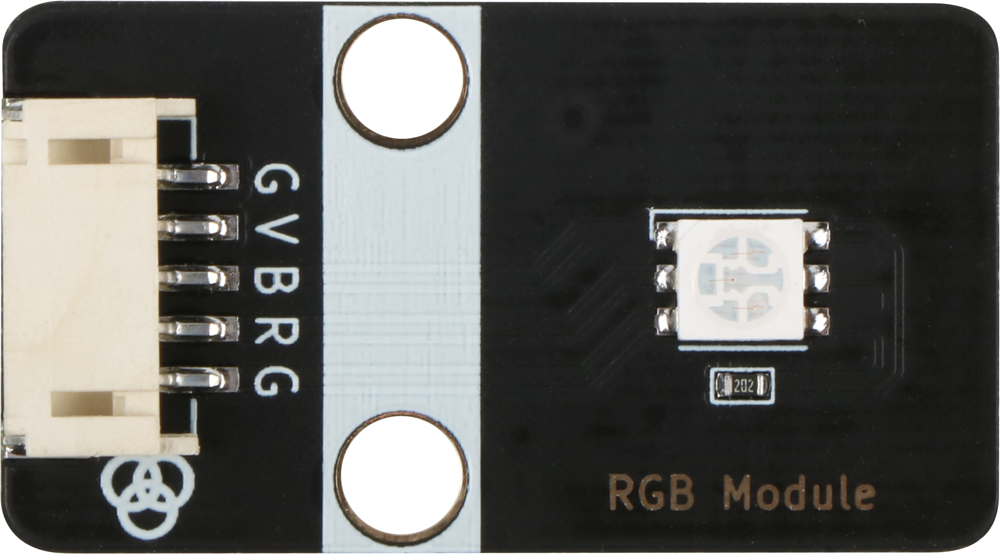
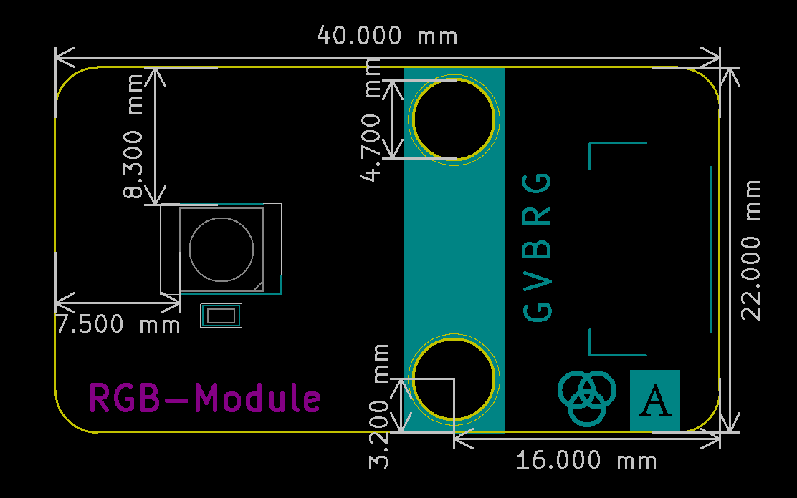

# RGB三色灯规格书

## 模块图

##  概述

​		LED是发光二极管的缩写，由混合化合物制成，即镓（Ga），砷（AS），磷（P）。 磷化镓二极管发红光，磷化镓二极管发绿光，碳化硅二极管发黄光。发光二极管的反向击穿电压为5v。 其正伏安特性曲线太陡，模块上板载了限流电阻，以便在使用时控制流过管道的电流。RGB代表红色，绿色和蓝色通道，是行业颜色标准。RGB通过改变三个通道并叠加它们来显示各种新颜色，根据统计，它可以创建16777216种不同的颜色。

## 原理图

## 模块参数

| 引脚名称 | 描述       |
| -------- | ---------- |
| V        | 5V电源引脚 |
| G        | GND 地线   |
| B        | 蓝灯引脚   |
| R        | 红灯引脚   |
| G        | 绿灯引脚   |

## 详细原理图

 [RGB三色灯.pdf](RGB-Module/RGB三色灯.pdf) 

## 结构 尺寸

## microbit示例程序

<a href="https://makecode.microbit.org/_XjfaiRCi5b5E" target="_blank">动手试一试</a>