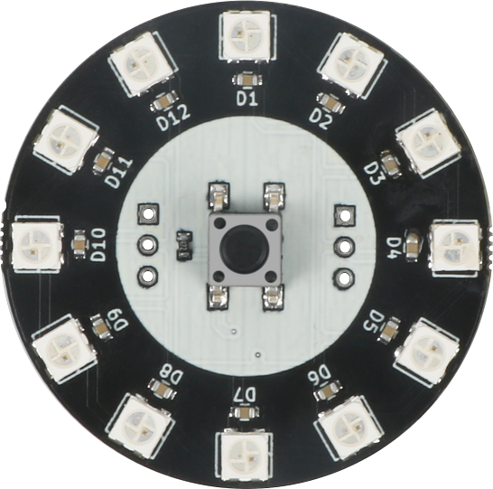
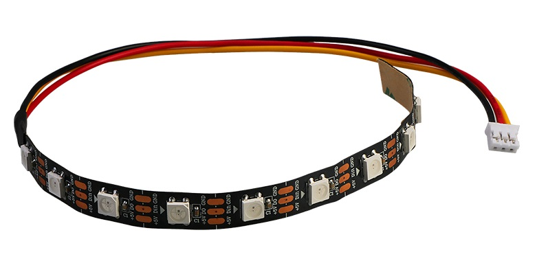

# 12位RGB灯环、灯带模块规格书

## 模块图





## 概述

​        WS2812是一个集控制电路与发光电路于一体的智能外控LED光源。其外型与一个5050LED灯珠相同， 每个元件即为一个像素点。像素点内部包含了智能数字接口数据锁存信号整形放大驱动电路， 还包含有高精度的内部振荡器和12V高压可编程定电流控制部分，有效保证了像素点光的颜色高度一致。数据协议采用单线归零码的通讯方式，像素点在上电复位以后，DIN端接受从控制器传输过来的数据，首先送过来的24bit数据被第一个像素点提取后，送到像素点内部的数据锁存器，剩余的数据经过内部整形处理电路整形放大后通过DO端口开始转发输出给下一个级联的像素点，每经过一个像素点的传输，信号减少24bit。每一个灯珠信号由IN脚输入，OUT输出连接到下一个灯珠的IN脚。像素点采用自动整形转发技术，使得该像素点的级联个数不受信号传送的限制，仅仅受限信号传输速度要求。LED具有低电压驱动，环保节能，亮度高，散射角度大，一致性好，超低功率，超长寿命等优点。将控制电路集成于上面，电路变得更加简单，体积小，安装更加简便。

## 原理图


## 模块参数

| 引脚名称 | 描述                     |
| -------- | ------------------------ |
| V        | 5V电源引脚               |
| G        | GND 地线                 |
| RGB/DI   | 灯环/灯带RGB信号输入引脚 |
| B        | 灯环按键信号引脚         |

## `详细原理图`

 [RGB-ring.pdf](12-bit_RGB_lamp_ring/RGB-ring.pdf) 

## 机械尺寸


## Arduino示例
```
#include "RGBLed.h"                 // 引入RGB灯的库
#define RgbPin 6                    // 定义Rgb信号引脚
#define RgbNum 12                   // 设置Rgb灯环 或灯带的灯珠个数
RGBLed mRgb(RgbPin, RgbNum);        // 初始化灯带或灯环 将灯带的IN脚接RgbPin引脚
                                    // 或者灯环的RGB引脚接RgbPin引脚,12为灯环或灯带的灯珠个数
void setup() {
  mRgb.setBrightness(50);           // 设置灯珠的亮度
}

void loop() {
  for(int i=1-1; i<RgbNum; i++){    // 通过for循环点亮每一个灯珠
    mRgb.setColorAt(i, 255, 255, 0);// 设置灯珠的颜色 第一个参数为灯珠的序号 第二个参数为三原色红色R的值 第三个参数为三原色绿色G的值 第二个参数为三原色蓝色B的值
    delay(50);                      // 延时50ms点亮下一个灯珠
    mRgb.show();                    // 点亮灯珠
  }
}
```

[Arduino程序下载](./12-bit_RGB_lamp_ring/WS2812B.zip)

## MicroBit示例

MicroBit灯环/灯带扩展链接：https://github.com/microsoft/pxt-neopixel

[点击查看示例](https://makecode.microbit.org/_ETYcpDRmPdFt)