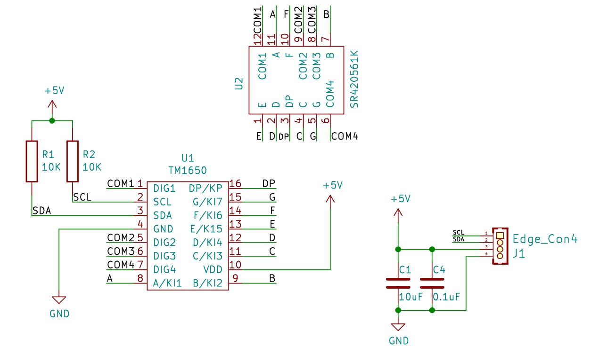

# TM1650数码管显示模块规格书

## 模块图

## 概述

​		4位7段数码管由一个12管脚的4位7段共阳极数码管和一个控制芯片TM1650构成。该模块采用沉金工艺，外观更加美观，同时采用防插反接口，操作更加安全，插口一边有大写字母IIC表示该模块采用IIC协议通信。此产品可以应用在显示数字的设备上。

## 原理图

## 模块参数

| 引脚名称 | 描述     |
|------|--------|
| GND  | GND 地线 |
| VCC  | 5V电源引脚 |
| SDA  | 数据引脚   |
| SCL  | 时钟引脚   |

## 详细原理图

 [TM1650.pdf](4-digit 7 segment/TM1650.pdf) 

## 机械尺寸

## microbit示例程序

<a href="https://makecode.microbit.org/_5AVM1M6WWFTJ" target="_blank">动手试一试</a>