## 介绍

| 名称       | 实物图                                       | 基础参数                                                     | 详情链接                                                     | 购买链接                                                     |
| ---------- | :------------------------------------------- | :----------------------------------------------------------- | ------------------------------------------------------------ | ------------------------------------------------------------ |
| 按键模块   | 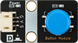         | 尺寸：40 x 22.5mm  供电电压：3V3/5V  连接方式：PH2.0 3PIN防反接线 安装方式：M4螺钉兼容乐高插孔固定  功能：按下时输出低电平，松开时 输出高电平 | [点击查看](https://test-doc-zh-cn.readthedocs.io/projects/emakefun/zh_CN/latest/sensors/base_modules/button_module/) | [点击查看](https://item.taobao.com/item.htm?spm=a1z10.5-c-s.w4002-21556097795.13.74904295vonoi3&id=691232296401) |
| 触摸模块   | 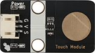         | 尺寸：40 x 22.5mm  供电电压：3V3/5V  连接方式：PH2.0 3PIN防反接线 安装方式：M4螺钉兼容乐高插孔固定  功能：触摸时输出低电平，松开时 输出高电平 | [点击查看](https://test-doc-zh-cn.readthedocs.io/projects/emakefun/zh_CN/latest/sensors/base_modules/touch_module/) | [点击查看](https://item.taobao.com/item.htm?spm=a1z10.5-c-s.w4002-21556097795.11.3d68667enK0BrV&id=613590049398https://item.taobao.com/item.htm?spm=a1z10.5-c-s.w4002-21556097795.11.3d68667enK0BrV&id=613590049398) |
| 触碰开关   | 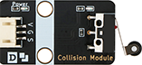         | 尺寸：40 x 22.5mm  供电电压：3V3/5V  连接方式：PH2.0 3PIN防反接线 安装方式：M4螺钉兼容乐高插孔固定  功能：开关触发被按下时输出低电 平，松开时输出高电平 | [点击查看](https://test-doc-zh-cn.readthedocs.io/projects/emakefun/zh_CN/latest/sensors/base_modules/collision_module/) | [点击查看](https://item.taobao.com/item.htm?spm=a1z10.3-c-s.w4002-21556097790.15.1b0268fefhBdcD&id=650434809333) |
| 旋转电位器 | 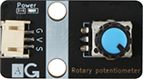         | 尺寸：40 x 22.5mm  供电电压：3V3/5V  连接方式：PH2.0 3PIN防反接线 安装方式：M4螺钉兼容乐高插孔固定  功能：输出电位器中间引脚的电压值 | [点击查看](https://test-doc-zh-cn.readthedocs.io/projects/emakefun/zh_CN/latest/sensors/base_modules/rotary_potentiometer/) | [点击查看](https://item.taobao.com/item.htm?spm=a1z10.5-c-s.w4002-21556097795.11.32f0cf7fjM4vTg&id=684854249052) |
| 旋转编码器 | 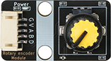         | 尺寸：40 x 22.5mm  供电电压：3V3/5V  连接方式：PH2.0 5PIN防反接线 安装方式：M4螺钉兼容乐高插孔固定 | [点击查看](https://test-doc-zh-cn.readthedocs.io/projects/emakefun/zh_CN/latest/sensors/base_modules/rotary_encoder_module/) | [点击查看](https://item.taobao.com/item.htm?spm=a1z10.5-c-s.w4002-21556097795.11.21f2cf7fOYPHNt&id=684854249052) |
| 触摸钢琴   | 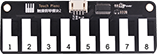           | 尺寸：109 x 36mm  供电电压：5V  连接方式：PH2.0 4PIN防反接线 安装方式：M4螺钉兼容乐高插孔固定   通讯方式:  2线串行 | [点击查看](https://test-doc-zh-cn.readthedocs.io/projects/emakefun/zh_CN/latest/sensors/base_modules/touch_piano/) | [点击查看](https://item.taobao.com/item.htm?spm=a1z10.5-c-s.w4002-21556097795.48.592dfeb7J1QuUB&id=614087379229) |
| 滑动变阻器   |            | 尺寸：57 x 22.5  供电电压：3V3/5V  连接方式：PH2.0 3PIN防反接线 安装方式：M4螺钉兼容乐高插孔固定   功能：滑动到最左边时读取的值 为0滑动到最右边时读取的值为最大 | [点击查看](https://test-doc-zh-cn.readthedocs.io/projects/emakefun/zh_CN/latest/sensors/base_modules/slide_potentiometer/) | [点击查看](https://item.taobao.com/item.htm?spm=a1z10.5-c-s.w4002-21556097795.58.48b4feb7u8AzEK&id=685447955284) |
| 摇杆模块   | 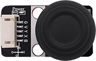           | 尺寸：40x22.5mm  供电电压：5V  连接方式：PH2.0 5PIN防反接线 安装方式：M4螺钉兼容乐高插孔固定   功能：读取遥感XY轴值与按键值 | [点击查看](https://test-doc-zh-cn.readthedocs.io/projects/emakefun/zh_CN/latest/sensors/base_modules/rocker_module/) | [点击查看](https://item.taobao.com/item.htm?spm=a1z10.5-c-s.w4002-21556097795.40.2557feb7473sYR&id=613837670592) |
| 触摸矩阵键盘 | 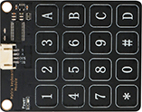           | 尺寸：56x70mm  供电电压：5V  连接方式：PH2.0 4PIN防反接线 安装方式：M4螺钉兼容乐高插孔固定  通讯方式:  I2C | [点击查看](https://test-doc-zh-cn.readthedocs.io/projects/emakefun/zh_CN/latest/sensors/base_modules/matrix_keyboard_module/) | [点击查看](https://item.taobao.com/item.htm?spm=a1z10.5-c-s.w4002-21556097795.40.2557feb7473sYR&id=613837670592) |
| PH2.0小手柄 |            | 尺寸：56 x 70mm  供电电压：5V  连接方式：PH2.0 4PIN防反接线 安装方式：M4螺钉兼容乐高插孔固定  通讯方式:  I2C | [点击查看](https://test-doc-zh-cn.readthedocs.io/projects/emakefun/zh_CN/latest/sensors/base_modules/joystick_handle/) | [点击查看](https://item.taobao.com/item.htm?spm=a1z10.5-c-s.w4002-21556097795.39.1803feb7rhoWpq&id=651182131460) |
| 声音传感器模块 | 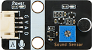           | 尺寸：40 x 22.5mm  供电电压：3V3/5V  连接方式：PH2.0 4PIN防反接线 安装方式：M4螺钉兼容乐高插孔固定  功能：读取声音传感器模拟值与数字值 | [点击查看](https://test-doc-zh-cn.readthedocs.io/projects/emakefun/zh_CN/latest/sensors/sensors/sound_sensor/) | [点击查看](https://item.taobao.com/item.htm?spm=a1z10.5-c-s.w4002-21556097795.20.585942951OlLOp&id=613587105859) |
| 光敏传感器模块 | 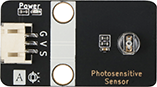           | 尺寸：40 x 22.5mm  供电电压：3V3/5V  连接方式：PH2.0 4PIN防反接线 安装方式：M4螺钉兼容乐高插孔固定  功能：光线强时,读取的值则越大 | [点击查看](https://test-doc-zh-cn.readthedocs.io/projects/emakefun/zh_CN/latest/sensors/sensors/photo_sensitive_sensor/) | [点击查看](https://item.taobao.com/item.htm?spm=a1z10.5-c-s.w4002-21556097795.14.585942951OlLOp&id=613314512645) |
| 热敏传感器 | 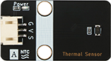           | 尺寸：40 x 22.5mm  供电电压：3V3/5V  连接方式：PH2.0 3PIN防反接线 安装方式：M4螺钉兼容乐高插孔固定  功能：温度越高时,读取的值则越大 | [点击查看](https://test-doc-zh-cn.readthedocs.io/projects/emakefun/zh_CN/latest/sensors/sensors/thermal_sensor/) | [点击查看](https://item.taobao.com/item.htm?spm=a1z10.5-c-s.w4002-21556097795.32.585942951OlLOp&id=650436369057) |
| 火焰传感器 | 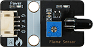           | 尺寸：40 x 22.5mm  供电电压：3V3/5V  连接方式：PH2.0 4PIN防反接线 安装方式：M4螺钉兼容乐高插孔固定  功能：读取火焰传感器模拟值与数字值 | [点击查看](https://test-doc-zh-cn.readthedocs.io/projects/emakefun/zh_CN/latest/sensors/sensors/flame_sensor/) | [点击查看](https://item.taobao.com/item.htm?spm=a1z10.5-c-s.w4002-21556097795.52.585942951OlLOp&id=686818917336) |
| 土壤湿度传感器 | 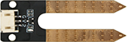           | 尺寸：56 x 19mm  供电电压：3V3/5V  连接方式：PH2.0 3PIN防反接线 安装方式：M4螺钉兼容乐高插孔固定  功能：土壤湿度越湿,模拟值则越大 | [点击查看](https://test-doc-zh-cn.readthedocs.io/projects/emakefun/zh_CN/latest/sensors/sensors/soil_moisture_sensor/) | [点击查看](https://item.taobao.com/item.htm?spm=a1z10.5-c-s.w4002-21556097795.22.585942951OlLOp&id=614086087644) |
| 雨滴传感器 | 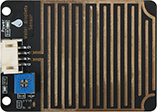           | 尺寸：56 x 40mm  供电电压：3V3/5V  连接方式：PH2.0 4PIN防反接线 安装方式：M4螺钉兼容乐高插孔固定  功能：读取雨滴传感器模拟值与数字值 | [点击查看](https://test-doc-zh-cn.readthedocs.io/projects/emakefun/zh_CN/latest/sensors/sensors/water_droplets_sensor/) | [点击查看](https://item.taobao.com/item.htm?spm=a1z10.5-c-s.w4002-21556097795.36.585942951OlLOp&id=651167931915) |
| 水深传感器 | 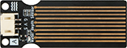           | 尺寸：56 x 22mm  供电电压：3V3/5V  连接方式：PH2.0 3PIN防反接线 安装方式：M4螺钉兼容乐高插孔固定  使用方式：通过MCU对该模块进行 模拟读取，从而感受水的深度。当 模拟值越大，水的深度越深。 | [点击查看](https://test-doc-zh-cn.readthedocs.io/projects/emakefun/zh_CN/latest/sensors/sensors/water_depth_sensor/) | [点击查看](https://item.taobao.com/item.htm?spm=a1z10.5-c-s.w4002-21556097795.26.742542955tP4jN&id=693466696533) |
| 温湿度 传感器 | 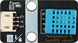           | 尺寸：40 x 22.5mm  供电电压：3V3/5V  连接方式：PH2.0 3PIN防反接线 安装方式：M4螺钉兼容乐高插孔固定   | [点击查看](https://test-doc-zh-cn.readthedocs.io/projects/emakefun/zh_CN/latest/sensors/sensors/temperature_humidity_sensor/) | [点击查看](https://item.taobao.com/item.htm?spm=a1z10.5-c-s.w4002-21556097795.18.37294295cAbCp2&id=613317468964) |
| DS18B20 数字温度传感器 | 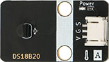           | 尺寸：40 x 22.5mm  供电电压：3V3/5V  连接方式：PH2.0 3PIN防反接线 安装方式：M4螺钉兼容乐高插孔固定   | [点击查看](https://test-doc-zh-cn.readthedocs.io/projects/emakefun/zh_CN/latest/sensors/sensors/ds18b20_sensor/) | [点击查看](https://item.taobao.com/item.htm?spm=a1z10.5-c-s.w4002-21556097795.16.37294295cAbCp2&id=613317376979) |
| MQ-4气体传感器 | 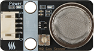           | 尺寸：40 x 22.5mm  供电电压：3V3/5V  连接方式：PH2.0 4PIN防反接线 安装方式：M4螺钉兼容乐高插孔固定   | [点击查看](https://test-doc-zh-cn.readthedocs.io/projects/emakefun/zh_CN/latest/sensors/sensors/mq_gas_sensor/) | [点击查看](https://item.taobao.com/item.htm?spm=a1z10.5-c-s.w4002-21556097795.28.324a4295husxW5&id=693468648782) |
| 人体热释电传感器| 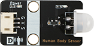           | 尺寸：40 x 22.5mm  供电电压：3V3/5V  连接方式：PH2.0 4PIN防反接线 安装方式：M4螺钉兼容乐高插孔固定   | [点击查看](https://test-doc-zh-cn.readthedocs.io/projects/emakefun/zh_CN/latest/sensors/sensors/human_body_sensor/) | [点击查看](https://item.taobao.com/item.htm?spm=a1z10.5-c-s.w4002-21556097795.12.3e154295OfD44u&id=613314496570) |
| 红外循迹传感器| 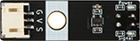           | 尺寸：40 x 22.5mm  供电电压：3V3/5V  连接方式：PH2.0 4PIN防反接线 安装方式：M4螺钉兼容乐高插孔固定   | [点击查看](https://test-doc-zh-cn.readthedocs.io/projects/emakefun/zh_CN/latest/sensors/sensors/tracking_sensor/) | [点击查看](https://item.taobao.com/item.htm?spm=a1z10.5-c-s.w4002-21556097795.56.3e154295OfD44u&id=688530331810) |
| 磁簧开关传感器| 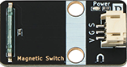           | 尺寸：40 x 22.5mm  供电电压：3V3/5V  连接方式：PH2.0 4PIN防反接线 安装方式：M4螺钉兼容乐高插孔固定   | [点击查看](https://test-doc-zh-cn.readthedocs.io/projects/emakefun/zh_CN/latest/sensors/sensors/tracking_sensor/) | [点击查看](https://item.taobao.com/item.htm?spm=a1z10.5-c-s.w4002-21556097795.56.3e154295OfD44u&id=688530331810) |
| 灰度传感器| 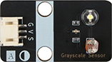           | 尺寸：40 x 22.5mm  供电电压：3V3/5V  连接方式：PH2.0 3PIN防反接线 安装方式：M4螺钉兼容乐高插孔固定   | [点击查看](https://test-doc-zh-cn.readthedocs.io/projects/emakefun/zh_CN/latest/sensors/sensors/grayscale_sensor/) | [点击查看](https://item.taobao.com/item.htm?spm=a1z10.5-c-s.w4002-21556097795.28.39104295b4No5G&id=650018244258) |
| 震动传感器| 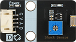           | 尺寸：40 x 22.5mm  供电电压：3V3/5V  连接方式：PH2.0 4PIN防反接线 安装方式：M4螺钉兼容乐高插孔固定   | [点击查看](https://test-doc-zh-cn.readthedocs.io/projects/emakefun/zh_CN/latest/sensors/sensors/shock_sensor/) | [点击查看](https://item.taobao.com/item.htm?spm=a1z10.5-c-s.w4002-21556097795.38.39104295b4No5G&id=651168903449) |
| 倾斜传感器| 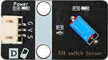           | 尺寸：40 x 22.5mm  供电电压：3V3/5V  连接方式：PH2.0 3PIN防反接线 安装方式：M4螺钉兼容乐高插孔固定   | [点击查看](https://test-doc-zh-cn.readthedocs.io/projects/emakefun/zh_CN/latest/sensors/sensors/tilt_switch_sensor/) | [点击查看](https://item.taobao.com/item.htm?spm=a1z10.5-c-s.w4002-21556097795.26.39104295b4No5G&id=650018144949) |
| 气压传感器| 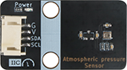           | 尺寸：40 x 22.5mm  供电电压：3V3/5V  连接方式：PH2.0 4PIN防反接线 安装方式：M4螺钉兼容乐高插孔固定  通讯方式：IIC | [点击查看](https://test-doc-zh-cn.readthedocs.io/projects/emakefun/zh_CN/latest/sensors/sensors/atmospheric_pressure_sensor/) | [点击查看](https://item.taobao.com/item.htm?spm=a1z10.5-c-s.w4002-21556097795.30.39104295b4No5G&id=650018544511) |
| 压力传感器模块| 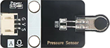           | 尺寸：40 x 22.5mm  供电电压：3V3/5V  连接方式：PH2.0 3PIN防反接线 安装方式：M4螺钉兼容乐高插孔固定   | [点击查看](https://test-doc-zh-cn.readthedocs.io/projects/emakefun/zh_CN/latest/sensors/sensors/pressure_sensor/) | [点击查看](https://item.taobao.com/item.htm?spm=a1z10.5-c-s.w4002-21556097795.40.39104295b4No5G&id=651175763219) |
| 五路循迹模块| 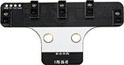           | 尺寸：40 x 22.5mm  供电电压：3V3/5V  连接方式：PH2.0 3PIN防反接线 安装方式：M4螺钉兼容乐高插孔固定  通讯方式：IIC | [点击查看](https://test-doc-zh-cn.readthedocs.io/projects/emakefun/zh_CN/latest/sensors/sensors/five_way_tracking_sensor/) | [点击查看](https://item.taobao.com/item.htm?spm=a1z10.5-c-s.w4002-21556097795.58.39104295b4No5G&id=691157907715) |