## 介绍

| 序号  | 名称                  | 实物图                                                    | 基础参数                                                                                                                                                     | 详情链接                                                                                                                              | 购买链接                                                                                                                                                                                                             |
|-----|:--------------------|:-------------------------------------------------------|----------------------------------------------------------------------------------------------------------------------------------------------------------|-----------------------------------------------------------------------------------------------------------------------------------|------------------------------------------------------------------------------------------------------------------------------------------------------------------------------------------------------------------|
| 1   | 按键模块                |                        | 尺寸：40 x 22.5mm  供电电压：3V3/5V  连接方式：PH2.0 3PIN防反接线 安装方式：M4螺钉兼容乐高插孔固定  功能：按下时输出低电平，松开时 输出高电平                                                 | [点击查看](https://test-doc-zh-cn.readthedocs.io/projects/emakefun/zh_CN/latest/sensors/base_modules/button_module/)                  | [点击查看](https://item.taobao.com/item.htm?spm=a1z10.5-c-s.w4002-21556097795.13.74904295vonoi3&id=691232296401)                                                                                                     |
| 2   | 触摸模块                |                         | 尺寸：40 x 22.5mm  供电电压：3V3/5V  连接方式：PH2.0 3PIN防反接线 安装方式：M4螺钉兼容乐高插孔固定  功能：触摸时输出低电平，松开时 输出高电平                                                 | [点击查看](https://test-doc-zh-cn.readthedocs.io/projects/emakefun/zh_CN/latest/sensors/base_modules/touch_module/)                   | [点击查看](https://item.taobao.com/item.htm?spm=a1z10.5-c-s.w4002-21556097795.11.3d68667enK0BrV&id=613590049398https://item.taobao.com/item.htm?spm=a1z10.5-c-s.w4002-21556097795.11.3d68667enK0BrV&id=613590049398) |
| 3   | 触碰开关                |                     | 尺寸：40 x 22.5mm  供电电压：3V3/5V  连接方式：PH2.0 3PIN防反接线 安装方式：M4螺钉兼容乐高插孔固定  功能：开关触发被按下时输出低电 平，松开时输出高电平                                            | [点击查看](https://test-doc-zh-cn.readthedocs.io/projects/emakefun/zh_CN/latest/sensors/base_modules/collision_module/)               | [点击查看](https://item.taobao.com/item.htm?spm=a1z10.3-c-s.w4002-21556097790.15.1b0268fefhBdcD&id=650434809333)                                                                                                     |
| 4   | 旋转电位器               |                | 尺寸：40 x 22.5mm  供电电压：3V3/5V  连接方式：PH2.0 3PIN防反接线 安装方式：M4螺钉兼容乐高插孔固定  功能：输出电位器中间引脚的电压值                                                         | [点击查看](https://test-doc-zh-cn.readthedocs.io/projects/emakefun/zh_CN/latest/sensors/base_modules/rotary_potentiometer/)           | [点击查看](https://item.taobao.com/item.htm?spm=a1z10.5-c-s.w4002-21556097795.11.32f0cf7fjM4vTg&id=684854249052)                                                                                                     |
| 5   | 旋转编码器               |               | 尺寸：40 x 22.5mm  供电电压：3V3/5V  连接方式：PH2.0 5PIN防反接线 安装方式：M4螺钉兼容乐高插孔固定                                                                              | [点击查看](https://test-doc-zh-cn.readthedocs.io/projects/emakefun/zh_CN/latest/sensors/base_modules/rotary_encoder_module/)          | [点击查看](https://item.taobao.com/item.htm?spm=a1z10.5-c-s.w4002-21556097795.11.21f2cf7fOYPHNt&id=684854249052)                                                                                                     |
| 6   | 触摸钢琴                |                          | 尺寸：105 x 36mm  供电电压：5V  连接方式：PH2.0 4PIN防反接线 安装方式：M4螺钉兼容乐高插孔固定   通讯方式:  2线串行                                                                  | [点击查看](https://test-doc-zh-cn.readthedocs.io/projects/emakefun/zh_CN/latest/sensors/base_modules/touch_piano/)                    | [点击查看](https://item.taobao.com/item.htm?spm=a1z10.5-c-s.w4002-21556097795.48.592dfeb7J1QuUB&id=614087379229)                                                                                                     |
| 7   | 滑动变阻器               |                 | 尺寸：57 x 22.5  供电电压：3V3/5V  连接方式：PH2.0 3PIN防反接线 安装方式：M4螺钉兼容乐高插孔固定   功能：滑动到最左边时读取的值 为0滑动到最右边时读取的值为最大                                        | [点击查看](https://test-doc-zh-cn.readthedocs.io/projects/emakefun/zh_CN/latest/sensors/base_modules/slide_potentiometer/)            | [点击查看](https://item.taobao.com/item.htm?spm=a1z10.5-c-s.w4002-21556097795.58.48b4feb7u8AzEK&id=685447955284)                                                                                                     |
| 8   | 摇杆模块                |                        | 尺寸：40x22.5mm  供电电压：5V  连接方式：PH2.0 5PIN防反接线 安装方式：M4螺钉兼容乐高插孔固定   功能：读取遥感XY轴值与按键值                                                               | [点击查看](https://test-doc-zh-cn.readthedocs.io/projects/emakefun/zh_CN/latest/sensors/base_modules/rocker_module/)                  | [点击查看](https://item.taobao.com/item.htm?spm=a1z10.5-c-s.w4002-21556097795.40.2557feb7473sYR&id=613837670592)                                                                                                     |
| 9   | 触摸矩阵键盘              |             | 尺寸：56x70mm  供电电压：5V  连接方式：PH2.0 4PIN防反接线 安装方式：M4螺钉兼容乐高插孔固定  通讯方式:  IIC                                                                       | [点击查看](https://test-doc-zh-cn.readthedocs.io/projects/emakefun/zh_CN/latest/sensors/base_modules/matrix_keyboard_module/)         | [点击查看](https://item.taobao.com/item.htm?spm=a1z10.3-c-s.w4002-21556097790.9.338968fevzmIzk&id=650820674601)                                                                                                      |
| 10  | PH2.0小手柄            |                  | 尺寸：90 x 40mm  供电电压：5V  连接方式：PH2.0 4PIN防反接线 通讯方式:  IIC                                                                                           | [点击查看](https://test-doc-zh-cn.readthedocs.io/projects/emakefun/zh_CN/latest/sensors/base_modules/joystick_handle/)                | [点击查看](https://item.taobao.com/item.htm?spm=a1z10.5-c-s.w4002-21556097795.39.1803feb7rhoWpq&id=651182131460)                                                                                                     |
| 11  | 声音传感器模块             |                      | 尺寸：40 x 22.5mm  供电电压：3V3/5V  连接方式：PH2.0 4PIN防反接线 安装方式：M4螺钉兼容乐高插孔固定  功能：读取声音传感器模拟值与数字值                                                        | [点击查看](https://test-doc-zh-cn.readthedocs.io/projects/emakefun/zh_CN/latest/sensors/sensors/sound_sensor/)                        | [点击查看](https://item.taobao.com/item.htm?spm=a1z10.5-c-s.w4002-21556097795.20.585942951OlLOp&id=613587105859)                                                                                                     |
| 12  | 光敏传感器模块             |            | 尺寸：40 x 22.5mm  供电电压：3V3/5V  连接方式：PH2.0 4PIN防反接线 安装方式：M4螺钉兼容乐高插孔固定  功能：光线强时,读取的值则越大                                                          | [点击查看](https://test-doc-zh-cn.readthedocs.io/projects/emakefun/zh_CN/latest/sensors/sensors/photo_sensitive_sensor/)              | [点击查看](https://item.taobao.com/item.htm?spm=a1z10.5-c-s.w4002-21556097795.14.585942951OlLOp&id=613314512645)                                                                                                     |
| 13  | 热敏传感器               |                      | 尺寸：40 x 22.5mm  供电电压：3V3/5V  连接方式：PH2.0 3PIN防反接线 安装方式：M4螺钉兼容乐高插孔固定  功能：温度越高时,读取的值则越大                                                         | [点击查看](https://test-doc-zh-cn.readthedocs.io/projects/emakefun/zh_CN/latest/sensors/sensors/thermal_sensor/)                      | [点击查看](https://item.taobao.com/item.htm?spm=a1z10.5-c-s.w4002-21556097795.32.585942951OlLOp&id=650436369057)                                                                                                     |
| 14  | 火焰传感器               |                        | 尺寸：40 x 22.5mm  供电电压：3V3/5V  连接方式：PH2.0 4PIN防反接线 安装方式：M4螺钉兼容乐高插孔固定  功能：读取火焰传感器模拟值与数字值                                                        | [点击查看](https://test-doc-zh-cn.readthedocs.io/projects/emakefun/zh_CN/latest/sensors/sensors/flame_sensor/)                        | [点击查看](https://item.taobao.com/item.htm?spm=a1z10.5-c-s.w4002-21556097795.52.585942951OlLOp&id=686818917336)                                                                                                     |
| 15  | 土壤湿度传感器             |                     | 尺寸：56 x 19mm  供电电压：3V3/5V  连接方式：PH2.0 3PIN防反接线 安装方式：M3螺钉固定  功能：土壤湿度越湿,模拟值则越大                                                                 | [点击查看](https://test-doc-zh-cn.readthedocs.io/projects/emakefun/zh_CN/latest/sensors/sensors/soil_moisture_sensor/)                | [点击查看](https://item.taobao.com/item.htm?spm=a1z10.5-c-s.w4002-21556097795.22.585942951OlLOp&id=614086087644)                                                                                                     |
| 16  | 雨滴传感器               |               | 尺寸：56 x 40mm  供电电压：3V3/5V  连接方式：PH2.0 4PIN防反接线 安装方式：M4螺钉兼容乐高插孔固定  功能：读取雨滴传感器模拟值与数字值                                                          | [点击查看](https://test-doc-zh-cn.readthedocs.io/projects/emakefun/zh_CN/latest/sensors/sensors/water_droplets_sensor/)               | [点击查看](https://item.taobao.com/item.htm?spm=a1z10.5-c-s.w4002-21556097795.36.585942951OlLOp&id=651167931915)                                                                                                     |
| 17  | 水深传感器               |                  | 尺寸：56 x 22mm  供电电压：3V3/5V  连接方式：PH2.0 3PIN防反接线 安装方式：M3螺钉固定  使用方式：通过MCU对该模块进 行模拟读取，从而感受水的深度。 当模拟值越大，水的深度越深。                             | [点击查看](https://test-doc-zh-cn.readthedocs.io/projects/emakefun/zh_CN/latest/sensors/sensors/water_depth_sensor/)                  | [点击查看](https://item.taobao.com/item.htm?spm=a1z10.5-c-s.w4002-21556097795.26.742542955tP4jN&id=693466696533)                                                                                                     |
| 18  | 温湿度传感器              |        | 尺寸：40 x 22.5mm  供电电压：3V3/5V  连接方式：PH2.0 3PIN防反接线 安装方式：M4螺钉兼容乐高插孔固定  通讯方式：DATA串行数据，单总线                                                        | [点击查看](https://test-doc-zh-cn.readthedocs.io/projects/emakefun/zh_CN/latest/sensors/sensors/temperature_humidity_sensor/)         | [点击查看](https://item.taobao.com/item.htm?spm=a1z10.5-c-s.w4002-21556097795.18.37294295cAbCp2&id=613317468964)                                                                                                     |
| 19  | DS18B20 数字温度传感器  |             | 尺寸：40 x 22.5mm  供电电压：3V3/5V  连接方式：PH2.0 3PIN防反接线 安装方式：M4螺钉兼容乐高插孔固定  通讯方式：DATA串行数据，单总线                                                        | [点击查看](https://test-doc-zh-cn.readthedocs.io/projects/emakefun/zh_CN/latest/sensors/sensors/ds18b20_sensor/)                      | [点击查看](https://item.taobao.com/item.htm?spm=a1z10.5-c-s.w4002-21556097795.16.37294295cAbCp2&id=613317376979)                                                                                                     |
| 20  | MQ-4气体传感器           |                   | 尺寸：40 x 22.5mm  供电电压：3V3/5V  连接方式：PH2.0 4PIN防反接线 安装方式：M4螺钉兼容乐高插孔固定  功能：读取气体传感器模拟值与数字值                                                        | [点击查看](https://test-doc-zh-cn.readthedocs.io/projects/emakefun/zh_CN/latest/sensors/sensors/mq_gas_sensor/)                       | [点击查看](https://item.taobao.com/item.htm?spm=a1z10.5-c-s.w4002-21556097795.28.324a4295husxW5&id=693468648782)                                                                                                     |
| 21  | 人体热释电传感器            |                | 尺寸：40 x 22.5mm  供电电压：3V3/5V  连接方式：PH2.0 3PIN防反接线 安装方式：M4螺钉兼容乐高插孔固定  功能：当前方有人时输出高电平， 当前方没有人时输出低电平                                          | [点击查看](https://test-doc-zh-cn.readthedocs.io/projects/emakefun/zh_CN/latest/sensors/sensors/human_body_sensor/)                   | [点击查看](https://item.taobao.com/item.htm?spm=a1z10.5-c-s.w4002-21556097795.12.3e154295OfD44u&id=613314496570)                                                                                                     |
| 22  | 单路红外 循迹传感器       |                 | 尺寸：40 x 12mm  供电电压：3V3/5V  连接方式：PH2.0 3PIN防反接线 安装方式：M4螺钉兼容乐高插孔固定  功能：当遇到黑色时输出高电平  当没有遇到黑色时输出低电平                                           | [点击查看](https://test-doc-zh-cn.readthedocs.io/projects/emakefun/zh_CN/latest/sensors/sensors/tracking_sensor/)                     | [点击查看](https://item.taobao.com/item.htm?spm=a1z10.5-c-s.w4002-21556097795.56.3e154295OfD44u&id=688530331810)                                                                                                     |
| 23  | 双路红外 循迹传感器       | 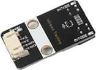              | 尺寸：40 x 12mm  供电电压：3V3/5V  连接方式：PH2.0 4PIN防反接线 安装方式：M4螺钉兼容乐高插孔固定  功能：当遇到黑色时输出高电平  当没有遇到黑色时输出低电平                                           | 正在上传                                                                                                                              | [点击查看](https://item.taobao.com/item.htm?spm=a1z10.3-c-s.w4002-21556097790.13.60e968fexT4n2S&id=694518979639)                                                                                                     |
| 24  | 红外避障 传感器模块       | 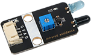    | 尺寸：40 x 12mm  供电电压：3V3/5V  连接方式：PH2.0 4PIN防反接线 安装方式：M4螺钉兼容乐高插孔固定  功能：当遇到障碍物时输出高电平  当没有遇到障碍物时输出低电平                                         | 正在上传                                                                                                                              | [点击查看](https://item.taobao.com/item.htm?spm=a1z10.3-c-s.w4002-21556097790.9.1ee968fehZ31ZW&id=693672520361)                                                                                                      |
| 25  | 磁簧开关传感器             |            | 尺寸：40 x 22.5mm  供电电压：3V3/5V  连接方式：PH2.0 3PIN防反接线 安装方式：M4螺钉兼容乐高插孔固定  功能：当有磁铁在传感器上时输 出低电平，当没有磁铁在传感器 时输出高电平                               | [点击查看](https://test-doc-zh-cn.readthedocs.io/projects/emakefun/zh_CN/latest/sensors/sensors/tracking_sensor/)                     | 正在上传                                                                                                                                                                                                             |
| 26  | 灰度传感器               |                    | 尺寸：40 x 22.5mm  供电电压：3V3/5V  连接方式：PH2.0 3PIN防反接线 安装方式：M4螺钉兼容乐高插孔固定  功能：遇到不同颜色的时物体时读 取的值则不同                                                | [点击查看](https://test-doc-zh-cn.readthedocs.io/projects/emakefun/zh_CN/latest/sensors/sensors/grayscale_sensor/)                    | [点击查看](https://item.taobao.com/item.htm?spm=a1z10.5-c-s.w4002-21556097795.28.39104295b4No5G&id=650018244258)                                                                                                     |
| 27  | 震动传感器               |                        | 尺寸：40 x 22.5mm  供电电压：3V3/5V  连接方式：PH2.0 4PIN防反接线 安装方式：M4螺钉兼容乐高插孔固定  功能：读取震动传感器模拟值与数字值                                                        | [点击查看](https://test-doc-zh-cn.readthedocs.io/projects/emakefun/zh_CN/latest/sensors/sensors/shock_sensor/)                        | [点击查看](https://item.taobao.com/item.htm?spm=a1z10.5-c-s.w4002-21556097795.38.39104295b4No5G&id=651168903449)                                                                                                     |
| 28  | 倾斜传感器               |                  | 尺寸：40 x 22.5mm  供电电压：3V3/5V  连接方式：PH2.0 3PIN防反接线 安装方式：M4螺钉兼容乐高插孔固定  功能：当模块倾斜时输出低电平， 当模块没有倾斜时输出高电平                                         | [点击查看](https://test-doc-zh-cn.readthedocs.io/projects/emakefun/zh_CN/latest/sensors/sensors/tilt_switch_sensor/)                  | [点击查看](https://item.taobao.com/item.htm?spm=a1z10.5-c-s.w4002-21556097795.26.39104295b4No5G&id=650018144949)                                                                                                     |
| 29  | 气压传感器               |         | 尺寸：40 x 22.5mm  供电电压：3V3/5V  连接方式：PH2.0 4PIN防反接线 安装方式：M4螺钉兼容乐高插孔固定  通讯方式：IIC                                                                 | [点击查看](https://test-doc-zh-cn.readthedocs.io/projects/emakefun/zh_CN/latest/sensors/sensors/atmospheric_pressure_sensor/)         | [点击查看](https://item.taobao.com/item.htm?spm=a1z10.5-c-s.w4002-21556097795.30.39104295b4No5G&id=650018544511)                                                                                                     |
| 30  | 压力传感器模块             |                   | 尺寸：40 x 22.5mm  供电电压：3V3/5V  连接方式：PH2.0 3PIN防反接线 安装方式：M4螺钉兼容乐高插孔固定  功能：当传感器收到的压力越大， 则读取的模拟值越大                                             | [点击查看](https://test-doc-zh-cn.readthedocs.io/projects/emakefun/zh_CN/latest/sensors/sensors/pressure_sensor/)                     | [点击查看](https://item.taobao.com/item.htm?spm=a1z10.5-c-s.w4002-21556097795.40.39104295b4No5G&id=651175763219)                                                                                                     |
| 31  | 五路循迹模块              |                  | 尺寸：72 x 37.5mm  供电电压：5V  连接方式：PH2.0 4PIN防反接线 安装方式：M4螺钉兼容乐高插孔固定  通讯方式：IIC                                                                     | [点击查看](https://test-doc-zh-cn.readthedocs.io/projects/emakefun/zh_CN/latest/sensors/sensors/five_way_tracking_sensor/)            | [点击查看](https://item.taobao.com/item.htm?spm=a1z10.5-c-s.w4002-21556097795.58.39104295b4No5G&id=691157907715)                                                                                                     |
| 32  | 水蒸气 传感器模块        | 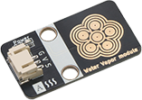                           | 尺寸：40 x 22.5mm  供电电压：3V3/5V  连接方式：PH2.0 3PIN防反接线 安装方式：M4螺钉兼容乐高插孔固定  功能：当水蒸气越大时值越大                                                            | 正在上传                                                                                                                              | [点击查看](https://item.taobao.com/item.htm?spm=a1z10.3-c-s.w4002-21556097790.9.5f4068fe7L41ji&id=694436375063)                                                                                                      |
| 33  | LM35传感器             | 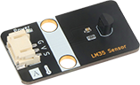                             | 尺寸：40 x 22.5mm  供电电压：3V3/5V  连接方式：PH2.0 3PIN防反接线 安装方式：M4螺钉兼容乐高插孔固定  功能：温度越高读取的模拟值越大                                                          | 正在上传                                                                                                                              | [点击查看](https://item.taobao.com/item.htm?spm=a1z10.3-c-s.w4002-21556097790.9.520a68feTELeDF&id=684001235528)                                                                                                      |
| 34  | 有源蜂鸣器               |                       | 尺寸：40 x 22.5mm  供电电压：3V3/5V  连接方式：PH2.0 3PIN防反接线 安装方式：M4螺钉兼容乐高插孔固定  功能：输入高电平时蜂鸣器发出声音                                                         | [点击查看](https://test-doc-zh-cn.readthedocs.io/projects/emakefun/zh_CN/latest/sensors/actuators/buzzerModel/)                       | [点击查看](https://item.taobao.com/item.htm?spm=a1z10.5-c-s.w4002-21556097795.52.28fffeb7wH0LdX&id=693787653864)                                                                                                     |
| 35  | 无源蜂鸣器               | 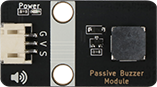              | 尺寸：40 x 22.5mm  供电电压：3V3/5V  连接方式：PH2.0 3PIN防反接线 安装方式：M4螺钉兼容乐高插孔固定  功能：输入高电平时的频率不同时 蜂鸣器发出的声音就不同                                           | [点击查看](https://test-doc-zh-cn.readthedocs.io/projects/emakefun/zh_CN/latest/sensors/actuators/passiveBuzzerModel/)                | [点击查看](https://item.taobao.com/item.htm?spm=a1z10.5-c-s.w4002-21556097795.44.7e22feb7Sci1Mu&id=614081935363)                                                                                                     |
| 36  | 直流电机模块              | 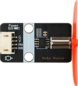                      | 尺寸：40 x 22.5mm  供电电压：3V3/5V  连接方式：PH2.0 4PIN防反接线 安装方式：M4螺钉兼容乐高插孔固定  功能：INA输入低电平，INB输入 高电平，直流电机模块正转。                                       | [点击查看](https://test-doc-zh-cn.readthedocs.io/projects/emakefun/zh_CN/latest/sensors/actuators/motorModel/)                        | [点击查看](https://item.taobao.com/item.htm?spm=a1z10.5-c-s.w4002-21556097795.38.c88cfeb732F0rS&id=692535366739)                                                                                                     |
| 37  | 继电器模块               | 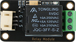                       | 尺寸：40 x 22.5mm  供电电压：3V3/5V  连接方式：PH2.0 3PIN防反接线 安装方式：M3螺钉固定  功能：输入高电平时，继电器闭合。                                                               | [点击查看](https://test-doc-zh-cn.readthedocs.io/projects/emakefun/zh_CN/latest/sensors/actuators/relayModel/)                        | [点击查看](https://item.taobao.com/item.htm?spm=a1z10.5-c-s.w4002-21556097795.32.1fcbfeb7zxNSC6&id=613593525071)                                                                                                     |
| 38  | 激光发射模块              | 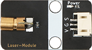             | 尺寸：40 x 22.5mm  供电电压：3V3/5V  连接方式：PH2.0 3PIN防反接线 安装方式：M4螺钉兼容乐高插孔固定  功能：输入高电平时，激光发射模 块会发射出一束激光。                                            | [点击查看](https://test-doc-zh-cn.readthedocs.io/projects/emakefun/zh_CN/latest/sensors/actuators/laserEmissionModel/)                | [点击查看](https://item.taobao.com/item.htm?spm=a1z10.5-c-s.w4002-21556097795.62.1fcbfeb7zxNSC6&id=650443957766)                                                                                                     |
| 39  | 振动马达模块              | 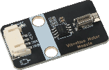            | 尺寸：40 x 22.5mm  供电电压：3V3/5V  连接方式：PH2.0 4PIN防反接线 安装方式：M4螺钉兼容乐高插孔固定  功能：输入高电平时，激光发射模 块会发射出一束激光。                                            | [点击查看](https://test-doc-zh-cn.readthedocs.io/projects/emakefun/zh_CN/latest/sensors/actuators/Vibration%20motor%20module/)        |                                                                                                                                                                                                                  |
| 40  | 大电机模块               | 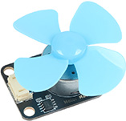                               | 尺寸：40 x 22.5mm  供电电压：3V3/5V  连接方式：PH2.0 4PIN防反接线 安装方式：M4螺钉兼容乐高插孔固定  功能：INA输入低电平，INB输入 高电平，直流电机模块正转。                                      | [点击查看](https://test-doc-zh-cn.readthedocs.io/projects/emakefun/zh_CN/latest/sensors/actuators/High%20power%20motor%20module/)     | [点击查看](https://item.taobao.com/item.htm?spm=a1z10.5-c-s.w4002-21556097795.43.8396cf7fqUnNR1&id=651189583754)                                                                                                     |
| 41  | 步进电机 驱动模块        | 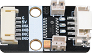      | 尺寸：40 x 22.5mm  供电电压：5V  连接方式：PH2.0 6PIN防反接线 安装方式：M4螺钉兼容乐高插孔固定                                                                               | 正在上传                                                                                                                              | [点击查看](https://item.taobao.com/item.htm?spm=a1z10.3-c-s.w4002-21556097790.13.7d5b68fet4Vln4&id=695935736935)                                                                                                     |
| 42  | 功放喇叭模块              | 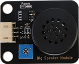                | 尺寸：40 x 32mm  供电电压：5V  连接方式：PH2.0 3PIN防反接线 安装方式：M4螺钉兼容乐高插孔固定                                                                                 | 正在上传                                                                                                                              | [点击查看](https://item.taobao.com/item.htm?spm=a1z10.3-c-s.w4002-21556097790.9.4b0168fepJuYmL&id=692096471868)                                                                                                      |
| 43  | 双路电机驱动模块            | 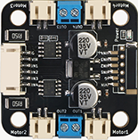               | 尺寸：40 x 40mm  供电电压：5-35V  连接方式：PH2.0 6PIN防反接线 安装方式：M4螺钉兼容乐高插孔固定  功能：四路PWM驱动                                                                  | 正在上传                                                                                                                              | [点击查看](https://item.taobao.com/item.htm?spm=a1z10.3-c-s.w4002-21556097790.9.7d5b68fet4Vln4&id=650817934396)                                                                                                      |
| 43  | 电机驱动模块              |                                                        | 尺寸：40 x 22.5 mm  供电电压：3V3/5V  连接方式：PH2.0 4PIN防反接线 安装方式：M4螺钉兼容乐高插孔固定  功能：两路PWM驱动                                                              | 正在上传                                                                                                                              | 正在上传                                                                                                                                                                                                             |
| 44  | LED灯                | 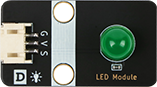                          | 尺寸：40 x 22.5mm  供电电压：3V3/5V  连接方式：PH2.0 4PIN防反接线 安装方式：M4螺钉兼容乐高插孔固定  功能：输入高电平LED亮，输入低 LED灭。                                                | [点击查看](https://test-doc-zh-cn.readthedocs.io/projects/emakefun/zh_CN/latest/sensors/displayers/LED/)                              | [点击查看](https://item.taobao.com/item.htm?spm=a1z10.5-c-s.w4002-21556097795.21.5392cf7fjuEiXb&id=613835494926)                                                                                                     |
| 45  | 1602LCD             | 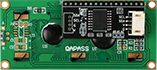                          | 尺寸：40 x 22.5mm  供电电压：5V  连接方式：PH2.0 4PIN防反接线 安装方式：M3螺钉固定  通讯方式：IIC                                                                        | [点击查看](https://test-doc-zh-cn.readthedocs.io/projects/emakefun/zh_CN/latest/sensors/displayers/LCD1602/)                          | [点击查看](https://item.taobao.com/item.htm?spm=a1z10.5-c-s.w4002-21556097795.17.2910cf7fHSX3vs&id=684487386430)                                                                                                     |
| 46  | TM1650 数码管显示模块   |           | 尺寸：40 x 22.5mm  供电电压：3V3/5V  连接方式：PH2.0 4PIN防反接线 安装方式：M2螺钉固定  通讯方式：2线串行                                                                   | [点击查看](https://test-doc-zh-cn.readthedocs.io/projects/emakefun/zh_CN/latest/sensors/displayers/TM1650/)                           | [点击查看](https://item.taobao.com/item.htm?spm=a1z10.5-c-s.w4002-21556097795.19.6eb7cf7fFsJO6r&id=686484460308)                                                                                                     |
| 47  | TM1637时钟 数码管显示模块 | 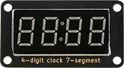  | 尺寸：40 x 22.5mm  供电电压：3V3/5V  连接方式：PH2.0 4PIN防反接线 安装方式：M2螺钉固定  通讯方式：2线串行                                                                   | [点击查看](https://test-doc-zh-cn.readthedocs.io/projects/emakefun/zh_CN/latest/sensors/displayers/TM1637/)                           | [点击查看](https://item.taobao.com/item.htm?spm=a1z10.5-c-s.w4002-21556097795.17.6eb7cf7fFsJO6r&id=686482912534)                                                                                                     |
| 48  | 8X8点阵显 示模块       | 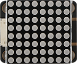                   | 尺寸：40 x 32mm  供电电压：3V3/5V  连接方式：PH2.0 4PIN防反接线 安装方式：M4螺钉兼容乐高插孔固定  通讯方式：2线串行                                                               | [点击查看](https://test-doc-zh-cn.readthedocs.io/projects/emakefun/zh_CN/latest/sensors/displayers/8x8LedDisplay/)                    | [点击查看](https://item.taobao.com/item.htm?spm=a1z10.5-c-s.w4002-21556097795.21.69d4cf7fTCHPYm&id=687406751368)                                                                                                     |
| 49  | 红绿交通灯               |                | 尺寸：56 x 32mm  供电电压：3V3/5V  连接方式：PH2.0 5PIN防反接线 安装方式：M4螺钉兼容乐高插孔固定  功能：G输入高电平绿色LED灯亮             Y输入高电平黄色LED灯亮             R输入高电平红色LED灯亮 | [点击查看](https://test-doc-zh-cn.readthedocs.io/projects/emakefun/zh_CN/latest/sensors/displayers/trafficLights/)                    | [点击查看](https://item.taobao.com/item.htm?spm=a1z10.5-c-s.w4002-21556097795.25.5392cf7f2NDbFD&id=686481880843)                                                                                                     |
| 50  | RGB三色灯              | 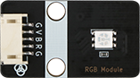                        | 尺寸：40 x 22.5mm  供电电压：3V3/5V  连接方式：PH2.0 5PIN防反接线 安装方式：M4螺钉兼容乐高插孔固定  功能：B输入高电平RGB三色灯显 示蓝色，R输入高电平RGB三色灯 显示红色，G输入高电平RGB三色 灯显绿色。        | [点击查看](https://test-doc-zh-cn.readthedocs.io/projects/emakefun/zh_CN/latest/sensors/displayers/RGB/)                              | [点击查看](https://item.taobao.com/item.htm?spm=a1z10.5-c-s.w4002-21556097795.23.5392cf7f2NDbFD&id=614081339601)                                                                                                     |
| 51  | 12位RGB 灯环模块      |           | 尺寸：40 mm  供电电压：3V3/5V  连接方式：PH2.0 4PIN防反接线 安装方式：排针接口固定  通讯方式：一线串行                                                                            | [点击查看](https://test-doc-zh-cn.readthedocs.io/projects/emakefun/zh_CN/latest/sensors/displayers/RGBRing/)                          | [点击查看](https://item.taobao.com/item.htm?spm=a1z10.5-c-s.w4002-21556097795.17.5392cf7f2NDbFD&id=613316208253)                                                                                                     |
| 52  | OLED模块              | 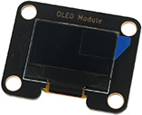                              | 尺寸：40 x 32 mm  供电电压：3V3/5V  连接方式：PH2.0 4PIN防反接线 安装方式：M4螺钉兼容乐高插孔固定  通讯方式：IIC                                                                  | [点击查看](https://test-doc-zh-cn.readthedocs.io/projects/emakefun/zh_CN/latest/sensors/displayers/GT20L16S1Y%20OLED/)                | [点击查看](https://item.taobao.com/item.htm?spm=a1z10.5-c-s.w4002-21556097795.17.318bcf7f4oOaIl&id=687119318729)                                                                                                     |
| 53  | 红外发射模块              |           | 尺寸：40 x 22.5 mm  供电电压：3V3/5V  连接方式：PH2.0 3PIN防反接线 安装方式：M4螺钉兼容乐高插孔固定                                                                         | [点击查看](https://test-doc-zh-cn.readthedocs.io/projects/emakefun/zh_CN/latest/sensors/actuators/infraredEmissionModel/)             | [点击查看](https://item.taobao.com/item.htm?spm=a1z10.5-c-s.w4002-21556097795.17.110fcf7fyj8SgF&id=693540980936)                                                                                                     |
| 54  | 红外接收模块              | 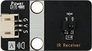                       | 尺寸：40 x 22.5 mm  供电电压：3V3/5V  连接方式：PH2.0 3PIN防反接线 安装方式：M4螺钉兼容乐高插孔固定  通讯方式：一线串行                                                               | [点击查看](https://test-doc-zh-cn.readthedocs.io/projects/emakefun/zh_CN/latest/sensors/actuators/irReceiverModel/)                   | [点击查看](https://item.taobao.com/item.htm?spm=a1z10.5-c-s.w4002-21556097795.23.5a30cf7fo8WG9D&id=688360591588)                                                                                                     |
| 55  | 颜色识别 传感器模块       | 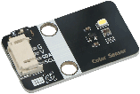              | 尺寸：40 x 22.5 mm  供电电压：5V  连接方式：PH2.0 4PIN防反接线 安装方式：M4螺钉兼容乐高插孔固定  通讯方式：IIC                                                                    | [点击查看](https://test-doc-zh-cn.readthedocs.io/projects/emakefun/zh_CN/latest/sensors/smart_modules/color_recognition/)           | [点击查看](https://item.taobao.com/item.htm?spm=a1z10.5-c-s.w4002-21556097795.17.b498cf7fiJdcXb&id=650809718169)                                                                                                     |
| 56  | DB5883 指南针模块     | 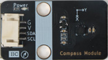                      | 尺寸：40 x 22.5 mm  供电电压：5V  连接方式：PH2.0 4PIN防反接线 安装方式：M4螺钉兼容乐高插孔固定  通讯方式：IIC                                                                    | [点击查看](https://test-doc-zh-cn.readthedocs.io/projects/emakefun/zh_CN/latest/sensors/smart_modules/compass/)                       | [点击查看](https://item.taobao.com/item.htm?spm=a1z10.5-c-s.w4002-21556097795.17.1628cf7foz1hDP&id=650454433736)                                                                                                     |
| 57  | DS1302 电子时钟模块    |                 | 尺寸：40 x 22.5 mm  供电电压：5V  连接方式：PH2.0 5PIN防反接线 安装方式：M4螺钉兼容乐高插孔固定  通讯方式：IIC                                                                    | [点击查看](https://test-doc-zh-cn.readthedocs.io/projects/emakefun/zh_CN/latest/sensors/smart_modules/ds1302_rtc/)                    | [点击查看](https://item.taobao.com/item.htm?spm=a1z10.5-c-s.w4002-21556097795.17.19accf7fdw5Pen&id=650817426726)                                                                                                     |
| 58  | MPU6050 六轴陀螺仪模   | .png) | 尺寸：40 x 22.5 mm  供电电压：5V  连接方式：PH2.0 4PIN防反接线 安装方式：M4螺钉兼容乐高插孔固定  通讯方式：IIC                                                                    | [点击查看](https://test-doc-zh-cn.readthedocs.io/projects/emakefun/zh_CN/latest/sensors/smart_modules/mpu6050/)                       | [点击查看](https://item.taobao.com/item.htm?spm=a1z10.5-c-s.w4002-21556097795.17.f904cf7fQPxgnk&id=684538725026)                                                                                                     |
| 59  | 手势 传感器模块         | 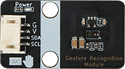       | 尺寸：40 x 22.5 mm  供电电压：5V  连接方式：PH2.0 4PIN防反接线 安装方式：M4螺钉兼容乐高插孔固定  通讯方式：IIC                                                                    | [点击查看](https://test-doc-zh-cn.readthedocs.io/projects/emakefun/zh_CN/latest/sensors/smart_modules/gestureRecognitionSensor/)      | [点击查看](https://item.taobao.com/item.htm?spm=a1z10.5-c-s.w4002-21556097795.17.6e82cf7fy1MLj0&id=694604372568)                                                                                                     |
| 60  | LD3320 语音识别模块    | 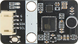                      | 尺寸：40 x 22.5 mm  供电电压：5V  连接方式：PH2.0 4PIN防反接线 安装方式：M4螺钉兼容乐高插孔固定  通讯方式：IIC                                                                    | [点击查看](https://test-doc-zh-cn.readthedocs.io/projects/emakefun/zh_CN/latest/sensors/smart_modules/ld3320/)                        | [点击查看](https://item.taobao.com/item.htm?spm=a1z10.5-c-s.w4002-21556097795.17.56e4cf7flvkQU1&id=650810486058)                                                                                                     |
| 61  | MP3语音模块             |                        | 尺寸：40 x 22.5 mm  供电电压：5V  连接方式：PH2.0 4PIN防反接线 安装方式：M4螺钉兼容乐高插孔固定  通讯方式：UART                                                                   | [点击查看](https://test-doc-zh-cn.readthedocs.io/projects/emakefun/zh_CN/latest/sensors/smart_modules/MP3/)                           | [点击查看](https://item.taobao.com/item.htm?spm=a1z10.5-c-s.w4002-21556097795.19.f7e6cf7fieckM1&id=650812782908)                                                                                                     |
| 62  | MQTT 物联网无线模块     | 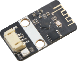              | 尺寸：40 x 22.5 mm  供电电压：5V  连接方式：PH2.0 4PIN防反接线 安装方式：M4螺钉兼容乐高插孔固定  通讯方式：UART                                                                   | [点击查看](https://test-doc-zh-cn.readthedocs.io/projects/emakefun/zh_CN/latest/sensors/smart_modules/esp8266_mqtt/)                  | [点击查看](https://item.taobao.com/item.htm?spm=a1z10.5-c-s.w4002-21556097795.17.1dbdcf7f4tqpCp&id=651185247161)                                                                                                     |
| 63  | 语音合成模块              |                                                        | 尺寸：40 x 22.5 mm  供电电压：5V  连接方式：PH2.0 4PIN防反接线 安装方式：M4螺钉兼容乐高插孔固定  通讯方式：UART/IIC                                                               | [点击查看](https://test-doc-zh-cn.readthedocs.io/projects/emakefun/zh_CN/latest/sensors/smart_modules/tts_module/)                    | [点击查看](https://item.taobao.com/item.htm?spm=a1z10.5-c-s.w4002-21556097795.17.32a7cf7f6ANAdm&id=650810486058)                                                                                                     |
| 64  | 7.4V充电 电池模块      | 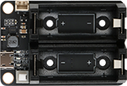           | 尺寸：57 x 40 mm  供电电压：5V  连接方式：PH2.0 4PIN防反接线 安装方式：M4螺钉兼容乐高插孔固定  电池类型：7.4V 2S锂聚合物/锂离 子电池                                                    | [点击查看](https://test-doc-zh-cn.readthedocs.io/projects/emakefun/zh_CN/latest/sensors/power_module/2xcr123a_li_ion_battery_module/) | [点击查看](https://item.taobao.com/item.htm?spm=a1z10.3-c-s.w4002-21556097790.11.721568feIThYa6&id=686519692234)                                                                                                     |
| 65  | 3.7V升压充电 电池模块    | 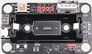         | 尺寸：57 x 32 mm  供电电压：5V  连接方式：PH2.0 4PIN防反接线 安装方式：M4螺钉兼容乐高插孔固定  电池类型：3.7V 2S锂聚合物/锂离 子电池                                                    | [点击查看](https://test-doc-zh-cn.readthedocs.io/projects/emakefun/zh_CN/latest/sensors/power_module/3.7v_module/)                    | [点击查看](https://item.taobao.com/item.htm?spm=a1z10.3-c-s.w4002-21556097790.9.448368feuEWPQJ&id=686519692234)                                                                                                      |