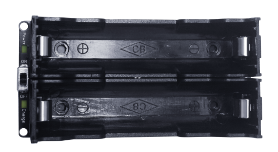
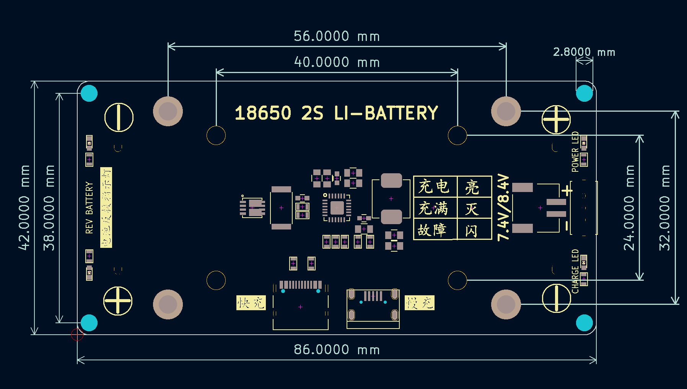

# 两节18650锂电池锂电池模块

## 实物图

## 概述
​		8.4V锂电池充电模块，板载2节18650电池盒。直接通过usb接口直接5V电压充电，最高充电电流达到1.2A ，TypeC接口支持PD快充，最大15W充电，两节2000mA锂电池充电，最快1个小时充满。 通过PH2.0接口直接输出锂电池电压。

## 模块参数

- micro-usb接口充电输入电压 ：5V 1.2A

- TypeC接口支持快充： 最大15W 输入充电

- 升压充电效率94%

- 电池类型：18650锂电池(充满电压8.4V)

- 模块尺寸：86 * 42mm

- 安装方式：M3螺钉固定

- 集成输出过流、 输入欠压、 过压、 过温、电池反接等保护功能，支持均衡充电

  

## 充电过程

 当电池电压小于3.7V时，以50mA的电流对电池充电。
当电池电压大于3.7V小于6V时，以100mA的电流对电池充电。
当电池电压大于6V时，以设定的恒流电流1.2A充电；
当电池电压接近8.4V时，进入恒压充电模式。
电池充满停充后，且输入持续存在，如果电池电压小于8V，就会再次开启充电 

## 快充过程

 当电池电压 VBAT<6.2V 时， 不申请快充，只是以 5V 输入充电；
当电池电压 6.2V<=VBAT<6.8V，会尝试申请 5.4V 输入快充；
当电池电压 6.8V<=VBAT<7.8V，会尝试申请 6V 输入快充；
当电池电压 VBAT>=7.8V 后，会尝试申请 7V 输入快充  

## LED状态说明

| LED                | 描述                                         |
| ------------------ | -------------------------------------------- |
| Power蓝色指示灯    | 拨动开关打到ON时电源蓝色灯亮起               |
| REV BAT 红色指示灯 | 当18650电池盒里的电池接反时，对应的红灯亮起  |
| CHG绿色指示灯      | 绿色常亮表示正在充电，充满后灯熄灭，异常闪烁 |

## 机械尺寸图

