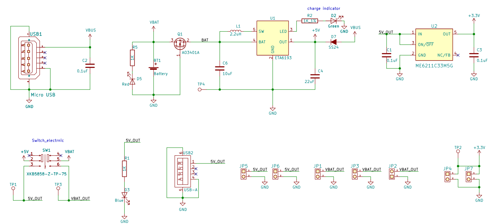
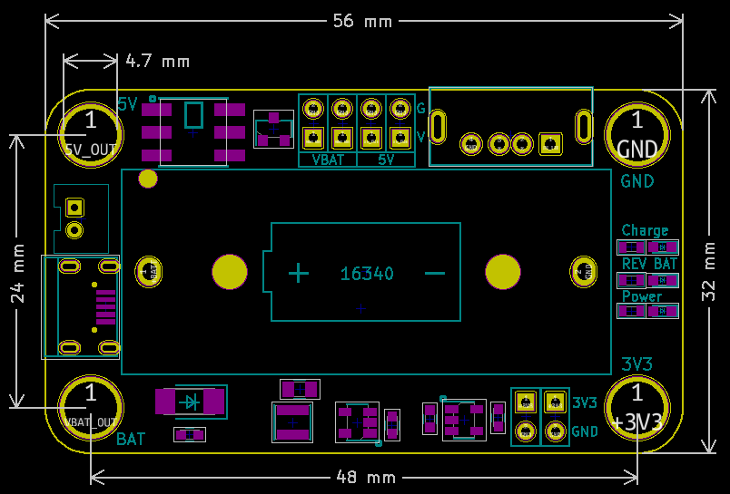

# 3.7V锂电池充电模块

## 实物图

## 概述
​		3.7V锂电池充电模块，板载16340电池盒。仅需一个手机充电头（或充电宝、排针接口）和一条安卓数据线，即可为板载16340电池提供最高1A的安全高效充电,也可以通过PH2.0接口、排针接口或金属孔位给其他3.7V锂电池充电(如用PH2.0接口或排针接口给锂电池充电时,需将自锁按键按下),除了作为充电模块使用以外，也可以将其作为供电电源使用，按下自锁按键时板载16340电池通过排针接口与USB-A接口和金属空位输出5V或3V3直流电源。 

## 模块参数	

-  USB充电输入电压 ：5V
- 电池类型：3.7V 2S锂聚合物/锂离子电池(充满电电压4.2V)
- 模块尺寸：56 x 32 mm
- 安装方式：M4螺钉螺母固定
- 电池过充/反接保护

## LED状态说明

| LED            | 描述                                                         |
| -------------- | ------------------------------------------------------------ |
| Power指示灯    | 当自锁按键按下时Power指示灯常亮                              |
| REV BAT 指示灯 | 当16340电池盒里的电池反接或PH2.0接口上接有的电池反接时,REV指示灯常亮 |
| CHG指示灯      | 闪烁表示正在充电，常亮表示电池已经充满                       |

## 原理图

[原理图下载](3.7V_Battery_Module/3.7V_Battery_Module.pdf)

## 机械尺寸图

