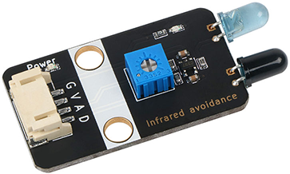
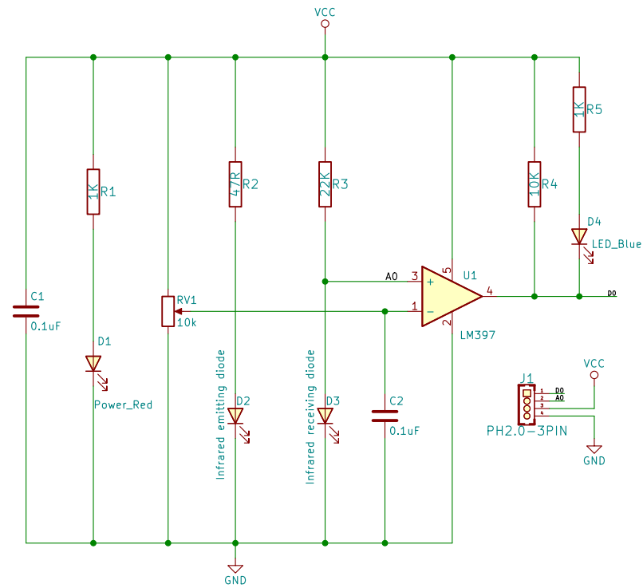
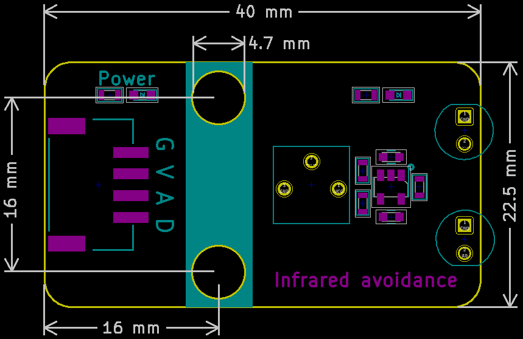

# 红外避障传感器模块

## 实物图



## 概述

​		火焰传感器是一种传感器装置，广泛应用与机器人避障、避障小车、流水线计数等众多场合。该传感器模块对环境光线适应能力强，其具有一堆红外发射与接收管， 发射管发射出一定频率的红外线，当检测方向遇到障碍物（反射面）时，红外线反射回来被接收管接收，经过比较器电路处理之后，蓝色指示灯会亮起，同时信号输出接口输出数字信号（一个低电平信号），可通过电位器旋钮调节检测距离，有效距离范围2～30cm，工作电压为3.3V-5V。该传感器的探测距离可以通过电位器调节、具有干扰小、便于装配、使用方便等特点。

## 原理图

 [查看原理图](infrared_obstacle_avoidance_module/InfraredObstacleAvoidance_schematic.pdf) 



## 模块参数
| 引脚名称 |     描述     |
| :------: | :----------: |
|    G     |     GND      |
|    V     |     VCC      |
|    A     | 模拟信号引脚 |
|    D     | 数字信号引脚 |
- 供电电压:3v3/5V

- 连接方式:4PIN防反接杜邦线

- 模块尺寸:40 x 22.5 mm

- 安装方式:M4螺钉兼容乐高插孔固定


## 机械尺寸


## Arduino示例程序

[下载示例程序](infrared_obstacle_avoidance_module/InfraredObstacleAvoidanceModule.zip)

```c++
#include "Buzzer.h"

#define DigitalPin  7//定义红外避障模块数字引脚
#define AnalogPin  A0//定义红外避障模块模拟引脚
#define BuzzerPin A3//定义无源蜂鸣器块引脚

Buzzer buzzer(BuzzerPin) ;
int  AnalogValue = 0 ;//定义数字变量,读取红外避障模块模拟值
int  DigitalValue = 0 ;//定义数字变量,读取红外避障模块数字值
void setup()
{
  Serial.begin(9600);//设置串口波特率
  pinMode(DigitalPin, INPUT);//设置红外避障模块数字引脚为输入
  pinMode(AnalogPin, INPUT);//设置红外避障模块模拟引脚为输入
  pinMode(BuzzerPin, OUTPUT);//设置无源蜂鸣器模块引脚为输出
}
void loop()
{
  buzzer.noTone();//蜂鸣器停止
  AnalogValue = analogRead(AnalogPin);//读取红外避障模块模拟值
  DigitalValue = digitalRead(DigitalPin);//读取红外避障模块数字值
  Serial.print("InfraredObstacleAvoidanceModuleAnalog Data:  ");
  Serial.print(AnalogValue);//打印红外避障模块模拟值
  Serial.print("InfraredObstacleAvoidanceModuleDigital Data:  ");
  Serial.println(DigitalValue);//打印红外避障模块数字值
  if (DigitalValue == 0) {//判断红外避障模块是否检测到障碍物  检测到障碍物  蜂鸣器报警 
     for(int i = 200; i <= 800; i++)
     {
       buzzer.tone(i, 10);
     }
     for(int i= 800; i >= 200; i--)
     {
        buzzer.tone(i, 10);
     }
  }
  delay(200);
}
```

## microbit示例程序

<a href="https://makecode.microbit.org/_hHeEbt5H048T" target="_blank">动手试一试</a>