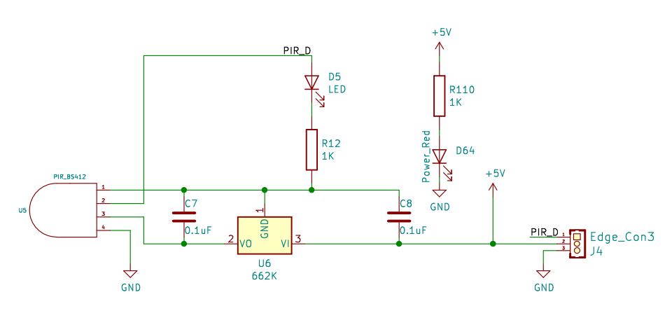

# 人体热释电传感器

## 模块图

## 概述

​		人体感应模块是基于红外线技术的自动控制产品,灵敏度高，可靠性强，超小体积，超低电压工作模式。广泛应用于各类自动感应电器设备,尤其是干电池供电的自动控制产品。全自动感应，人进入其感应范围则输出高电平，人离开感应范围则自动延时关闭高电平，输出低电平。可重复触发方式：即感应输出高电平后，在延时时间段内，如果有人体在其感应范围活动，其输出将一直保持高电平，直到人离开后才延时将高电平变为低电平，感应模块检测到人体的每一次活动后会自动顺延一个延时时间段（5S），并且以最后一次活动的时间为延时时间的起始点。

## 原理图

## 模块参数

| 引脚名称 | 描述       |
| -------- | ---------- |
| V        | 5V电源引脚 |
| G        | GND 地线   |
| S        | 信号引脚   |

1.供电电压:5V
2.连接方式:3PIN防反接杜邦线
3.模块尺寸:4*2.1cm
4.安装方式:M4螺钉兼容乐高插孔固定

## 详细原理图

 [人体.pdf](人体热释电传感器模块图片/人体.pdf) 

## 机械尺寸

