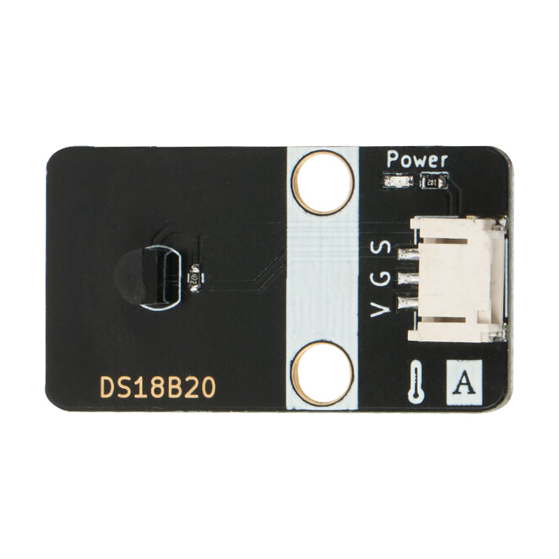
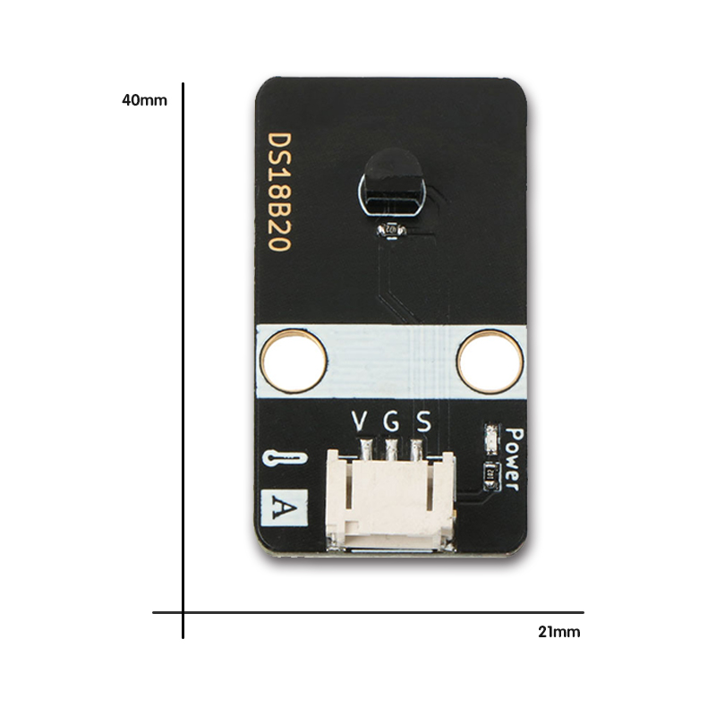
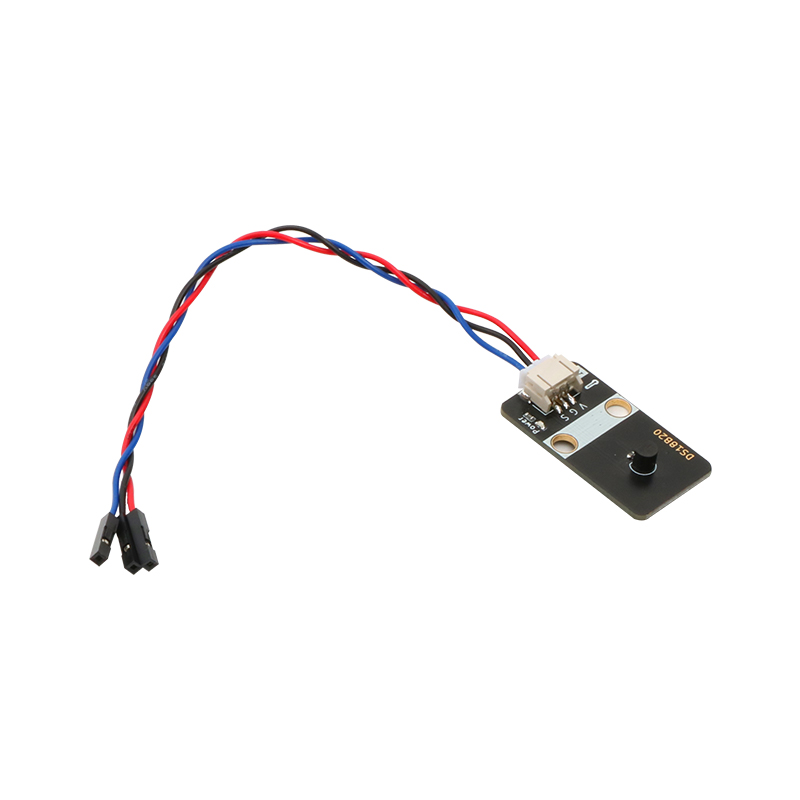

# DS18B20数字温度传感器模块规格书



## 概述

 DS18B20是常用的数字温度传感器，其输出的是数字信号，具有体积小，硬件开销低，抗干扰能力强，精度高的特点。 DS18B20数字温度传感器接线方便，  封装后的DS18B20可用于电缆沟测温，高炉水循环测温，锅炉测温，机房测温，农业大棚测温，洁净室测温，弹药库测温等各种非极限温度场合。耐磨耐碰，体积小，使用方便，封装形式多样，适用于各种狭小空间设备数字测温和控制领域。 

## 模块参数

* 工作电压：5V
* 连接方式：3 PIN 防反接杜邦线
* 模块尺寸：4 * 2.1cm
* 安装方式：M4螺钉螺母固定

## 引脚定义

| 引脚名称| 描述 |
|---- |----|
| V | 5V电源引脚 |
| G | GND 地线 |
| S | 信号引脚 |

## 模块尺寸



## 连接方式




##  arduino 应用场景

### arduino 程序代码

```c++
#include "OneWire.h"
#include "DallasTemperature.h"
#define ONE_WIRE_BUS 4            
OneWire oneWire(ONE_WIRE_BUS);    
DallasTemperature sensors(&oneWire);
 
void setup()
{
  Serial.begin(9600);            
  sensors.begin();                
}
 
void loop(void)
{ 
  sensors.requestTemperatures();  
  Serial.print("The temperature is:");         
  Serial.print(sensors.getTempCByIndex(0)); 
  Serial.println("℃");
  delay(200);
}
```

### 实验效果图

