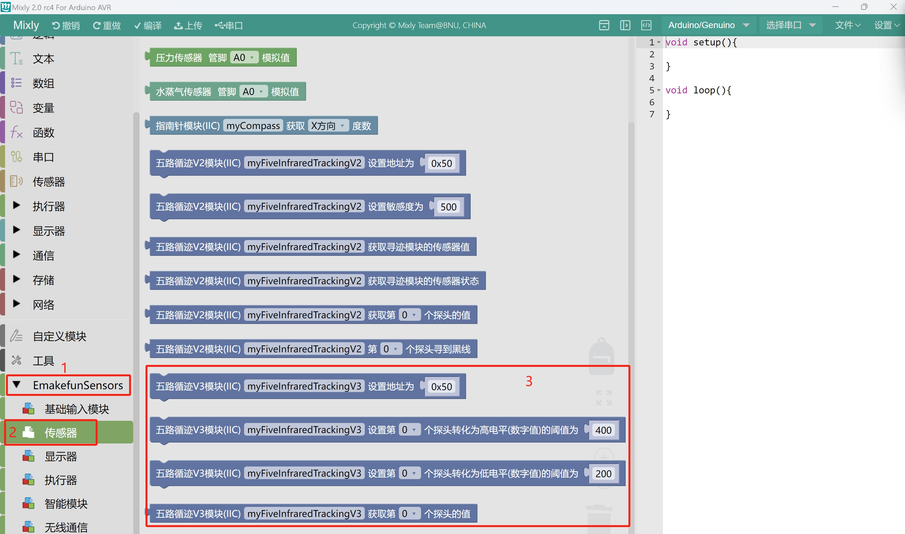
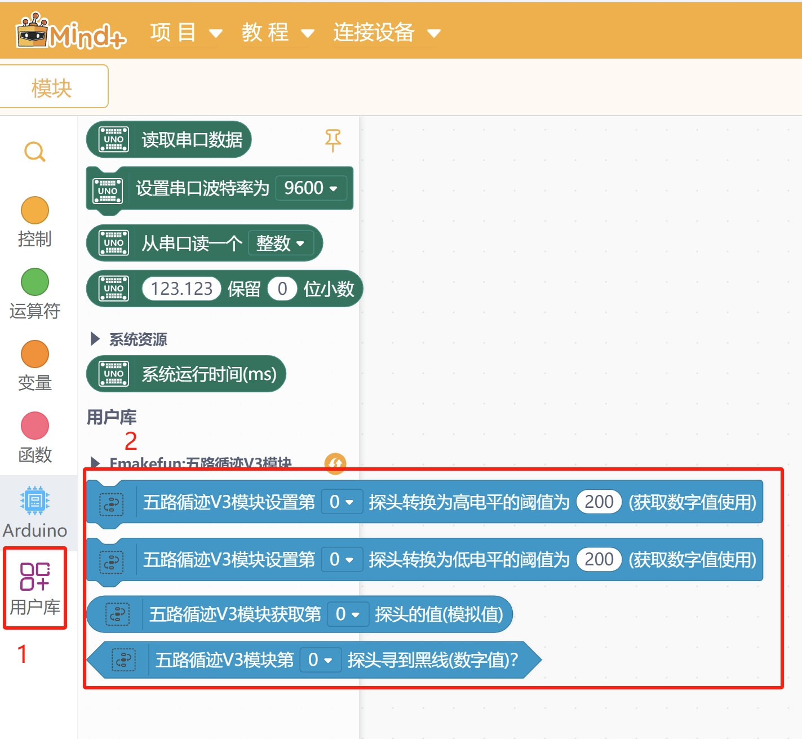

# 五路循迹模块V3.0

## 描述

该模块对线的探测主要是使用灰度传感器，它是一对抗干扰较强的光电传感器，其中发射管的光源采用高亮白色聚光LED，发射管端发出的光线通过不同环境背景的反射之后，最终由光敏接收管来接收，光敏接收管的阻抗随反射光线的强弱变化而变化（反射光线越强，阻值越小），最后通过分压和运放比较电路实现数字和模拟信号的双输出。

灰度传感器模块对白光反射强弱不同背景环境有非常好的识别效果，背景差异越大，分辨效果越好。灰度传感器相比普通红外传感器有着更高的抗干扰能力。

该模块支持五路数字输出，识别到黑线输出0，未识别到黑线输出1，我们可以通过设置灰度反射模拟阈值，来调节循迹检测高度。

该模块也可以直接读取五路灰度接收传感器上的模拟电压值， 当检测到黑线或者越靠近黑线时数值越大，反之越小。

建议探头距离地面1CM左右最佳。

## 实物图

## 产品参数

- 工作电压：3~5V
- 通信方式：IIC
- 接口类型：PH2.0-4Pin (G V SDA SCL)
- 检测高度：0.5cm ~ 4 cm
- 输出值：模拟值和数字值

## 引脚定义

| 引脚名称 | 描述       |
| ---- | -------- |
| V    | 3~5V电源引脚 |
| G    | GND 地线   |
| SDA  | IIC数据引脚  |
| SCL  | IIC时钟引脚  |

## 模块尺寸

## 使用说明

循迹模块中可读取每个光敏探头的接收模拟值和数字值。每个探头设有高阈值和低阈值。当模拟值高于高阈值时，数字值为 0；当模拟值低于低阈值时，数字值为 1。若模拟值处于高阈值与低阈值之间，则数字值不会发生变化。换言之，模拟值增大时，需高于高阈值，数字值才会变为 0；模拟值减小时，需低于低阈值，数字值才会变为 1，从而达到延迟反向的效果。

高低阈值可以由用户根据实际场景自行设置。若用户未设置，则会采用出厂固件中的默认值。建议先将模块安装在小车上，使探头离地约 1CM。然后，将车放在线上，让所有探头能够检测到线，此时使用程序读取出模拟值并计算平均值，记为`X`。接着，把车放离线上，使所有探头能检测到非线地面，再次使用程序读取出模拟值并计算平均值，记为`Y`。高阈值可设置为`(X - Y) * 2 / 3 + Y`，低阈值设置为`(X - Y) / 3 + Y`。

如何设置阈值和如何读取数字值模拟值请参考后面使用章节

## Arduino(C/C++)示例代码

### Arduino库和示例代码

[点击这里下载Arduino库和示例代码](emakefun_five_line_tracker_v3.zip)

## Micropython示例代码

[点击此处下载ESP32MicroPython示例代码](five_line_tracker_v3_micropython.zip)

## Mixly图形化块

[点击下载米思齐五路循迹V3.0获取模拟值示例程序](./examples/mixly_get_analog.zip)

[点击下载米思齐五路循迹V3.0获取数字值示例程序](./examples/mixly_get_digital.zip)

## Mind+图形化

[点击下载Mind+五路循迹V3.0用户库](./libs/emakefun-em_five_tracker_v3-thirdex-V0.0.1.mpext)

[点击下载mind+示例](./examples/mindplus_example.mp)

## Microbit示例程序

敬请期待.....

