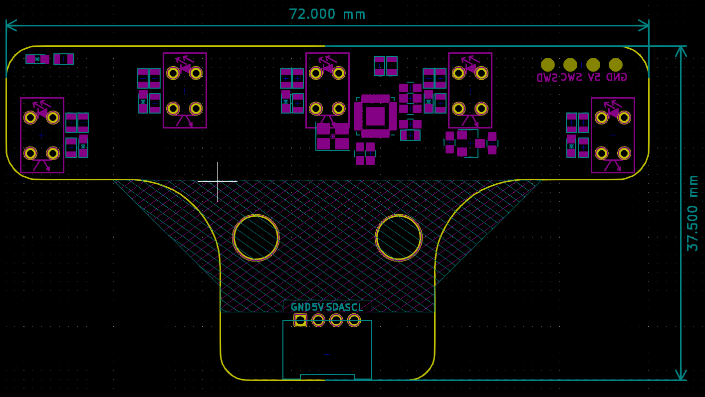

# 五路循迹模块V2.0

## 概述

五路循迹是一款基于红外感光原理的传感器模块，它包含五组红外发射和接收器件。当红外发射二极管发射红外线时，若有物体反射红外线，红外接收器就会接收到反射回来的信号，并输出模拟电压值。传感器输出的电压值与反射的强弱成反比关系，即反射越强，输出电压越小；反射越弱，输出电压越大。

本模块支持五路数字输出，并且可以设置红外反射模拟阈值。通过读取传感器的模拟电压值，可以判断传感器距离黑线的远近。数值越大的传感器距离黑线越近，相反数值越小传感器距离黑线越远。

使用该传感器模块，你可以通过读取传感器的数字输出或模拟电压值来实现循迹或避障等功能。具体的使用方法，请参考本库的示例代码和API文档。

## 硬件参数

- 工作电压：5V
- 通信方式：IIC
- 接口类型：PH2.0-4Pin (G V SDA SCL)
- 有效高度：0.5cm ~ 4 cm

## 寄存器地址

| 地址   | 描述 |
|:-----|:-----|
| 0x50 | 模块的 IIC地址 |
| 0x00 | 红外线反射检测灵敏度配置寄存器，范围0~1000（当传感器读取到的值大于此值时，传感器对应的灯灭，代表识别到黑线）|
| 0x02 | 传感器模拟数据的起始地址，使用时请求10字节数据 <br> 每两字节表示一路输出0~1023（高8位在前，低8位在后）|
| 0x0c | 传感器状态位地址，读取一字节数据 <br> bit0 bit1 bit2 bit3 bit4 <br> inf1 inf2 inf3 inf4 inf5 <br> 分别对用五路循迹状态，0代表识别到黑线，1代表未识别到黑线 |

## 引脚定义

| 引脚名称 | 描述 |
|------|---------|
| V    | 5V电源引脚  |
| G    | GND 地线  |
| SDA  | IIC数据引脚 |
| SCL  | IIC时钟引脚 |

## 模块尺寸



### Arduino使用教程

#### 安装库文件

[点击这里下载库文件:https://github.com/emakefun/emakefun_line_tracker](https://github.com/emakefun/emakefun_line_tracker)

#### 函数说明

##### 创建 LineTracker 对象

```c++
LineTracker line_tracker;
```

##### 设置敏感度

```c++
line_tracker.SetSensitivity(sensitivity);
```

其中 `sensitivity` 为敏感度值，取值范围为 1 ~ 1023。敏感度越高，模块对黑色物体的检测越敏感。

##### 获取传感器值

```c++
const uint16_t* sensor_values = line_tracker.GetSensorValues();
```

获取包含传感器值的数组，数组长度为 5，分别表示5个传感器的电压值，sensor_values[0] ~ sensor_values[4]对应硬件上面**从右到左**5个传感器。电压值越大表示反光越弱，即传感器越接近黑线。

##### 获取传感器状态

```c++
uint8_t sensor_states = line_tracker.GetSensorStates();
```

获取一个字节的值，表示寻迹模块的传感器状态。每个位表示一个传感器的状态，**1 表示传感器不在黑线上，0 表示在黑线上**。
状态值的低位到高位(bit0 ~ bit4)分别对应硬件上面**从右到左**5个传感器状态值

#### 示例代码

```c++
#include <Arduino.h>
#include <line_tracker.h>

// 创建 LineTracker 实例
LineTracker line_tracker;

void setup() {
  // 初始化串口通信
  Serial.begin(115200);
  Serial.println("setup");

  // 设置 LineTracker 的敏感度为 500
  line_tracker.SetSensitivity(500);
}

void loop() {
  String log;
  log += "sensor_states: 0x";

  // 获取传感器状态并转换为 16 进制格式字符串
  log += String(line_tracker.GetSensorStates(), HEX);
  log += " ";

  // 获取传感器值数组并逐一添加到 log 字符串中
  auto* sensor_values = line_tracker.GetSensorValues();
  for (uint8_t i = 0; i < LineTracker::LINE_NUMBER; i++) {
    log += i;
    log += ":";
    log += sensor_values[i]; // 获取一路传感器的值加到日志log变量中
    log += " ";
  }

  // 输出 log 字符串到串口
  Serial.println(log);
}
```

### MagicBlock图形化编程块

### Mixly图形化块（暂不支持）

### microbit makecode块

### microbit micropython支持

敬请期待
