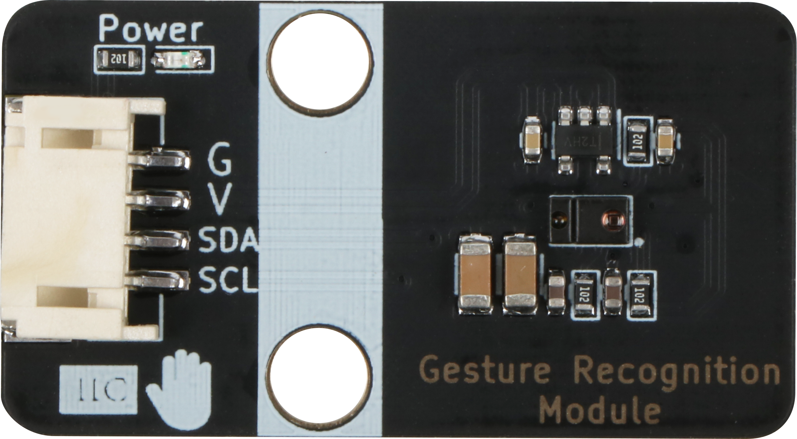

# 手势传感器模块规格书

## 模块图

##　概述

　　手势检测利用四个方向的光电二极管感应反射的红外能量（由集成LED提供），将物理运动信息（即速度、方向和距离）转换为数字信息。手势引擎的体系结构具有自动激活（基于接近引擎结果）、环境光减法、串音消除、双8位数据转换器、省电的内部转换延迟、32个数据集FIFO和中断驱动的I2C总线通信。手势引擎可满足各种移动设备手势要求：简单的上下左右手势或更复杂的手势可以被准确地感知。通过可调的红外LED定时，功耗和噪音最小化。

## 原理图

## 模块参数

| 引脚名称 | 描述         |
| -------- | ------------ |
| V        | 5V电源引脚   |
| G        | GND 地线     |
| SDA      | IIC 数据引脚 |
| SCL      | IIC 时钟引脚 |

## 详细原理图

  [手势传感器.pdf](手势传感器模块模块图片/手势传感器.pdf) 

## 机械尺寸

