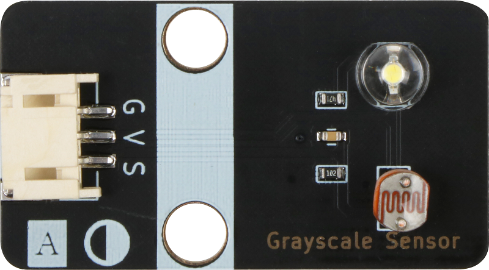

# 灰度传感器模块

## 实物图



## 概述

​        灰度传感器是模拟传感器，有一个发光二极管和一个光敏电阻，安装在同一面上。灰度传感器利用不同颜色的检测面对光的反射程度不同，光敏电阻对不同检测面返回的光的阻值也不同的原理进行颜色深浅检测。在有效的检测距离内，发光二极管发出白光，照射在检测面上，检测面反射部分光线，光敏电阻检测此光线的强度并将其转换为可以识别的信号。它输出的是连续的模拟信号。可以作为巡线小车的巡线传感器或者足球机器人的场地灰度识别。


## 原理图


## 模块参数

| 引脚名称 | 描述       |
| -------- | ---------- |
| V        | 5V电源引脚 |
| G        | GND 地线   |
| S        | 信号引脚   |

- 供电电压:5V

- 连接方式:4PIN防反接杜邦线

- 模块尺寸:4*2.1cm

- 安装方式:M4螺钉兼容乐高插孔固定

## 详细原理图

 [查看原理图](grayscale_sensor/灰度传感器.pdf) 

## 机械尺寸


## 示例程序

```c
void setup(){
  Serial.begin(9600);  // Set the serial port baud rate to 9600
  pinMode(A3, INPUT);   // Set A3 port as input mode
}

void loop(){
  Serial.println(analogRead(A3));  // Print the data read from A3 port
  delay(200); // Delay 200 milliseconds

}
```

