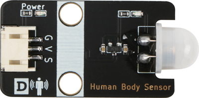
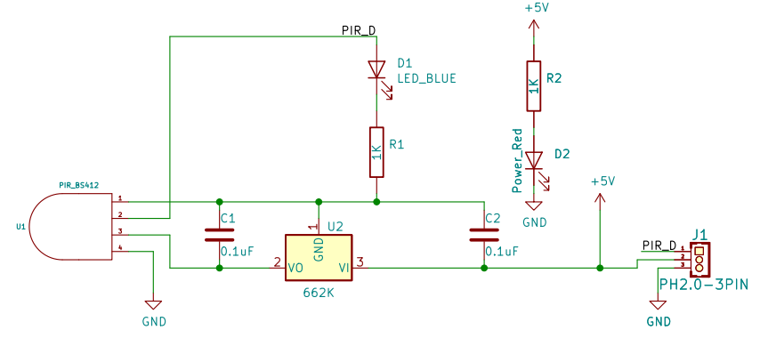
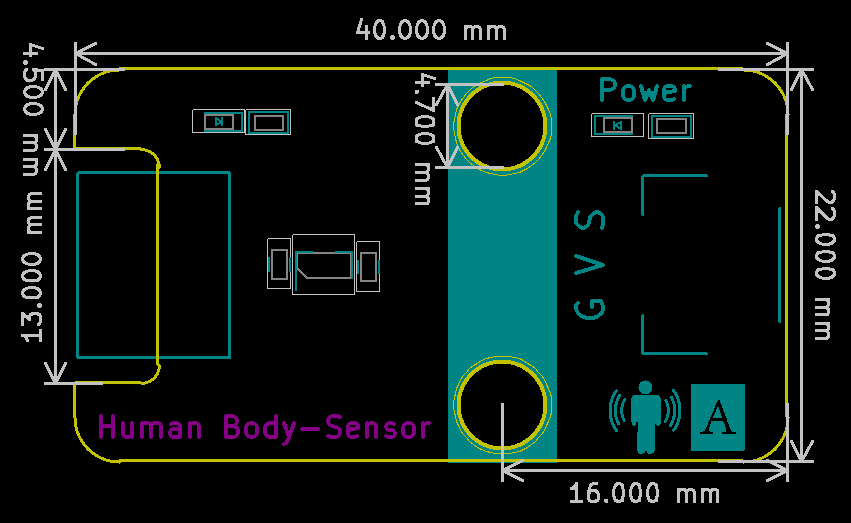

# 人体热释电传感器

## 实物图



## 概述

​		人体感应模块是基于红外线技术的自动控制产品,灵敏度高，可靠性强，超小体积，超低电压工作模式。广泛应用于各类自动感应电器设备,尤其是干电池供电的自动控制产品。全自动感应，人进入其感应范围则输出高电平，人离开感应范围则自动延时关闭高电平，输出低电平。可重复触发方式：即感应输出高电平后，在延时时间段内，如果有人体在其感应范围活动，其输出将一直保持高电平，直到人离开后才延时将高电平变为低电平，感应模块检测到人体的每一次活动后会自动顺延一个延时时间段（5S），并且以最后一次活动的时间为延时时间的起始点。

## 原理图



## 模块参数

| 引脚名称 | 描述       |
| -------- | ---------- |
| V        | 5V电源引脚 |
| G        | GND 地线   |
| S        | 信号引脚   |

- 供电电压:5V

- 连接方式:3PIN防反接杜邦线

- 模块尺寸:4*2.1cm

- 安装方式:M4螺钉兼容乐高插孔固定

## 详细原理图

 [查看原理图](human_body_sensor/human_body_sensor_schematic.pdf) 

## 机械尺寸图



## Arduino示例程序

[下载示例程序](human_body_sensor/human_body_sensor.zip) 

```c
void setup()
{
    Serial.begin(9600); 
	pinMode(A3, INPUT); 
	pinMode(3, OUTPUT); 
}

void loop()
{
    if (digitalRead(A3) == 1)   
    {  
        digitalWrite(3, HIGH);  
    } else {
        digitalWrite(3, LOW); 
    }
}
```

## microbit示例程序

<a href="https://makecode.microbit.org/_C6J5cuMMF8FU" target="_blank">动手试一试</a>