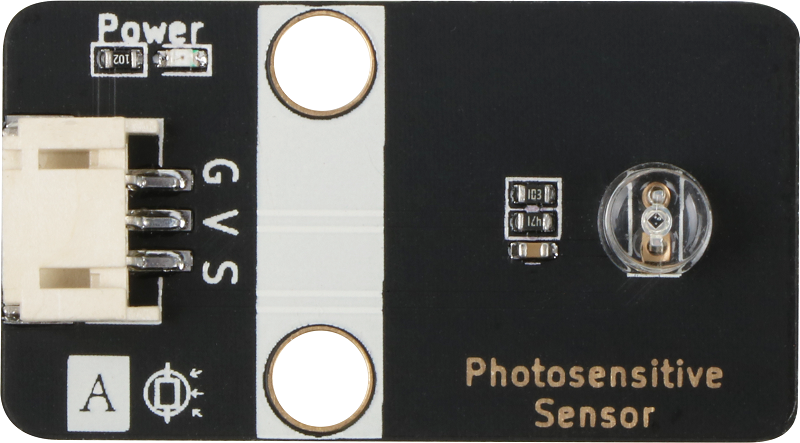
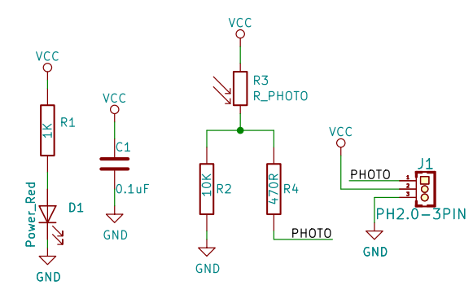
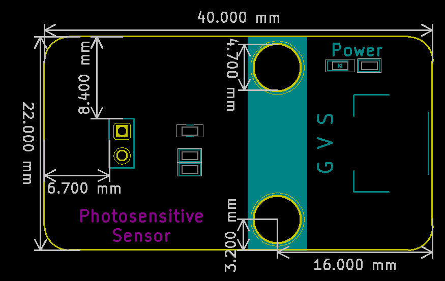

# 光敏传感器模块规格书

## 实物图



## 概述

​       众所周知，走廊中的语音控制灯除了语音控制外还有一个传感器，即光敏传感器。光电传感器也称为光敏电阻。它（光敏电阻，缩写为LDR）通常由硫化镉制成。当入射光上升时，电阻阻值会降低; 入射光减弱，阻值会增加。光敏电阻常用于光测量，控制和转换（光与电之间的变化）会发生变化（光变为电），它也可广泛应用于各种光控电路，比如控制 和调节灯以及光开关。 光敏电阻模块对环境光线最敏感，一般用来检测周围环境的光线的亮度，触发单片机或继电器模块等  。

## 原理图



## 模块参数

| 引脚名称 | 描述       |
| -------- | ---------- |
| V        | 5V电源引脚 |
| G        | GND 地线   |
| S        | 信号引脚   |

* 1.供电电压:5V
* 2.连接方式:3PIN防反接杜邦线
* 3.模块尺寸:4*2.1cm
* 4.安装方式:M4螺钉兼容乐高插孔固定

## 详细原理图

 [查看原理图](photo_sensitive_sensor/photo_sensitive_sensor_schematic.pdf) 

## 机械尺寸图 



## Arduino示例程序

 [下载示例程序](photo_sensitive_sensor/photo_sensitive_sensor.zip) 

```c++
#define PhotosensitivePin  A3//定义光敏传感器模块引脚
#define LedPin 3//定义LED模块引脚
int  PhotosensitiveValue = 0 ;//定义数字变量,读取光敏值
void setup()
{
  Serial.begin(9600);//设置串口波特率
  pinMode(PhotosensitivePin, INPUT);//设置光敏传感器模块引脚为输入
  pinMode(LedPin, OUTPUT);//设置LED模块引脚为输出
}
void loop()
{
  PhotosensitiveValue = analogRead(PhotosensitivePin);//读取光敏值
  Serial.print("Photosensitive Data:  ");
  Serial.println(PhotosensitiveValue);//打印光敏值
  if (PhotosensitiveValue < 50) { //打印光敏值
    digitalWrite(LedPin, HIGH);//如果光敏值小于50则执行此处,LED引脚为高电平
  } else {
    digitalWrite(LedPin, LOW);//如果光敏值小于50则执行此处,LED引脚为低电平
  }
}
```

