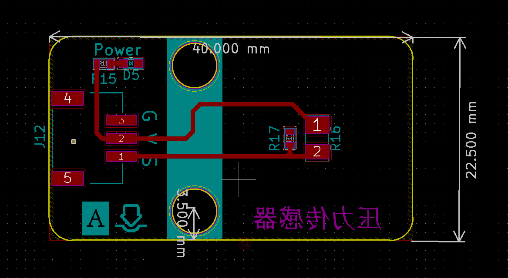

# 压力传感器模块

## 概述

薄膜压力传感器模块是基于新型纳米压敏材料辅以舒适杨式模量的超薄薄膜衬底一次性贴片而成，兼具防水和压敏双重功能。当传感器感知到外界的压力变化虎，传感器电阻值发生变化，我们采用电路讲传感器感知到的压力信号转换成相应变化的强度电信号输出。这样我们就可以通过检测电信号的变化就可以得知压力的变化情况。

## 模块参数

- 工作电压：5V
- 连接方式：3 PIN 防反接杜邦线
- 模块尺寸：4 * 2.1cm
- 安装方式：M4螺钉螺母固定

## 引脚定义

| 引脚名称 | 描述       |
| -------- | ---------- |
| G        | GND地线    |
| V        | 5V电源引脚 |
| S        | 数字引脚   |

## 原理图

## 模块尺寸

