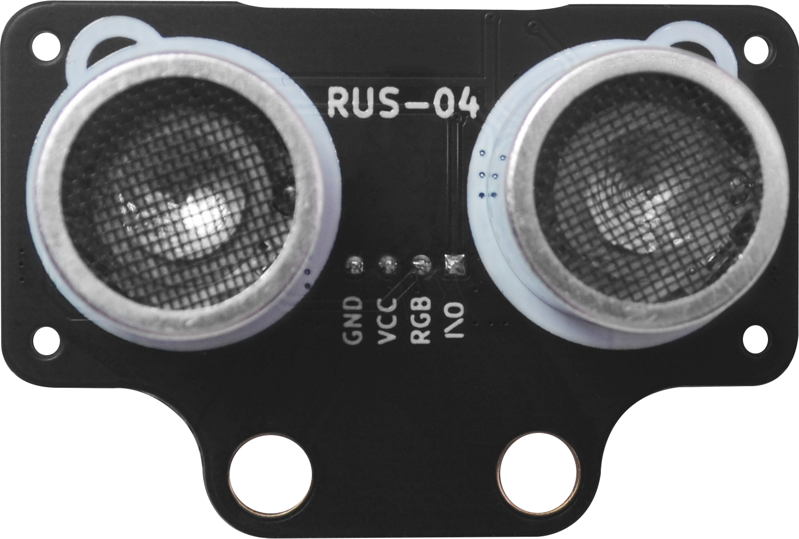

#  概述

|RUS-04(黑色款)|RUS-04|
| :-: | :-: |
|  |  |

## 产品简介

​		RUS-04是一款内置 6 颗炫彩 LED，单 总线超声波测距模块。 每个探头内部集成 3 颗 0807(WS2812)炫 彩 LED，可通程序控制 RGB 三色 LED，探头输 出各种颜色，使产品更加炫丽。特别应用于 玩具超声测距，机器人等应用。 2CM 超小盲区，4M 典型最远测距。采用 自研超声波测距解调芯片 RUS-04，单总 线，外围更加简洁，芯片内置高精度振荡器， 无需额外晶振。驱动采用扫频技术，减少探 头本身一致性对模块灵敏度的影响。

## 模块参数

|功能|RUS-04（黑色款）|RUS-04|HC-04(普通款)|
| :-: | :-: | :-: | :-: |
| 工作电压 | 3.5V~5.5V | 3.5V~5.5V |3.5V~5.5V|
| 功耗电流| 不开灯珠15mA 开灯珠65m | 不开灯珠15mA 开灯珠65m |15mA|
| RGB灯珠数量 | 6颗 | 6颗 |0颗|
| 谐振频率 | 40K | 40K |40K|
| 探测距离范围 | 2cm～4米 | 2cm～4米 |2cm～4米|
| 探测精度 | 1cm±2% |        1cm±2%        |1cm±2%|
| 探测角度 | < ±15-20° | < ±15-20° |< ±15-20°|
| 测量周期时间 | 60ms | 60ms |60ms|
| 工作温度范围 | -10℃~80℃ |       -10℃~80℃       |-10℃~80℃|
| 外形尺寸 | 48mm x 32mm x20mm | 45.2mm x 20.4mm x20mm |一款与RUS-04一样 二款与RUS-04(黑色款)一样|
| 接口 | PH2.0 - 4Pin或 RJ25接口两种接线方式 | PH2.0 - 4Pin或 2.54mm排针两种接线方式 |一款与RUS-04一样 二款与RUS-04(黑色款)一样|
| 通讯引脚 | IO：超声波引脚   RGB:RGB灯珠引脚 | IO：超声波引脚  RGB:RGB灯珠引脚 ||

## 模块结构图

### RUS-04结构图

​													 
### RUS-04(黑色版)结构图

# 模块原理介绍

## 超声波部分测量操作

​		外部 MCU 初始设置为输出，给模块 I/O 脚一个大于 10uS 的高电平脉冲；输出脉冲信号后，MCU 设置 为输入模式，等待模块给出的一个与距离等比的高电平脉冲信号；测量结束后 MCU 设置为输出模式，进行 下次测量。声速可根据脉宽时间“T”算出：

#### 距离=T（从发送信号至接收到信号的时间）*340/2 （ 340m/s是声音在空气中的传播速度） 

# RGB灯珠介绍

##  RGB LED灯介绍
​		RUS-04为了使用方便采用了直接集成了LED驱动控制芯片的WS2812B-2020RGB灯珠，控制芯片内部包含了智能数字接口，数据锁存信号，整形放大驱动电路，还包含有高精度的内部振荡器和15V高压可编程定电流输出驱动器。

​		RUS-04收发探头分别各集成了3个RGB灯珠。只需一条信号线来控制各个RGB灯发光
Arduino需要控制探头的发光，需要专门的RGB库支持。

####  详情可以看 [WS2812B规格书](./RGB_ultrasonic_Module/WS2812B.PDF)

## microbit示例程序

<a href="https://makecode.microbit.org/_PtqVy7dDj4PJ" target="_blank">动手试一试</a>