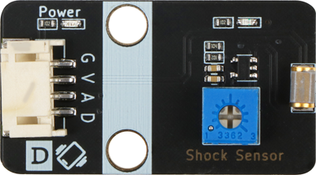
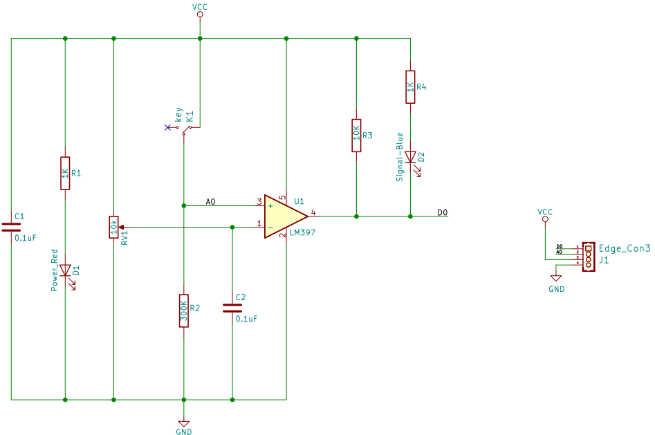
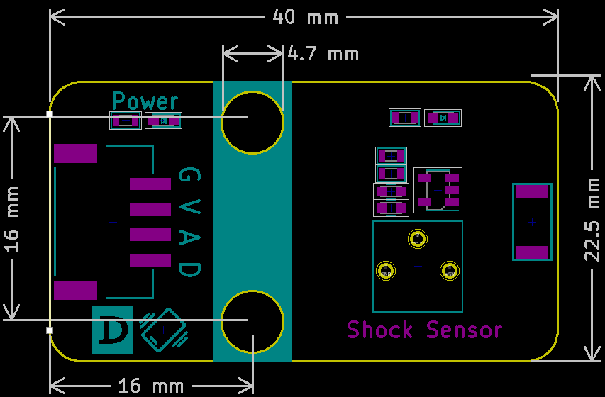

# 震动传感器

## 实物图



## 概述

​        震动传感器模块实质是一个开关,其内部是一个金属片和一个弹簧, 产品不震动时，震动开关呈断开状态，输出端输出高电平；产品震动时，震动开关由于弹簧和金属片瞬间导通，输出端输出低电平；输出端可以与单片机直接相连，通过单片机来检测高低电平，由此来检测环境是否有震动，起到报警作用。


## 原理图



## 模块参数

| 引脚名称 | 描述         |
| -------- | ------------ |
| V        | 5V电源引脚   |
| G        | GND 地线     |
| A        | 模拟信号引脚 |
| D        | 数字信号脚   |

- 供电电压:5V

- 连接方式:4PIN防反接杜邦线

- 模块尺寸:4*2.1cm

- 安装方式:M4螺钉兼容乐高插孔固定


## 详细原理图

 [查看原理图](shock_sensor/shock_sensor_schematic.pdf) 

## 机械尺寸图



## Arduino示例程序

[下载示例程序](shock_sensor/shock_sensor.rar) 

```c++
#include "Buzzer.h"

#define ShockAnalogPin A0//
#define ShockDigitalPin 7//
#define BuzzerPin A3//
Buzzer buzzer(BuzzerPin) ;

void setup()
{
    Serial.begin(9600); //
    pinMode(ShockAnalogPin, INPUT);//
   pinMode(ShockDigitalPin, INPUT);//
}

void loop()
{
	buzzer.noTone();//
	Serial.println("Shock Analog Data: ");
	Serial.println(analogRead(ShockAnalogPin)); //
if (digitalRead(ShockDigitalPin) == 0) {//
     for(int i = 200; i <= 800; i++)
     {
       buzzer.tone(i, 10);
     }
     for(int i= 800; i >= 200; i--)
     {
        buzzer.tone(i, 10);
     }
    } 
	delay(1000);
}
```


