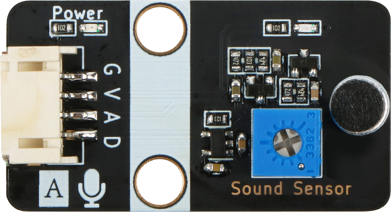

# 声音传感器模块规格书

## 模块图

## 概述

​		声音传感器模块的作用相当于一个话筒(麦克风)。它用来接收声波，显示声音的振动图象，但不能对噪声的强度进行测量。该传感器内置一个对声音敏感的电容式驻极体话筒。声波使话筒内的驻极体薄膜振动，导致电容的变化，而产生与之对应变化的微小电压。这一电压随后被转化成0-5V的电压，经过A/D转换被数据采集器接受，并传送给主控芯片。

## 原理图

## 模块参数

| 引脚名称 | 描述         |
| -------- | ------------ |
| V        | 5V电源引脚   |
| G        | GND 地线     |
| A        | 模拟信号引脚 |
| D        | 数字信号引脚 |

*  1.供电电压:5V
*  2.连接方式:3PIN防反接杜邦线
*  3.模块尺寸:4*2.1cm
*  4.安装方式:M4螺钉兼容乐高插孔固定

## 详细原理图

 [详细原理图](sound_sensor/11.pdf) 

## 机械尺寸

