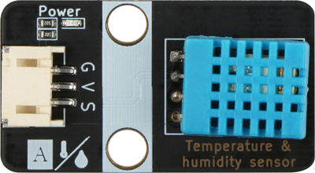
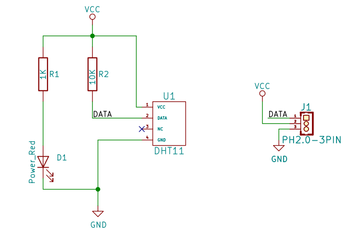
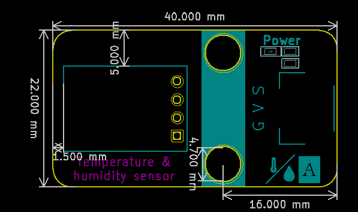

# 温湿度传感器

## 实物图



## 概述

​        DHT11数字温度 - 湿度传感器是一种包含校准数字信号输出的复合传感器。它采用特殊的数字模块采集技术和湿度 - 温度传感器技术，确保高可靠性和出色的长期稳定性。传感器由电阻式湿度元件和NTC温度测量元件组成 。        DHT11通过单总线与微处理器通信。 它只需要一个线程，一次发送40个数据  。

​        数据格式：  8位湿度整数数据+ 8位湿度十进制数据+ 8位温度整数数据+ 8位温度十进制数据+ 8位奇偶校验位。   

​        数据发送过程：主控发送启动信号 - > DHT响应信号 - > DHT通知主控它已准备好接受信号 - > DHT发送准备好的数据 - > DHT结束信号 - > DHT内部重新测试环境温度和湿度，记录下一个数据 从主控开始发出信号。

​        通过该过程获得，每次收集的数据主控始终是最后一次DHT数据。如果我们想获得实时数据，那么主控可以收集两个连续的数据，但是，正式地，不建议连续多次读取DHT。如果每次读取的间隔时间超过5秒，则足以获得准确的数据。DHT在通电时需要1秒才能稳定。  

## 原理图

[查看原理图](temperature_humidity_sensor/temperature_humidity_sensor_schematic.pdf) 


## 模块参数

| 引脚名称 |         描述         |
| :------: | :------------------: |
|    G     |         GND          |
|    V     |         VCC          |
|    S     | DATA串行数据，单总线 |

- 供电电压:3v3/5V

- 连接方式:4PIN防反接杜邦线

- 模块尺寸:40 x 22.5 mm

- 安装方式:M4螺钉兼容乐高插孔固定

## 机械尺寸图



## Arduino示例程序

[下载示例程序](temperature_humidity_sensor/temperature_humidity_sensor.zip)

```c++
#include <Wire.h>//导入通信库
#include"dht11.h"//导入DHT11库

#define DHT11Pin 3 //定义温湿度传感器引脚

dht11 DHT11;//创建DHT11对象

void setup() {
  Serial.begin(9600);//设置串口波特率
}

void loop() {
  DHT11.read(DHT11Pin);//初始化温湿度引脚
  Serial.print("Tep: ");
  Serial.print((float)DHT11.temperature);//打印温度
  Serial.print("C"); 
  Serial.print("     Hum: ");
  Serial.print((float)DHT11.humidity);//打印湿度
  Serial.println("%");
  delay(200);
}
```

## microbit示例程序

<a href="https://makecode.microbit.org/_YiMV02Ksuc73" target="_blank">动手试一试</a>
