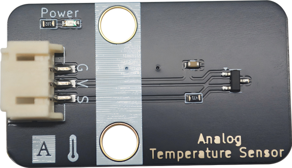

# NL50温度传感器

## 模块实物图

## 概述

NL50是由我司自主研发的温度传感器，该温度传感器是利用二极管的基本原理来测量已知温度值。随着温度的升高，二极管俩端的电压的已知的速率增加.通过精确放大电压变化，产生与环境温度成正比的电压信号，从而获取相应的温度值。

因此NL50传感器具有精确度高，连接方式简单等优点。具有±5℃从0℃到85℃温度范围，比同类市场上的同类兼容设备更准确。

### 原理图

[点击下载NL50原理图](temperature_sensor_nl50/nl50.pdf)

### 芯片规格书

待补充

### 尺寸图

待补充

## 模块参数

- 供电电压：3.3-5V

- 宽温度测量范围：-40℃至+150℃

- 连接方式：3PIN防反接杜邦线

- 模块尺寸：22.4*38.4mm，兼容乐高积木和M4螺丝固定孔

- 安装方式：M4螺钉兼容乐高插孔固定

## 引脚定义

| 引脚名称 |         描述         |
| :------- | :------------------- |
|    G     |         GND          |
|    V     |         VCC          |
|    S     | 信号线（模拟输出） |

## Arduino示例程序（C/C++）

| 支持开发板系列    |
| :---------------- |
| Arduino UNO R3    |
| Arduino Nano      |
| Arduino Mega 2560 |
| ESP32             |

[点击下载Arduino库以及示例程序](temperature_sensor_nl50/emakefun_temperature_sensor_nl50.zip)

## Microython示例程序

[点击下载Micropython库和示例程序](temperature_sensor_nl50/nl50_py.zip)

## Mixly图形化示例

待补充

## Mind+图形化示例

待补充
