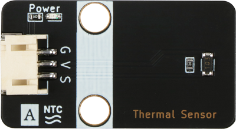
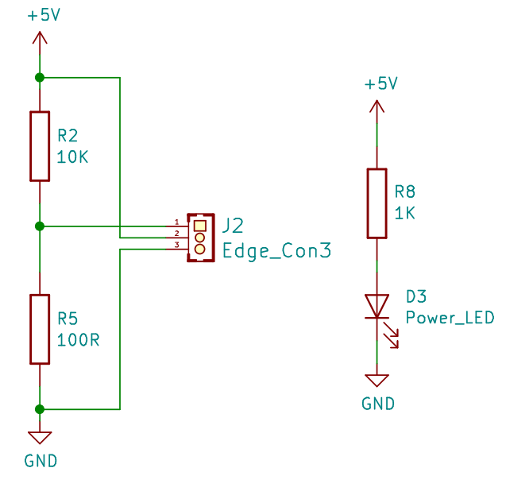
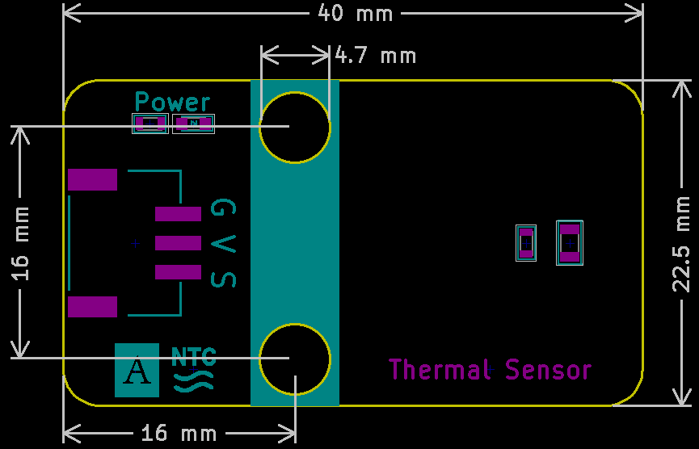

# 热敏传感器

## 实物图

## 概述

热敏电阻器是敏感元件的一类，按照温度系数不同分为正温度系数热敏电阻器(PTC)和负温度系数热敏电阻器(NTC)。热敏电阻器的典型特点是对温度敏感，不同的温度下表现出不同的电阻值。正温度系数热敏电阻器(PTC)在温度越高时电阻值越大，负温度系数热敏电阻器(NTC)在温度越高时电阻值越低，它们同属于半导体器件。  

## 原理图

## 模块参数

| 引脚名称 | 描述       |
| :------- | ---------- |
| V        | 5V电源引脚 |
| G        | GND 地线   |
| S        | 信号引脚   |

- 供电电压:5V

- 连接方式:3PIN防反接杜邦线

- 模块尺寸:4*2.1cm

- 安装方式:M4螺钉兼容乐高插孔固定

## 详细原理图

 [查看原理图](thermal_sensor/thermal_sensor_schematic.pdf) 

## 机械尺寸图

