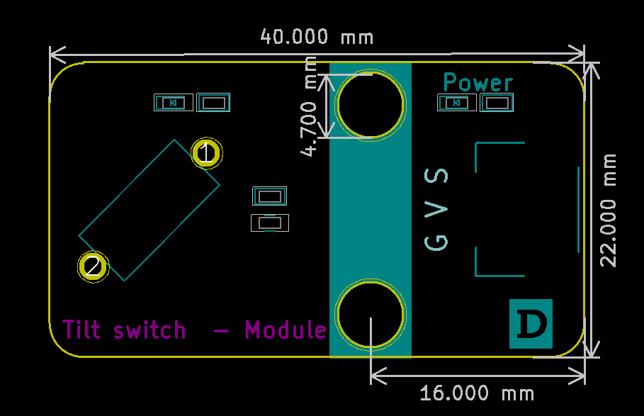

# 倾斜传感器

## 实物图

## 概述

​    	倾斜开关模块也称为珠形开关，钢球开关，实际上是一种振动开关。它有不同的名称，但工作原理保持不变。滚珠通过与金属板接触或不接触来控制电路的连接或断开。简单地说，就像打开或关闭灯一样，如果开关接触内部的金属板，灯将亮，当开关离开时，灯将熄灭。与金属端子接触或在开关中用小珠子改变光的行进路径将能够产生传导效应。

## 原理图

## 模块参数

| 引脚名称 | 描述         |
| -------- | ------------ |
| V        | 5V电源引脚   |
| G        | GND 地线     |
| A        | 模拟信号引脚 |
| D        | 数字信号脚   |

- 供电电压:5V

- 连接方式:4PIN防反接杜邦线

- 模块尺寸:4*2.1cm

- 安装方式:M4螺钉兼容乐高插孔固定

## 详细原理图

 [查看原理图](tilt_switch_sensor/倾斜传感器.pdf) 

## 机械尺寸

