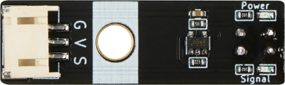
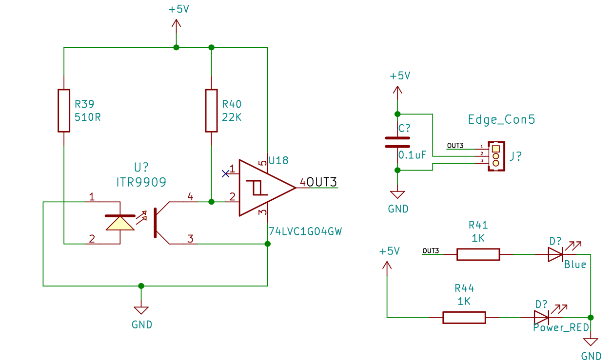
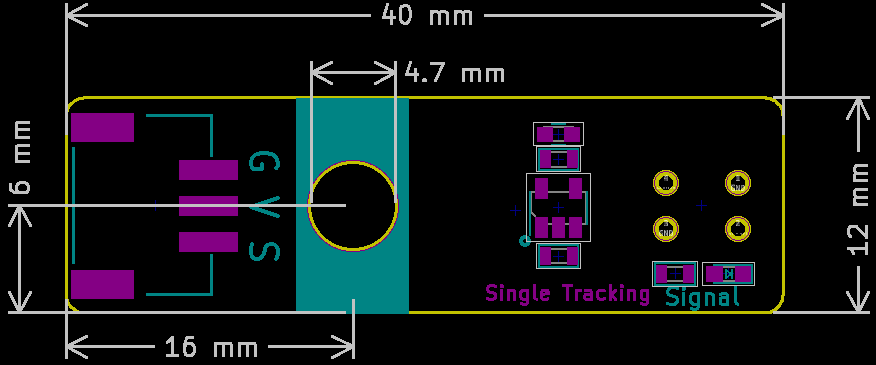

# 红外循迹传感器

## 实物图



## 概述

​        红外循迹模块本质上是一个红外线收发装置，是具有一对红外线发射与接收管，发射管发射出一定频率的红外线，当检测方向遇到反射面时，红外线反射回来被接收管接收，经过比较器电路处理之后，指示灯会亮起，同时信号输出接口输出数字信号（一个低电平信号）。

## 原理图





## 模块参数

| 引脚名称 | 描述       |
| -------- | ---------- |
| V        | 5V电源引脚 |
| G        | GND 地线   |
| S        | 信号引脚   |

- 供电电压:5V

- 连接方式:3PIN防反接杜邦线

- 模块尺寸:4*1.2cm

- 安装方式:M3螺钉

## 详细原理图

  [查看原理图](tracking_sensor/infrared_tracking_schematic.pdf) 

## 机械尺寸图



## Arduino示例程序

[下载示例程序](tracking_sensor/infrared_tracking.zip)

```c++
void setup(){
  Serial.begin(9600);  // Set the serial port baud rate to 9600
  pinMode(A3, INPUT);   // Set A3 port as input mode
}

void loop(){
  if (digitalRead(A3) == 1) {  // Determine whether a black line is detected
    Serial.println("No black line detected");
    delay(300);
     // print information No black line detected
  } else {
    Serial.println("Black line detected");
// print information Black line detected
  }

}
```


## microbit示例程序

<a href="https://makecode.microbit.org/_8KJhf5XsoWqh" target="_blank">动手试一试</a>
