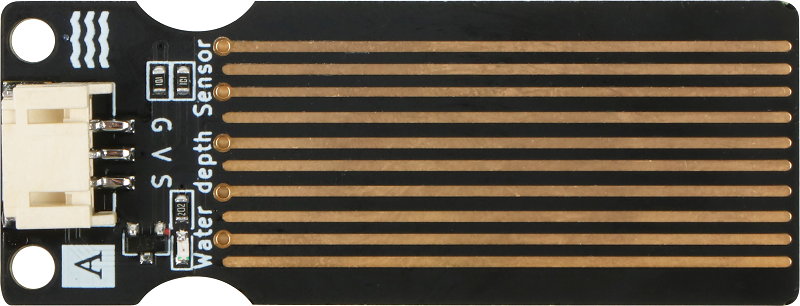
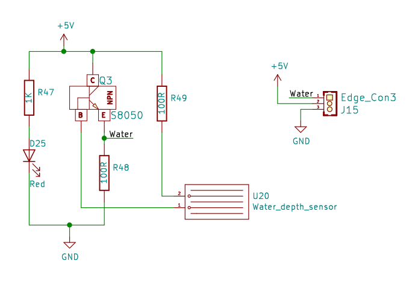
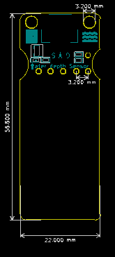

# 水深传感器



## 概述

水深传感器专为水质检测而设计，可广泛用于感应降雨，水位，甚至液体泄漏。
该传感器的工作原理是将一系列暴露的走线连接到地，并在接地走线之间交错，即感应走线。传感器走线具有1MΩ的弱上拉电阻。电阻器将传感器迹线值拉高，直到一滴水使传感器走线短路到接地走线。可以将它与模拟引脚配合使用，以检测接地和传感器走线之间的水接触量。

## 原理图



## 模块参数

| 引脚名称| 描述 |
|---- |----|
| V | 5V电源引脚 |
| G | GND 地线 |
| S | 信号引脚 |

- 供电电压：5V

- 连接方式：3PIN防反接杜邦线

- 模块尺寸：5.6*2.1cm

- 安装方式：M3螺钉兼容乐高插孔固定

## 详细原理图

 [查看原理图](water_depth_sensor/water_depth_sensor_schematic.pdf) 

## 机械尺寸图



## Arduino示例程序

[下载示例程序](water_depth_sensor/water_depth_sensor.zip)

```c++
#define DepthPin A3
#define BuzzerPin 3

int DepthValue; 
Buzzer buzzer(BuzzerPin) ;

void setup() {
    Serial.begin(9600);
    pinMode(DepthPin,INPUT);
}

void loop() {   
  buzzer.noTone();
    DepthValue=analogRead(DepthPin);
if (DepthValue > 500) {
      for(int i = 200; i <= 800; i++)
     {
       buzzer.tone(i, 10);
     }
     for(int i= 800; i >= 200; i--)
     {
        buzzer.tone(i, 10);
     }
  } 
    delay(200);
}
```

## microbit示例程序

<a href="https://makecode.microbit.org/_i1ALFJiz18yE" target="_blank">动手试一试</a>

