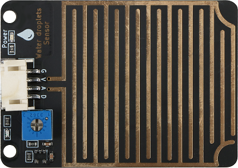
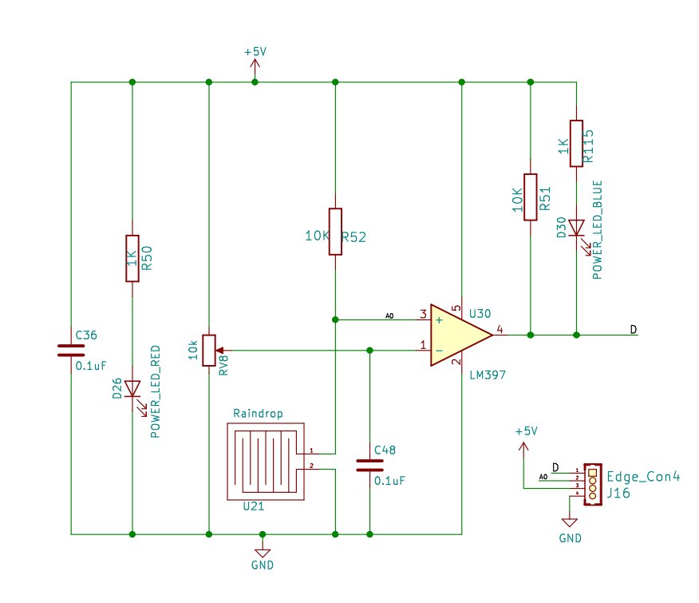
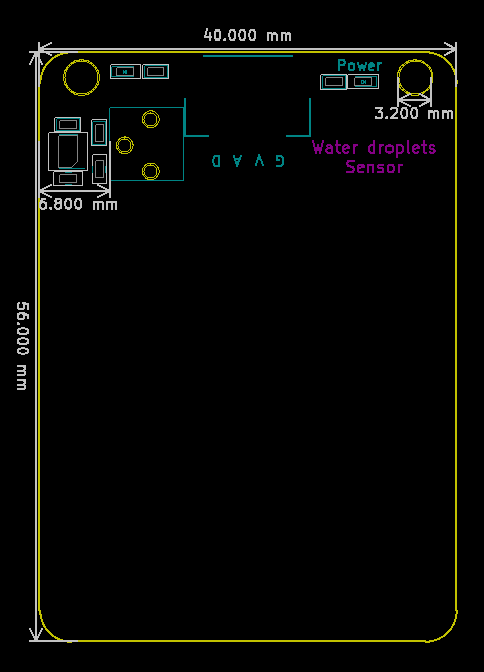

# 雨滴传感器 

## 实物图



## 概述

雨滴传感器是一种传感装置，主要用于检测是否下雨及雨量的大小，并广泛应用于汽车自动刮水系统、智能灯光系统和智能天窗系统等。传感器采用优质FR-04双料，大面积5.0 * 4.0厘米，镀镍处理面。 它具有抗氧化，导电性和更出色的耐久性能; 用电位器调节灵敏度; 工作电压为3.3 V至5 V. 输出形式：数字值输出（0和1）和模拟值AO电压输出, 使用LM393双电压比较器, 当传感器连接到5v电源时，感应板上没有水滴，DO输出处于高电平。 当滴下液滴时，DO输出处于低电平。 如果我们刷掉水滴，输出将返回高水平状态。 AO模拟输出可以连接到微控制器上的AD接口，以检测上面雨滴的大小。 DO数字输出也可以连接微控制器，以检测是否有雨。

## 原理图



## 模块参数

- 供电电压:5V

- 输出形式：数字值输出（0和1）和模拟值AO电压输出

- 连接方式:4PIN防反接杜邦线

- 模块尺寸:5.6*4cm

- 安装方式:M3螺钉兼容乐高插孔固定

## 详细原理图

 [查看原理图](water_droplets_sensor/water_droplets_sensor_schematic.pdf) 

## 机械尺寸图



## Arduino示例程序

[下载示例程序](water_droplets_sensor/water_droplets_sensor.zip)

```c++
#include <Servo.h>
#define RaindropAnalogPin A0
#define RaindropDigitalPin 7
int  RaindropAnalogValue;
int RaindropDigitalValue;
Servo servo_3;
void setup()
{
  Serial.begin(9600);
  servo_3.attach(3);
  pinMode(RaindropAnalogPin, INPUT);
  pinMode(RaindropDigitalPin, INPUT);
}

void loop() {
    RaindropAnalogValue= analogRead(RaindropAnalogPin);
    RaindropDigitalValue= digitalRead(RaindropDigitalPin);
    Serial.println("Raindrop Analog Data: ");
    Serial.print(RaindropAnalogValue);
    if (RaindropDigitalValue == 0) {
      servo_3.write(0);
    } else {
      servo_3.write(90);
    }
    delay(200);
}
```

