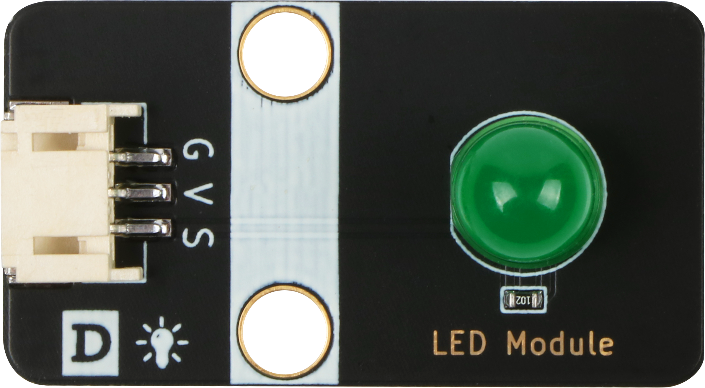

# LED灯规格书

## 模块图

## 概述

​		LED是发光二极管的缩写，由混合化合物制成，即镓（Ga），砷（AS），磷（P）。 磷化镓二极管发红光，磷化镓二极管发绿光，碳化硅二极管发黄光。发光二极管的反向击穿电压为5v。 其正伏安特性曲线太陡，模块上板载了限流电阻，以便在使用时控制流过管道的电流。

## 原理图

## 模块参数

| 引脚名称 | 描述       |
| -------- | ---------- |
| V        | 5V电源引脚 |
| G        | GND 地线   |
| S        | 信号引脚   |

## 详细原理图

 [LED灯.pdf](LED模块图片/LED灯.pdf) 

## 机械尺寸

