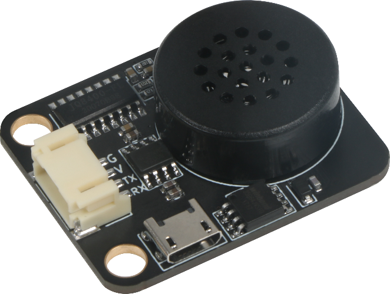

# MP3语音模块

## 模块图

## 概述

​		Emakefun MP3语音模块内置8 MB存储空间，无需外接SD卡，若一个音效以秒计算，8M的内存可以存储两百多个音效供您选用。存储方式和使用U盘一样简单，可随时更新模块内的音效。
使用上非常的简单，使用PH2.0接口，减少了接线的烦恼；支持MP3、WAV音频格式，可做指定播放，循环播放，单曲循环播放，下一首播放或上一首播放等。该MP3适用于各种需要有音效或者语音的项目，例如：智能小车、气象站、智能家居、车载导航、收费站、安监检测、机器语音导航等等。模块板载喇叭接口，可以直接推动8Ω3W无源小喇叭，使用简单。原理图

## 模块参数

| 引脚名称 |     描述     |
| :------: | :----------: |
|    G     |     GND      |
|    V     |     VCC      |
|    RX    | 串口通信引脚 |
|    TX    | 串口通信引脚 |
1. 工作电压：3.3V-5V
2. 接口类型：UART
3. 支持MP3 WAV硬件解码
4. 支持采样率（KHz）:8/11.025/12/16/22.05/24/32/44.1/48
5. 支持SPIFLASH模拟成U盘，直接操作U盘一样更新SPIFLASH里的语音
6. 支持30级音量调节
7. 模块尺寸：40x32mm，兼容乐高积木及M4螺丝固定孔

## 机械尺寸

## 串口通讯格式

###  格式：$S Len CMD para1 para2 $O  

| $S |     起始位0x7E     |每条命令反馈均以$开头,即0x7E|
| :------: | :----------: | ------------ |
|    Len     | len 后字节个数 |Len + CMD + para1 + para2|
|    CMD     |      命令字      |表示具体的操作,比如播放/暂停等等|
|    para1    |     参数1      |查询的数据高字节(比如歌曲序号)|
|    para2    | 参数2 |查询的数据低字节|
|     $O    | 结束位 0xEF |结束位0xEF|
## 通讯指令

### 直接发送的指令，带返回码 

| 指令 | 对应的功能 |命令|正确接收指令 返回码|
| :------: | :----------: | ------------ |------------|
| 0x01 |     播放     |7E 02 01 EF|AA 02 01 EF|
| 0x02 |     暂停     |7E 02 02 EF|AA 02 02 EF|
| 0x03 |     下一曲     |7E 02 03 EF|AA 02 03 EF|
| 0x04 |       上一曲       |7E 02 04 EF|AA 02 04 EF|
| 0x05 |     音量加     |7E 02 05 EF|AA 02 05 EF|
| 0x06 |     音量减     |7E 02 06 EF|AA 02 06 EF|
| 0x07 |     全部循环播放     |开始：7E 03 07 01 EF  停止：7E 03 07 00 EF|AA 02 07 EF|
| 0x08 |     随机播放播放     | 开始：7E 03 08 01 EF  停止：7E 03 08 00 EF |AA 02 08 EF|
| 0x09 |     停止插播，播放背景     |7E 02 09 EF|AA 02 09 EF|
| 0x0A |     关机     |7E 02 0A EF|AA 02 0A EF|
| 0x0B |     复位重启     |7E 02 0B EF|AA 02 0B EF|
| 0x0E |     停止     |7E 02 0E EF|AA 02 0E EF|
| 0x0F |     播放/暂停     |7E 02 0F EF|AA 02 0F EF|
| 0x41 |     指定索引播放     |7E 04 41 00 01 EF （支持65535段语音）|AA 02 41 EF|
| 0x42 |     指定文件夹曲目播放     |7E 04 42 02 16 EF （flash/TF/U 盘有用“02” 代表文件夹名称；“16(十六 进制)”代表文 件夹内文件名为“022xxx.mp3”[文件命名 前三位必须是3位数字]的 MP3文件。当文件夹名为 FF  时，代表根目录）|AA 02 42 EF|
| 0x43 |     索引插播     | 7E 04 43 00 08 EF  表示暂停当前播放，插 入播放索引为08的 MP3文件 |AA 02 43 EF|
| 0x44 |     文件夹内文件名插播     |7E 04 44 02 0A EF  表示插入播放文件夹名 称为“02”，文件名为 “010xxx.MP3”(“0x0A” 十进制为“10”)的 MP3文件， (高八位为文 件夹号，低八位为歌曲名字)| AA 02 44 EF         |
| 0x45 |     指定根目录下文件名 播放     |7E 04 45 00 01 EF 播放文件名为001xxx.mp3 的 MP3文件。（支持255段语音）| AA 02 45 EF         |
| 0x46 |     指定根目录下文件名 插播命令     |7E 04 46 00 01 EF  表示暂停当前播放，插入 播放文件名为001xxx.mp3的 MP3文件。|AA 02 46 EF|
| 0x47 |                指定索引组合播放                |7E 05 47 01 03 05 EF  表示索引为01,03,05 的 MP3文件组合播放。（最多支持50个文件组 合。）|AA 02 47 EF|
| 0x48 |     指定索引组合插播     |7E 05 48 02 04 06 EF  表示暂停当前播放，插 入播放索引为02,04,06的 MP3文件组合播放。 （最多支持50个文件组合。）| AA 02 48 EF         |
| 0x49 |          指定曲目索引 单曲循环播放          |7E 04 49 00 04 EF(支持65535)| AA 02 49 EF         |
| 0x4A |     指定 MP3文件夹内文件名 播 放 00001~65535文件名     |根目录下 MP3文件夹内00001~65535.MP3  7E 04 49 00 0F EF 播放00015.MP3|AA 02 4A EF|
| 0x4B |      指定根目录15个文件 夹内文件名播放      | 7E 04 49 AB 0F EF  表示 A:10文件夹 B0F:2831.MP3文件 单个文件夹支持 4095 个文件 |AA 02 4B EF|
| 0x4C |               指定文件夹循环播放               |7E 04 4C 00 0F EF  表示循环播放名称为15（0F）的文件夹|AA 02 4C EF|
| 0x4D |       指定文件夹内文件名 单曲循环播放       |7E 04 4D 63 64 EF  表示99（63）文件夹，100.MP3（64）播放| AA 02 4D EF         |
| 0x4E |     指定文件夹内文件名单曲 无缝循环播放     |7E 04 4E 0D 08 EF  文件夹名称为00~99对应99个文件夹，当为 FF 时表示根目录（主要用于播放白噪）|AA 02 4E EF|
| 0x4F |     指定曲目索引单曲 无缝循环播放     |7E 04 4F 00 04 EF (支持65535) （主要用于播放白噪）|AA 02 4F EF|
| 0x50 |     快进     |7E 02 50 EF|AA 02 50 EF|
| 0x51 |     快退     |7E 02 51 EF|AA 02 51 EF|
| 0x52 |     指定文件夹内文件名 组合播放     |文件夹名(01~99两位数字命名)， 文件名 (001~255xxx.mp3三位数字开头) 7E 08  52 0A 04 06 0F 64 FF EF 表示文件夹名为 10 （ 0x0A ）下 面 名 称 为 004.MP3、 006.MP3、015.MP3、100.MP3、 255.MP3 文件组合播放。最大支持50个文件组 合。|AA 02 52 EF|
| 0x53 |     指定文件夹内文件名 组合插播     |文件夹名(01~99两位数字命名)， 文件名(001 ~255xxx.mp3三位数字开头) 7E 08 53 0A 04  06 0F 64 FF EF表示文件夹名为10（ 0x0A ） 下 面 名称为 004.MP3、006.MP3、015.MP3、 100.MP3、255.MP3文件组合插播。最大支持50 个文件组 合。组合播放完之后回到被打断处恢复 播放。|AA 02 53 EF|
### 查询系统的参数
| 指令 |         对应的功能          | 参数(ASCK 码)（16位）                                 |
| :--: | :-------------------------: | :---------------------------------------------------- |
| 0x10 |        查询播放状态         | (0X0000-0X0005)(STOP/PLA Y/PAUS/NC/NC/插播)           |
| 0x11 |        查询音量大小         | 0-30(0X0000-0X001E)                                   |
| 0x12 |         查询当前 EQ         | EQ 0/1/2/3/4/5 Normal/Pop/Rock/Jazz/Classic/Bass      |
| 0x13 |      查询当前播放模式       | 0-5(全盘循环/文件夹循环/单 曲循环/随机/单曲播放/无缝) |
| 0x14 |     查询 flash 总文件数     | 1-65535(0X0000-0XFFFF)                                |
| 0x15 |    查询 SD 卡的总文件数     | 1-65535(0X0000-0XFFFF)                                |
| 0x16 |      查询 U 盘总文件数      | 1-65535(0X0000-0XFFFF)                                |
| 0x17 |      查询当前设备在线       | 01,U 盘/02,TF 卡/04，flash                            |
| 0x18 |      查询当前播放设备       | 1:USB 2:SD 4:flash                                    |
| 0x19 |    查询 TF 卡的当前曲目     | 1-65536(0X0000-0XFFFF)                                |
| 0x1A |     查询 U 盘的当前曲目     | 1-65536(0X0000-0XFFFF)                                |
| 0x1C |     查询 flash 当前曲目     | 1-65536(0X0000-0XFFFF)                                |
| 0x1D |     查询 busy 输出模式      | 参考设置命令0x38                                      |
| 0x1E |      查询短文件名功能       | 返回前8字节“xxxxxxxx.mp3”                             |
| 0x1F | 查询当前播放文件夹 内总数量 | 0-65536(0X0000-0XFFFF)                                |

系统参数返回格式： 
0xAA Len CMD para1 para2 0XEF 
举例： 查询音量大小 
发送： 7E 02 11 EF 
返回： AA 04 11 00 0E EF 
0XAA: AA 表示头 
Len: 04 表示去掉头尾的字节长度 
CMD: 11 表示发送的音量查询命令 
para1 para2: 00 0E 表示音量大小 
0XEF: EF 表示结束 

###  设置系统的参数 
| 指令 | 对应的功能 |参数(8位 HEX)|返回码|
| :------: | :----------: | ------------ | ------------ |
| 0x31 |     设置音量     |0-30（支持掉电记忆功能，循环播放状态不记忆）|AA 02 31 EF|
| 0x32 |     设置 EQ     |0-5(NO\POP\ROCK\JAZZ\CLASSIC\BASS)|AA 02 32 EF|
| 0x33 |     设置循环模式     |0全盘循环 1文件夹循环 2单曲循环 3随机 4单曲播放 （7E 03 33 0x EF） （此命令需在播放中发送才有效） （注：出厂默认为单曲播放，不能记忆）。|AA 02 33 EF|
| 0x35 |       U 盘/TF、flash 切换       |U 盘（7E 03 35 01 EF）TF(7E 03 35 02 EF)  Flash（7E 03 35 04 EF）|AA 02 35 EF|
| 0x38 |     设置busy输出 模式     |（7E 03 38 00 EF 播放输出低 L，停止 H）  （7E 03 38 01 EF 播放输出低 H，停止 L）  （7E 03 38 02 EF 播放输出200ms 脉冲，停止 H）  （7E 03 38 03 EF 播放输出600ms 脉冲，停止 H）  （注：出厂默认播放输出低，支持更改掉电记忆）|AA 02 38 EF|

说明：0x4D，0x4F 指令无缝循环：是指同一首音频文件循环播放时没有首尾接头的卡顿，主要用于白噪音播放。
例如，设置音量大小，发送:7E 03 31 1E EF 7E 起始地址 03 位长度，31指令，1E 为 30，EF 结束地址 音量设定 30。

### Mixly图形化块，使用的库为系统自带的执行器-->声音-->GD5800MP3模块，直接使用

