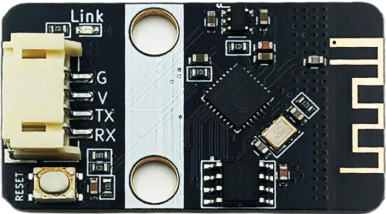
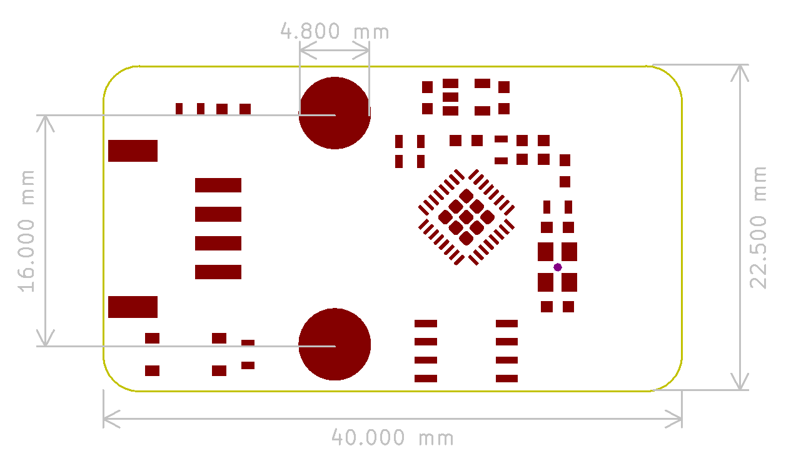
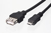
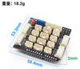
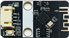
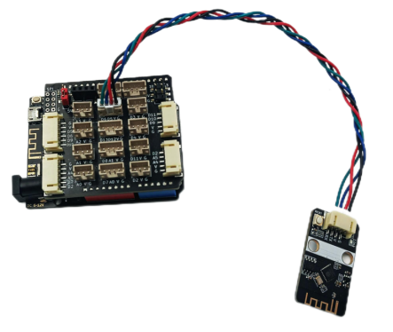
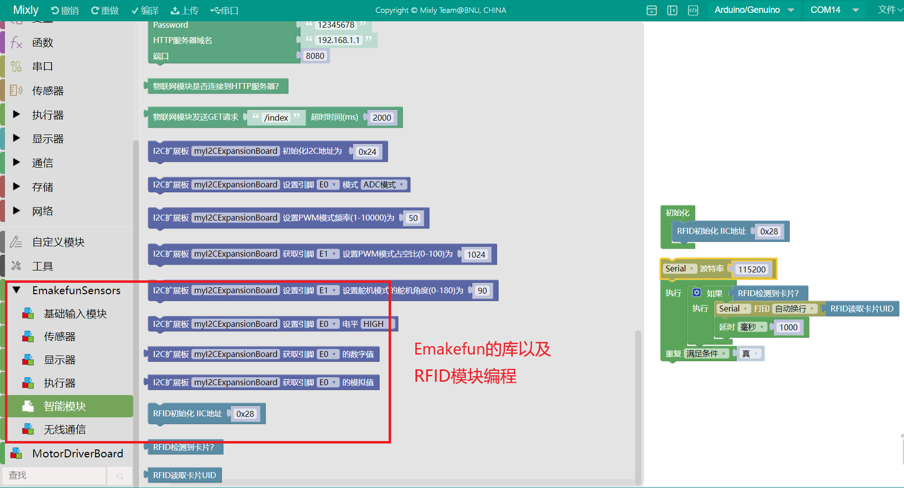
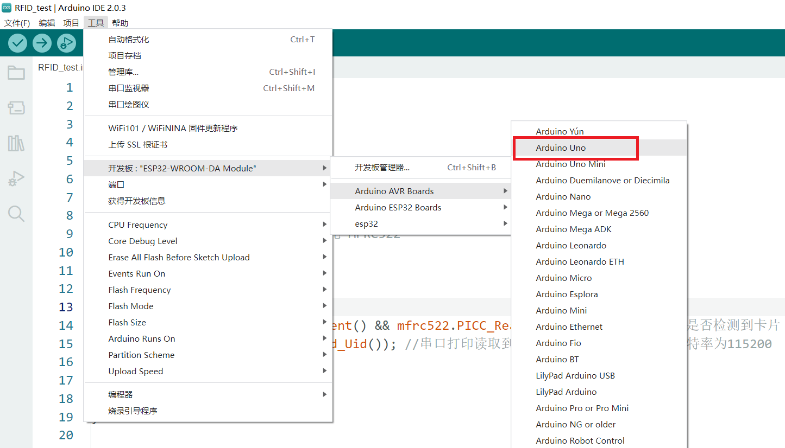
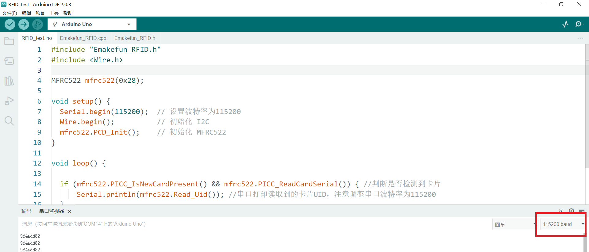

# MQTT物联网模块实验

## 模块实物图



## 概述

ESP8266-MQTT无线模块是emakefun公司基于乐鑫科技的wifi芯片ESP8266基础上重新研发的串口转wifi的物联网模块，该模块采用AT配置方式来支持wifi无线通信，AT指令全面兼容[乐鑫官方指令库（V3.0.0）](https://www.espressif.com/sites/default/files/documentation/4a-esp8266_at_instruction_set_cn.pdf)，在此基础上添加了MQTT指令，并且全部封装成scratch，mixly，Makecode图形化编程块支持arduino，micro:bit。让用户非常容易接收和发送物联网信息，远程物联网控制从未如此简单。详细资料请查看[技术文档](https://emakefun-docs.readthedocs.io/zh-cn/latest/sensors/smart_modules/esp8266_mqtt/)。

## **模块特点**

·内置低功率 32 位 CPU：可以兼作应用处理器

·内置协议：TCP/IP 协议栈

·加密类型：WPA WPA2/WPA2–PSK

·支持乐鑫官方AT标准指令集

·支持连接标准MQTT协议和TTL串口到无线的应用

## **模块参数**

·工作电压：3.3V

·接口速率：9600 bps

·无线频率：2.4GHz

·接口类型：PH2.0-4Pin (G V TX TX)

·无线模式：IEEE802.11b/g/n

·SRAM：160KB

·外置Flash：4MB

·支持低功耗：<240mA

·模块尺寸：4 * 2.1cm

·安装方式：M4螺钉螺母固定

## 原理图



## 1.1实验器件

|  |  |  |  |  |
| -------------------- | -------------------- | -------------------------------- | ------------------------------ | ---------------------- |
| BLE-UNO 主板*1       | USB数据线*1          | PH2.0 Sensor 扩展板*1            | HP2.0 4Pin线*1                 | MQTT物联网模块*1       |

## 1.2实验接线图

RFID模块接在拓展板I2C端口上。



## 1.3 在线运行代码

### 1.3.1.在Mixly中运行

打开Mixly软件，选择Arduino ESP8266 主板型号。[Mixly示例程序下载](./RFID-I2C/Milxy/FRID-I2C.zip)


点击右上角库文件管理，导入Emalefun Sensors 库。


示例程序：



自行写代码或者打开示例程序。

### 1.3.2.在Arduino IDE中运行

打开Arduino IDE软件，在工具-开发板中选择Arduino Uno主板型号。[IDE示例程序下载](./RFID-I2C/Arduino/RFID_test.zip)



打开示例程序或自行编写，注意波特率一定需要保持一致。



源代码：

```
#include "Emakefun_RFID.h"
#include <Wire.h>

MFRC522 mfrc522(0x28);

void setup() {
  Serial.begin(115200);  // 设置波特率为115200
  Wire.begin();          // 初始化 I2C
  mfrc522.PCD_Init();    // 初始化 MFRC522
}

void loop() {
  
  if (mfrc522.PICC_IsNewCardPresent() && mfrc522.PICC_ReadCardSerial()) { //判断是否检测到卡片
      Serial.println(mfrc522.Read_Uid()); //串口打印读取到的卡片UID，注意调整串口波特率为115200
  }
  delay(50);
  
}
```
### 1.3.3.在Mind+中运行

打开Mind+软件，选择Arduino UNO 主板型号，点击右上角的用户库。[Mind+示例程序以及库文件下载](./RFID-I2C/Mind+/Mind+.zip)


返回主界面后，能看到用户库已经被导入。


## 1.4实验结果

将卡片靠近RFID模块，此时串口打印出当前读取值。
