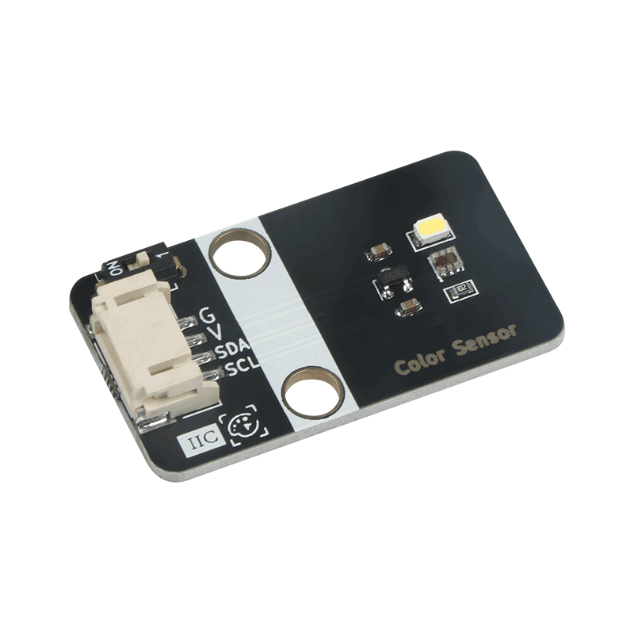
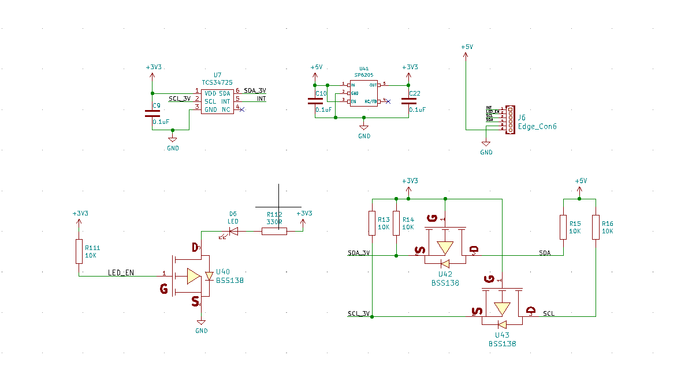
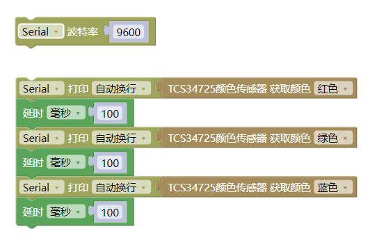

# 颜色识别传感器模块规格书

## 模块图



## 概述

TCS34725是一款低成本，高性价比的RGB全彩颜色识别传感器，传感器通过光学感应来识别物体的表面颜色。支持红、绿、蓝(RGB)三基色，支持明光感应，可以输出对应的具体数值，帮助您还原颜色本真。

为了提高精度，让颜色管理更加准确。板载自带一个高亮LED，可以让传感器在低环境光的情况下依然能够正常使用，实现“补光”的功能，可以通过LED Switch开关对它进行打开或关闭。颜色识别传感器模块采用I2C通信，拥有PH2.0防反插接口，使用便利

## 原理图



## 模块参数

* 工作电压：3.3-5V
* 工作电流：65uA
* 检测距离：3-10mm
* 时钟频率：0-400KHZ
* 接 口：IIC接口和2.54间距接口
* 温度范围：-30℃ ~ +70℃
* 通信方式:  IIC通信，地址0x29
* 尺 寸：40 * 22 mm，兼容乐高积木和M4螺丝固定孔

 

## 引脚定义

| 引脚名称 | 描述        |
| -------- | ----------- |
| G        | GND地线     |
| V        | 5V电源引脚  |
| SDA      | I2C数据引脚 |
| SCL      | I2C时钟引脚 |

## 详细原理图

  [color recognition.pdf](color_recognition/color recognition.pdf) 


### Arduino函数介绍

```
#include "EM_TCS34725.h"

EM_TCS34725 tcs34725;  // 初始化颜色识别 I2C地址为 0x29

void setup() {

tcs34725.begin();  
  Serial.begin(115200);
}

void loop()  {
  int  R = tcs34725.getRedToGamma();                   // 颜色识别传感器读取颜色 并获取Red色值
  int  G = tcs34725.getGreenToGamma();                 // 颜色识别传感器读取颜色 并获取Green色值
  int  B = tcs34725.getBlueToGamma();                  // 颜色识别传感器读取颜色 并获取Blue色值
  Serial.print(String("R:") + String(R));         // 串口打印三原色
  Serial.print(",");
  Serial.print(String("G:") + String(G));
  Serial.print(",");
  Serial.println(String("B:") + String(B));
  delay(500);
}

```

  [点击下载Arduino示例](color_recognition/Experiment_of_color_recognition_sensor.zip)

## Mixly图形化示例



程序解析：颜色识别模块为I2C通信，将模块与Arduino Uno主板的I2C接口相连，将程序上传到主板中，就可以读取颜色的三色值。

[点击下载Mixly示例](./color_recognition/color_recognition_mixly.zip)

## Micro:Bit示例程序

  [点击打开MicroBit示例](https://makecode.microbit.org/_9Rk2LufUED6j)

