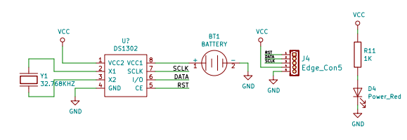
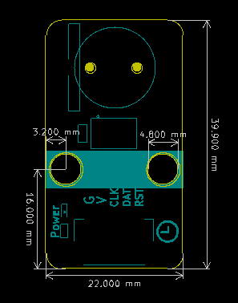
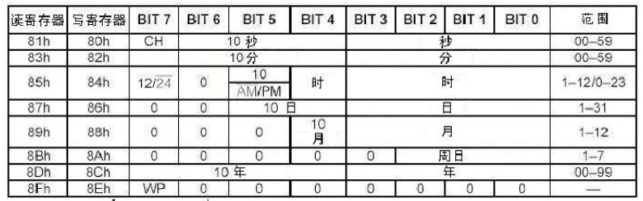

# DS1302电子时钟模块介绍

## 模块实物图

## 概述

​        DS1302 电子时钟模块的芯片是基于DALLAS 公司推出的涓流充电时钟芯片，内含有一个实时时钟/日历和31 字节静态RAM ，通过简单的串行接口与单片机进行通信。实时时钟/日历电路提供秒、分、时、日、周、月、年的信息，每月的天数和闰年的天数可自动调整。时钟操作可通过AM/PM 指示决定采用24 或12 小时格式。DS1302 与单片机之间能简单地采用同步串行的方式进行通信，仅需用到三个口线：（1）RES 复位（2）I/O 数据线（3）SCLK串行时钟。时钟/RAM 的读/写数据以一个字节或多达31 个字节的字符组方式通信。DS1302 工作时功耗很低保持数据和时钟信息时功率小于1mW。

​        DS1302模块的芯片 是由DS1202 改进而来增加了以下的特性：双电源管脚用于主电源和备份电源供应，Vcc1 为可编程涓流充电电源，附加七个字节存储器。它广泛应用于电话、传真、便携式仪器以及电池供电的仪器仪表等产品领域下面。将主要的性能指标作一综合：
★ 实时时钟具有能计算2100 年之前的秒、分、时、日、星期、月、年的能力，还有闰年调整的能力
★ 31 8 位暂存数据存储RAM
★ 串行 I/O 口方式使得管脚数量最少
★ 宽范围工作电压2.0 5.5V
★ 工作电流 2.0V 时,小于300nA
★ 读/写时钟或RAM 数据时有两种传送方式单字节传送和多字节传送字符组方式
★ 8 脚DIP 封装或可选的8 脚SOIC 封装根据表面装配
★ 简单 3 线接口
★ 与 TTL 兼容Vcc=5V
★ 可选工业级温度范围-40 +85
★ 双电源管用于主电源和备份电源供应
以上是DS1302的一些全面的预览，以下为DS1302原理图：

## 模块参数

- 工作电压：3.3V

- VCC2:  主电源引脚，

- X1,X2 : DS1302外部晶振引脚

- GND ：地

- RST :复位引脚

- I/O :串行数据引脚，数据输出或输入都从这个引脚

- SCLK:串行时钟引脚

- VCC1:备用电源

## 详细原理图

 [DS1302.pdf](DS1302图片/DS1302.pdf) 

##  机械安装图

 DS1302有关日历、时间的寄存器共有12个，其中有7个寄存器（读时81h~8Dh,写时80h~8Ch）是存放秒、分、时、日、月、年、周数据的，存放的数据格式为BCD码形式。

##  内部时间寄存器如下：

1、秒寄存器（81h、80h）的位7定义为时钟暂停标志（CH）。当初始上电时该位置为1，时钟振荡器停止，DS1302处于低功耗状态；只有将秒寄存器的该位置改写为0时，时钟才能开始运行。

2、控制寄存器（8Fh、8Eh）的位7是写保护位（WP），其它7位均置为0。在任何的对时钟和RAM的写操作之前，WP位必须为0。当WP位为1时，写保护位防止对任一寄存器的写操作。也就是说在电路上电的初始态WP是1，这时是不能改写上面任何一个时间寄存器的，只有首先将WP改写为0，才能进行其它寄存器的写操作。

3、控制寄存器（8Fh、8Eh）的位7是写保护位（WP），其它7位均置为0。在任何的对时钟和RAM的写操作之前，WP位必须为0。当WP位为1时，写保护位防止对任一寄存器的写操作。也就是说在电路上电的初始态WP是1，这时是不能改写上面任何一个时间寄存器的，只有首先将WP改写为0，才能进行其它寄存器的写操作。

