# esp8266-mqtt物联网无线模块


## 概述

​		esp8266-mqtt无线模块是emakefun公司基于乐鑫科技的wifi芯片ESP8266基础上重新研发的串口转wifi的物联网模块，该模块采用AT配置方式来支持wifi无线通信，AT指令全面兼容[乐鑫官方指令库（V3.0.0）](https://www.espressif.com/sites/default/files/documentation/4a-esp8266_at_instruction_set_cn.pdf)，在此基础上添加了MQTT指令，并且全部封装成scratch，mixly，Makecode图形化编程块支持arduino，micro:bit。让用户非常容易接收和发送物联网信息，远程物联网控制从未如此简单。

## 模块特点：

- 内置低功率 32 位 CPU：可以兼作应用处理器
- 内置协议：TCP/IP 协议栈
- 加密类型：WPA WPA2/WPA2–PSK
- 支持乐鑫官方AT标准指令集
- 支持连接标准MQTT协议和TTL串口到无线的应用

## 模块参数
- 工作电压：5V
- 接口速率：9600 bps
- 无线频率：2.4GHz
- 接口类型：PH2.0-4Pin (G V TX TX)
- 无线模式：IEEE802.11b/g/n
- SRAM：160KB
- 外置Flash：4MB
- 支持低功耗：<240mA
- 模块尺寸：4 * 2.1cm
- 安装方式：M4螺钉螺母固定
- LED指示灯：Link网络连接指示灯和MQTT服务器连接指示灯


| 引脚名称 | 描述         |
| :------: | :----------: |
| G      |    GND     |
| V       | 5V    |
| TX        | 串口发送端 |
| RX        | 串口接收端 |
## 机械尺寸图


## AT 指令可以细分为四种类型：

| 类型     | 指令格式     | 描述                                                   |
| -------- | ------------ | ------------------------------------------------------ |
| 测试指令 | AT+< x >=?   | 该命令⽤于该命令⽤于查询设置指令的参数以及取值范围。   |
| 查询指令 | AT+< x >?    | 该命令⽤于返回参数的当前值。                           |
| 设置指令 | AT+< x >=<…> | 该命令⽤于设置⽤户⾃定义的参数值。                     |
| 执⾏指令 | AT+< x >     | 该命令⽤于执⾏受模块内部程序控制的变参数不可变的功能。 |

**注意：**

• 不是每条 AT 指令都具备上述 4 种类型的命令。

• [ ] 括号内为缺省值，不必填写或者可能不显示。

• 使⽤双引号表示字符串数据 ”string”，例如：AT+CWSAP="ESP756290","21030826",1,4

• 默认波特率为 115200。

• AT 指令必须⼤写，并且以回⻋换⾏符结尾（CR LF）。


## MQTT扩展AT指令汇总

| 序号 | 指令 | 描述 |
| --------| -------- | ------------ |
| 1 | AT+CWMODE=1 | 重置 |
| 2 | AT+RST | 复位 |
| 3 | AT+CWJAP_DEF="EmakeFun","12345678" | wifi设置 |
| 4 | AT+MQTTUSERCFG | 配置 MQTT 用户属性 |
| 5     | AT+MQTTCONNCFG  |配置 MQTT 连接属性|
| 6    | AT+MQTTCONN |连接指定 MQTT broker|
| 7   | AT+ALIYUN_MQTTCONN? |连接指定的阿里云MQTT broker|
| 8  | AT+MQTTPUB |在 LinkID上通过 topic 发布数据 data，< br >data 为字符串消息|
| 9 | AT+MQTTPUBRAW |在 LinkID 上通过 topic 发布数据 data，< br > data 为二进制数据|
| 10 | AT+MQTTSUB |订阅指定连接的 MQTT 主题, 可重复多次< br >订阅不同 topic|
| 11 | AT+MQTTUNSUB |取消订阅指定连接的 MQTT 主题, 可多次< br >取消不同订阅 topic|
|12     | AT+MQTTCLEAN |关闭 MQTT Client 为 LinkID 的连接, 并释< br >放内部占用的资源|

## 串口助手调试AT指令

下载并安装[安信可串口调试助手](./esp8266_mqtt_pic/AiThinker Serial Tool V1.2.3.zip)，同时下载[AT指令txt文档](./esp8266_mqtt_pic/SendList_20240228.zip)。

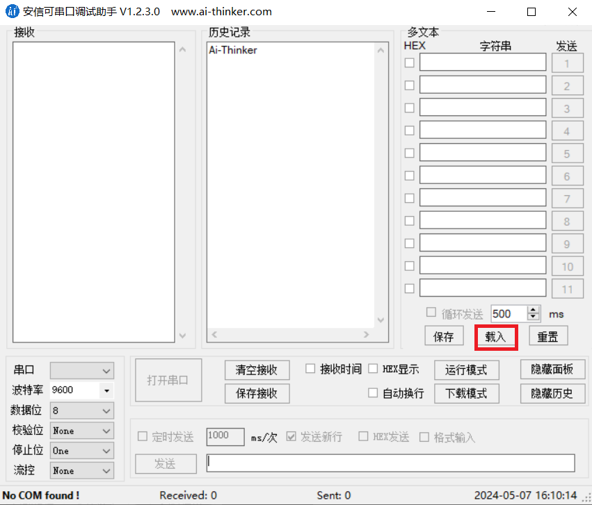

打开txt文档，对重要参数进行修改，注意文档中不能打中文。如下图：

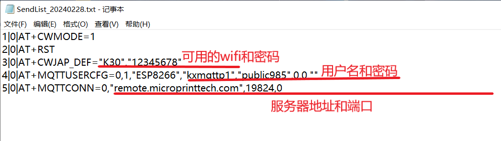

点击串口助手的载入，选择txt文档,电脑插上烧录器和MQTT模块，然后点击打开串口。

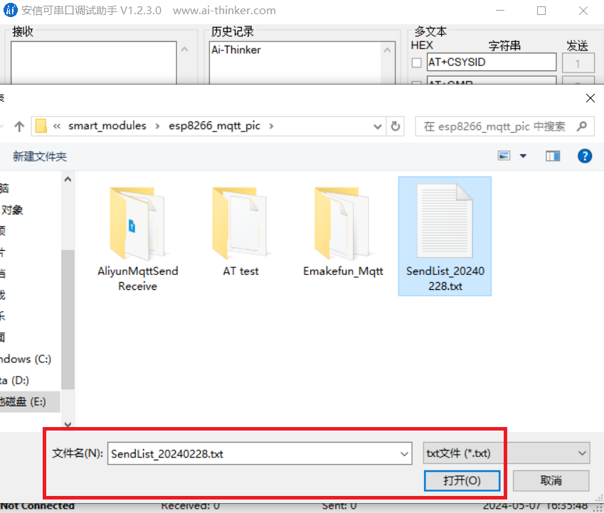

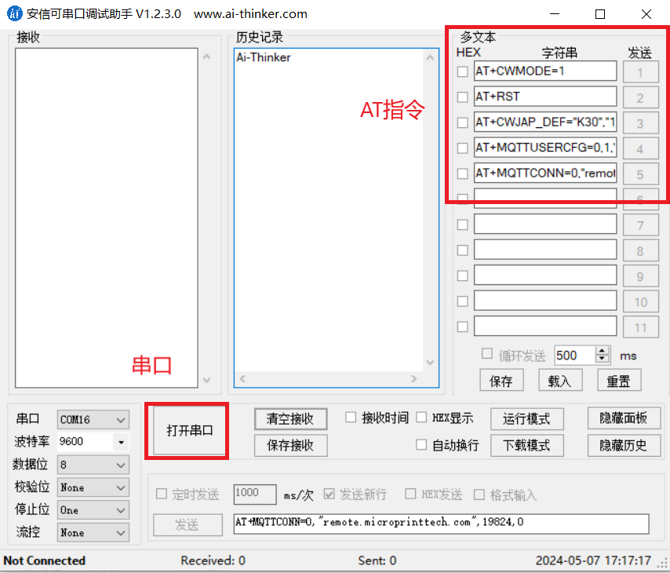

依次点击数字1、2、3、4、5，接收端会弹出连接信息OK，这代表重置后wifi连接成功，用户名设置成功，连接服务器成功。

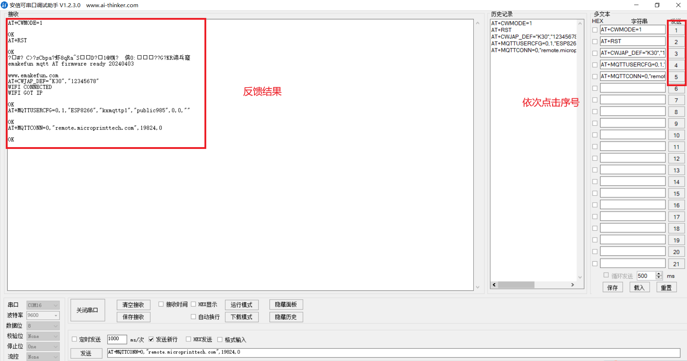

在浏览器打开[服务器网址](http://remote.microprinttech.com:19825/#/clients)，刷新后在客户端可看到ESP8266已连接。同时MQTT模块的第二个LED灯常亮。

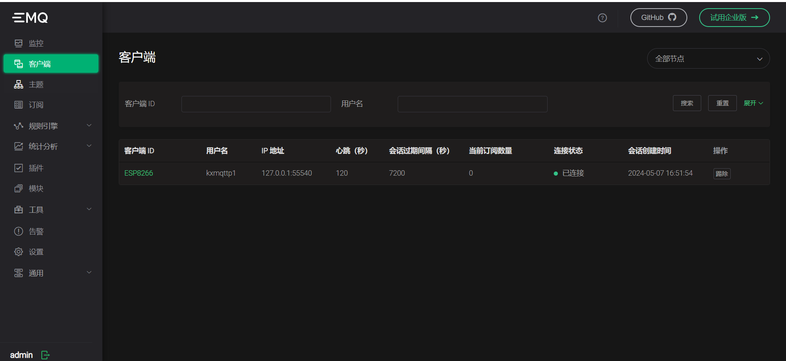

在此我们提供[服务器地址](remote.microprinttech.com:19825 )，端口19825

user:  admin

passwd: Anynod2022514

账号1：kxmqttp1  密码  public985

账号2：kxmqttp2  密码  public211

## AT指令详解

### 1.AT+CWMODE=1  重置模块

| 指令：AT+CWMODE=1                          |
| ------------------------------------------ |
| **功能：**重置MQTT模块，对内部进行参数重置 |
| **响应：**OK或ERROR                        |

**举例：**AT+CWMODE=1

**结果：**将示例复制在串口发送后，串口返回  OK


### 2.AT+RST  复位

| 指令：AT+RST                      |
| --------------------------------- |
| **功能：**复位MQTT模块            |
| **响应：**www.emakefun.com或ERROR |

**举例：**AT+RST

**结果：**将示例复制在串口发送后，串口返回  www.emakefun.com


### 3.AT+CWJAP_DEF="EmakeFun","12345678"  Wifi设置

| 指令：AT+CWJAP_DEF="EmakeFun","12345678"                |
| ------------------------------------------------------- |
| **功能：**对模块进行wifi设置                            |
| **响应：**OK（模块Link灯常亮）或ERROR（模块Link灯闪烁） |

**举例：**AT+CWJAP_DEF="EmakeFun","12345678"

**结果：**将示例复制在串口发送后，串口返回  OK，同时Link灯常亮


### 4.AT+MQTTUSERCFG - 配置 MQTT 用户属性

| 指令：AT+MQTTUSERCFG=LinkID,scheme,"client_id","username","password",cert_key_ID,CA_ID,"path" |
| ------------------------------------------------------------ |
| **功能：**设置 MQTT 用户配置                                 |
| **响应：**OK（模块MQTT灯常亮）或ERROR（模块MQTT灯不亮）      |

| 代码        | 含义                                                     | 举例      |
| ----------- | -------------------------------------------------------- | --------- |
| LinkID      | 当前只支持 0                                             | 0         |
| scheme      |                                                          | 1         |
| "client_id" | 对应 MQTT client ID, 用于标志 client 身份, 最长 256 字节 | ESP8266   |
| "username"  | 用于登录 MQTT broker 的 用户名, 最长 64 字节             | kxmqttp1  |
| "password"  | 用于登录 MQTT broker 的 密码, 最长 64 字节               | public985 |
| cert_key_ID | 证书 ID, 目前支持一套 cert 证书, 参数为 0                | 0         |
| CA_ID       | CA ID, 目前支持一套 CA 证书, 参数为 0                    | 0         |
| "path"      | 资源路径, 最长 32 字节                                   |           |

**举例：**AT+MQTTUSERCFG=0,1,"ESP8266","kxmqttp1","public985",0,0,""

**结果：**将示例复制在串口发送后，串口返回  OK，模块MQTT灯常亮


### **5.AT+MQTTCONNCFG - 配置 MQTT 连接属性**

| 指令：AT+MQTTCONNCFG=LinkID,keepalive,disable_clean_session,"lwt_topic","lwt_msg",lwt_qos,lwt_retain |
| ------------------------------------------------------------ |
| **功能：**设置 MQTT 连接配置                                 |
| **响应：**OK或ERROR                                          |

| 代码                  | 含义                                                     | 举例     |
| --------------------- | -------------------------------------------------------- | -------- |
| LinkID                | 当前只支持 0                                             | 0        |
| keepalive             | MQTT PING 超时时间,范围为 [60, 7200], 单位为秒. 默认 120 | 120      |
| disable_clean_session | MQTT 清理会话标志, 参数为 0 或 1, 默认为 0               | 0        |
| "lwt_topic"           | 主题 topic, 最长 64 字节                                 | Emakefun |
| "lwt_msg"             | 主题 message, 最长 64 字节                               | 12345678 |
| lwt_qos               | 主题 QoS, 参数可选 0, 1, 2, 默认为 0                     | 0        |
| lwt_retain            | 主题 retain, 参数可选 0, 1, 默认为 0                     | 0        |

**举例：**AT+MQTTCONNCFG=0,120,0,topic,msg,0,0

**结果：**将示例复制在串口发送后，串口返回  OK


### **6.AT+MQTTCONN - 连接服务器的IP地址**

| 指令：AT+MQTTCONN=LinkID,"host",port,reconnect |
| ---------------------------------------------- |
| **功能：**连接指定 MQTT broker                 |
| **响应：**OK或ERROR                            |

| 代码      | 含义                           | 举例           |
| --------- | ------------------------------ | -------------- |
| LinkID    | 当前只支持 0                   | 0              |
| "host"    | MQTT域名，IP地址               | 47.111.117.220 |
| port      | MQTT端口，一般情况下默认1833   | 1833           |
| reconnect | 0 代表不重连MQTT，1 会一直重连 | 0              |

**举例：**AT+MQTTCONN=0,"47.111.117.220",1883,0

**结果：**将示例复制在串口发送后，串口返回  OK


### **7.AT+ALIYUN_MQTTCONN?**

| 指令：AT+ALIYUN_MQTTCONN="host",port,"ProductKey","DeviceName","DeviceSecret" |
| ------------------------------------------------------------ |
| **功能：**连接指定的阿里云MQTT broker                        |
| **响应：**OK或ERROR                                          |

| 代码           | 含义                                                         | 举例         |
| -------------- | ------------------------------------------------------------ | ------------ |
| "host"         | 连接阿里云的MQTT broker 域名, 详情请参考阿里云域名格式       | 192.168.1.17 |
| port           | 连接 MQTT broker 端口, 最大 65535 默认 1883                  | 1883         |
| "ProductKey"   | 设备所属产品的ProductKey，即物联网平台为产品颁发的全局唯一标识符 | 0            |
| "DeviceName"   | 设备在产品内的唯一标识符。DeviceName与设备所属产品的ProductKey组合，作为设备标识，用来与物联网平台进行连接认证和通信。 | 0            |
| "DeviceSecret" | 物联网平台为设备颁发的设备密钥，用于认证加密。需与DeviceName成对使用 |              |

**举例：**AT+MQTTCONN="192.168.1.17",1883,0,0,

**结果：**将示例复制在串口发送后，串口返回  OK


### **8.AT+MQTTPUB**

| 指令：AT+MQTTPUB=LinkID,"topic","data",qos,retain            |
| ------------------------------------------------------------ |
| **功能：**在 LinkID上通过 topic 发布数据 data, 其中 data 为字符串消息, 若要发布二进制,请使用 AT+MQTTPUBRAW |
| **响应：**OK或ERROR                                          |

| 代码    | 含义                                                         | 举例   |
| ------- | ------------------------------------------------------------ | ------ |
| LinkID  | 当前只支持 0                                                 | 0      |
| "topic" | 发布主题, 最长 64 字节                                       | topic  |
| "data"  | 发布消息, data 不能包含 \0, 请确保整条 AT+MQTTPUB 不超过 AT 指令的最大长度限制 | test   |
| qos     | 发布服务质量, 参数可选 0,1,2, 默认为 0                       | 0      |
| retain  | 发布 retain                                                  | retain |

**举例：**AT+MQTTPUB=0,"topic","test",0,retain

**结果：**将示例复制在串口发送后，串口返回  OK


### **9.AT+MQTTPUBRAW**

| 指令：AT+MQTTPUBRAW=LinkID,"topic",length,qos,retain         |
| ------------------------------------------------------------ |
| **功能：**在 LinkID 上通过 topic 发布数据 data, 其中 data 为二进制数据 |
| **响应：**OK或ERROR,等待用户输入 length 大小数据, 之后响应如下:+MQTTPUB:FAIL或+MQTTPUB:OK |

| 代码    | 含义                                   | 举例   |
| ------- | -------------------------------------- | ------ |
| LinkID  | 当前只支持 0                           | 0      |
| "topic" | 发布主题, 最长 64 字节                 | topic  |
| length  | 要发布消息长度, 长度受限于当前可用内存 | 2      |
| qos     | 发布服务质量, 参数可选 0,1,2, 默认为 0 | 0      |
| retain  | 发布 retain                            | retain |

**举例：**AT+MQTTPUBRAW=0,"topic",2,0,retain

**结果：**将示例复制在串口发送后，串口返回  OK


### **10.AT+MQTTSUB**

| 指令：AT+MQTTSUB=LinkID,"topic",qos                          |
| ------------------------------------------------------------ |
| **功能：**订阅指定连接的 MQTT 主题, 可重复多次订阅不同 topic |
| **响应：**OK或ERROR，当收到对应主题订阅的 MQTT 消息时, 将按照如下格式打印消息内容+MQTTSUBRECV:LinkID,"topic",data_length,data  如果订阅已订阅过的主题, 仍无条件向 MQTT broker 订阅, Log 口打印 ALREADY SUBSCRIBE |

| 代码    | 含义                                   | 举例  |
| ------- | -------------------------------------- | ----- |
| LinkID  | 当前只支持 0                           | 0     |
| "topic" | 订阅主题, 最长 64 字节                 | topic |
| qos     | 订阅服务质量, 参数可选 0,1,2, 默认为 0 | 0     |

**举例：**AT+MQTTSUB=0,"topic",0

**结果：**将示例复制在串口发送后，串口返回  OK


### **11.AT+MQTTUNSUB**

| 指令：AT+MQTTUNSUB=LinkID,"topic"                            |
| ------------------------------------------------------------ |
| **功能：**取消订阅指定连接的 MQTT 主题, 可多次取消不同订阅 topic |
| **响应：**OK或ERROR                                          |

| 代码    | 含义                   | 举例  |
| ------- | ---------------------- | ----- |
| LinkID  | 当前只支持 0           | 0     |
| "topic" | 订阅主题, 最长 64 字节 | topic |

**举例：**AT+MQTTUNSUB=0,"topic"

**结果：**将示例复制在串口发送后，串口返回  ERROR


### **12.AT+MQTTCLEAN**

| 指令：AT+MQTTCLEAN=LinkID                                    |
| ------------------------------------------------------------ |
| **功能：**关闭 MQTT Client 为 LinkID 的连接, 并释放内部占用的资源 |
| **响应：**OK或ERROR                                          |

| 代码   | 含义         | 举例 |
| ------ | ------------ | ---- |
| LinkID | 当前只支持 0 | 0    |

**举例：**AT+MQTTCLEAN=0

**结果：**将示例复制在串口发送后，串口返回  OK


##  **arduino 应用场景**

**AT串口测试**

[下载最新示例程序](./esp8266_mqtt_pic/AT test.zip)

```
#include "Arduino.h"
#include "SoftwareSerial.h"
SoftwareSerial Serial1(5, 6); // RX, TX

void setup()
{
  Serial.begin(115200); // serial port used for debugging
  Serial1.begin(9600);  // your ESP's baud rate might be different
}
 
void loop()
{
  if(Serial1.available())  // check if the ESP is sending a message
  {
    while(Serial1.available())
    {
      int c = Serial1.read(); // read the next character
      Serial.write((char)c);  // writes data to the serial monitor
    }
  }
 
  if(Serial.available())
  {
    // wait to let all the input command in the serial buffer
    delay(10);

    // read the input command in a string
    String cmd = "";
    while(Serial.available())
    {
      cmd += (char)Serial.read();
    }

    // print the command and send it to the ESP
    Serial.println();
    Serial.print(">>>> ");
    Serial.println(cmd);

    // send the read character to the ESP
    Serial1.print(cmd);
  }
}
```
### **arduino示例程序**

**[下载最新库程序](./esp8266_mqtt_pic/Emakefun_Mqtt.zip)**

```
#include "WiFiEsp.h"
#include "WifiEspMqtt.h"
#include "SoftwareSerial.h"
SoftwareSerial esp8266_serial(5, 6);  // RX, TX
uint32_t _startMillis = 0;

WiFiEspMqtt esp8266;

void setup() {
  Serial.begin(115200);
  esp8266_serial.begin(9600);
  WiFi.init(&esp8266_serial);
  if (WiFi.begin("Emakefun", "12345678") == WL_CONNECTED) {    //在此设置wifi和密码
    Serial.println("wifi connected");
    esp8266.mqtt_usercfg("esp8266_client333", "kxmqttp1", "public985");    //个人账号和密码
    delay(1000);
    esp8266.mqtt_connect("remote.microprinttech.com", 19824, 0);    //服务器地址和端口
    delay(1000);
    esp8266.mqtt_sub("topic_1", 0);  //订阅topic_1主题，qos为0
  }
  esp8266.mqtt_public("topic_led", "on", 0);
  delay(3000);
}

void loop() {
  if (esp8266.mqtt_receive()) {
    Serial.print("topic:");
    Serial.println(esp8266.mqtt_topic);
    Serial.print("message:");
    Serial.println(esp8266.mqtt_message);
  }
}

```

### **Arduino连接阿里云案例分析**

```
/*
 WiFiEsp test: BasicTest

 Performs basic connectivity test and checks.
*/

#include "WiFiEsp.h"
#include "WifiEspMqtt.h"
#include "SoftwareSerial.h"
SoftwareSerial esp8266_serial(5, 6); // RX, TX
uint32_t _startMillis = 0;

WiFiEspMqtt esp8266;

char ssid[] = "emakefun";        // your network SSID (name)
char passwd[] = "501416wf";        // your network password

char aliyun_mqtt_host[] = "a1gVfAJo2pv.iot-as-mqtt.cn-shanghai.aliyuncs.com";  // 阿里云物联网服务器host
uint16_t aliyun_mqtt_port = 1883;    // 阿里云物联网服务器端口
char product_key[] = "a1gVfAJo2pv";  // 设备所属产品的ProductKey，即物联网平台为产品颁发的全局唯一标识符
char device_name[] = "emakefun";     // 设备在产品内的唯一标识符。DeviceName与设备所属产品的ProductKey组合，作为设备标识，用来与物联网平台进行连接认证和通信。
char device_secret[] = "8412c9a3a13d5398fb33afc91a5f4c0c";  // 物联网平台为设备颁发的设备密钥，用于认证加密。需与DeviceName成对使用。

void setup()
{
  Serial.begin(115200);
  esp8266_serial.begin(9600);
  Serial.println("Aliyun MqttSendReveive Test");
  WiFi.init(&esp8266_serial);
  assertEquals("Firmware version", WiFi.firmwareVersion(), "3.0.2");
  assertEquals("Status is (WL_DISCONNECTED)", WiFi.status(), WL_DISCONNECTED);
  esp8266.mqtt_connect_aliyun(aliyun_mqtt_host, aliyun_mqtt_port, product_key, device_name, device_secret, 0);

  if (WiFi.begin(ssid, passwd) == WL_CONNECTED)
  {
     Serial.println("wifi connected");
     
     esp8266.mqtt_sub("/a1gVfAJo2pv/emakefun/user/get", 0);   // 订阅topic
  }
  esp8266.mqtt_public("/a1gVfAJo2pv/emakefun/user/add", "on", 0); // 发布topic 数据为 "on"
  delay(10000);
}

void loop()
{
    if (esp8266.mqtt_receive())
    {

     Serial.print("topic:");
     Serial.println(esp8266.mqtt_topic);    // 打印订阅的topic
     Serial.print("message:");
     Serial.println(esp8266.mqtt_message);  // 打印订阅的topic的数据
    
    }
}

void assertNotEquals(const char* test, int actual, int expected)
{
  if(actual!=expected)
    pass(test);
  else
    fail(test, actual, expected);
}

void assertEquals(const char* test, int actual, int expected)
{
  if(actual==expected)
    pass(test);
  else
    fail(test, actual, expected);
}

void assertEquals(const char* test, char* actual, char* expected)
{
  if(strcmp(actual, expected) == 0)
    pass(test);
  else
    fail(test, actual, expected);
}


void pass(const char* test)
{
  Serial.print(F("********** "));
  Serial.print(test);
  Serial.println(" > PASSED");
  Serial.println();
}

void fail(const char* test, char* actual, char* expected)
{
  Serial.print(F("********** "));
  Serial.print(test);
  Serial.print(" > FAILED");
  Serial.print(" (actual=\"");
  Serial.print(actual);
  Serial.print("\", expected=\"");
  Serial.print(expected);
  Serial.println("\")");
  Serial.println();
  delay(10000);
}

void fail(const char* test, int actual, int expected)
{
  Serial.print(F("********** "));
  Serial.print(test);
  Serial.print(" > FAILED");
  Serial.print(" (actual=");
  Serial.print(actual);
  Serial.print(", expected=");
  Serial.print(expected);
  Serial.println(")");
  Serial.println();
  delay(10000);
}
```
**当连接上WIFI时，物联网模块的蓝灯会常亮，否则蓝灯会闪烁，同时串口监视器会显示WiFi connected,如下图所示。**
**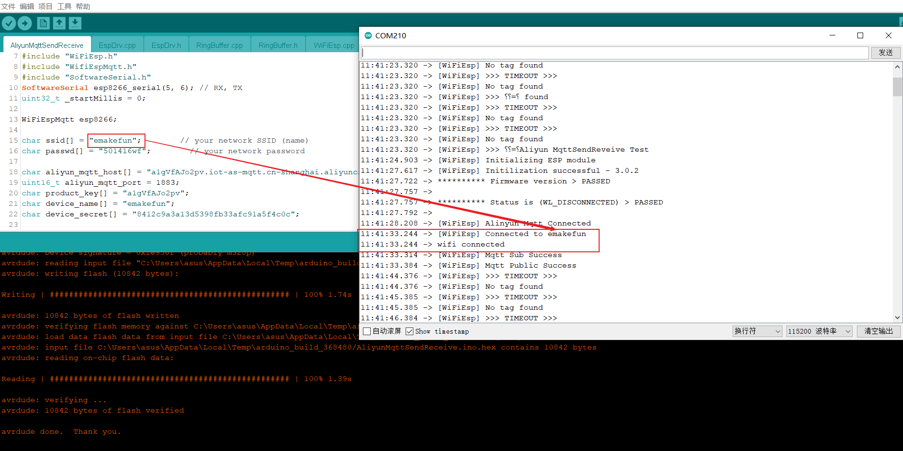**
**当连上阿里云服务器时，选择阿里云设备菜单时，会显示当前在线的设备数量，并且所连接的设备的状态为在线状态，如下图所示。**
**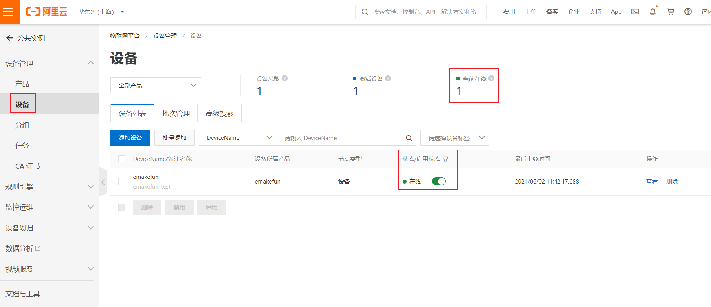**
**同时在串口监视器里面可以看到是否连接成功，如下图所示。**
**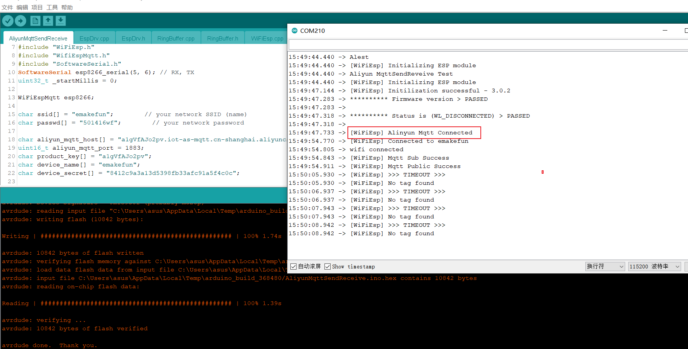**
**当前程序会在连接阿里云服务器成功之后，会向服务器发布和订阅相关的主题(topic)。**
**发布: 向云端发送数据。比如温度、湿度、气压值、停车位......** 
     **可以在阿里云的监控运维->日志服务里面可以看到当前发布的记录，并且点击查看可以看到发送的数据。**
**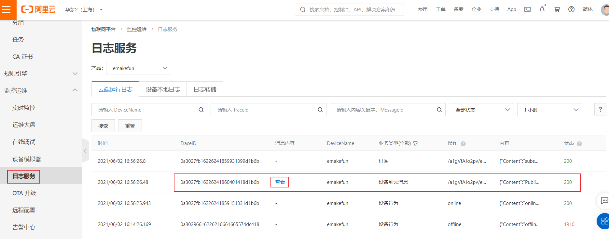**	 
**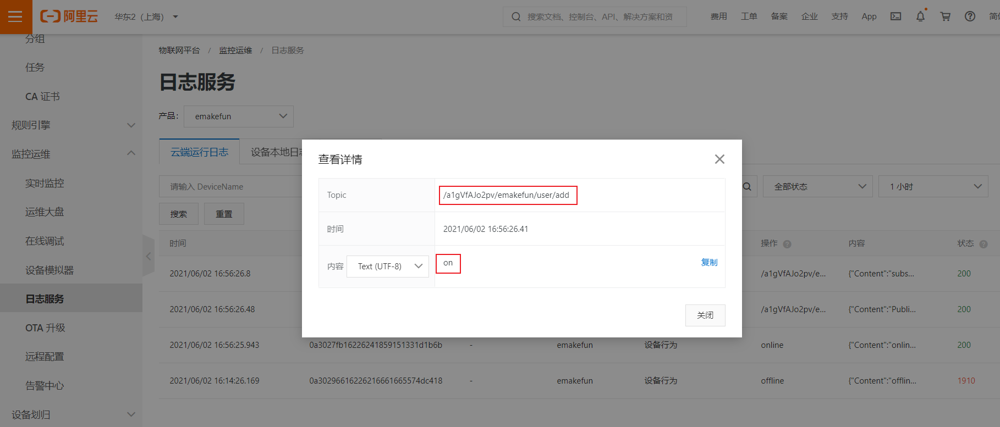**	 
**订阅: 获取云端的数据。比如天气预报.....**
     **可在设备的topic列表里找到相应的topic，并且点击发布消息，发布想要发布的数据。**
**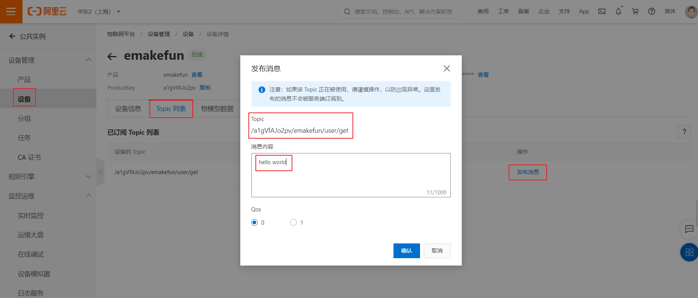**
	 **同时在串口监视器里面我们可以看到订阅的数据。**
**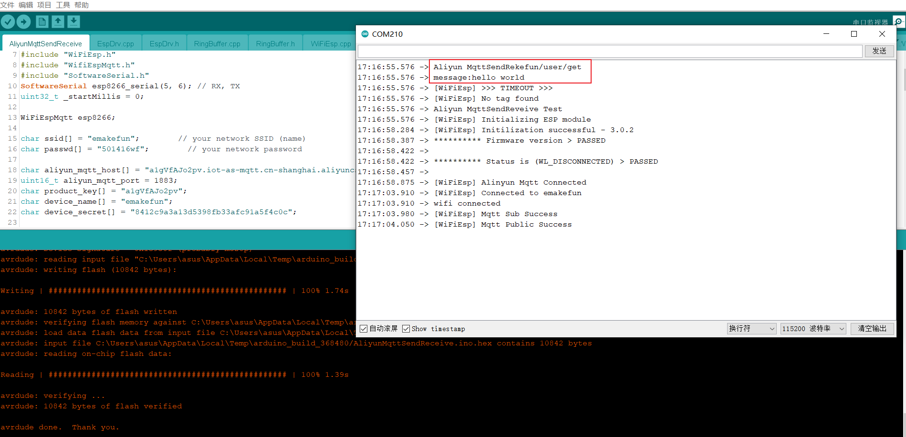**

**[下载最新示例程序](https://www.emakefun.com/sources/AliyunMqttSendReceive.7z)**

**MQTT物联网需要先导入或者更新最新PH2.0的Mixly图形化库具体请看**

**[物联网模块的mixly参考链接](https://github.com/emakefun/emakefun_sensors_graphical_lib#MQTT物联网模块 )**

**[microbit使用参考示例]( https://github.com/emakefun/pxt-mqtt )**


```

```