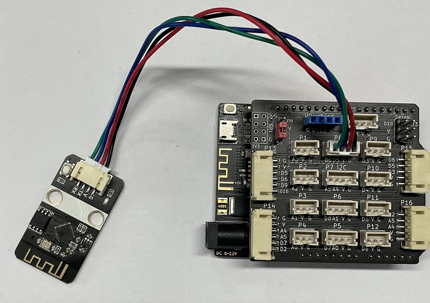

# esp8266-mqtt物联网无线模块


## 概述

esp8266-mqtt无线模块是emakefun公司基于乐鑫科技的wifi芯片ESP8266基础上重新研发的串口转wifi的物联网模块，该模块采用AT配置方式来支持wifi无线通信，AT指令全面兼容[乐鑫官方指令库（V3.0.0）](https://www.espressif.com/sites/default/files/documentation/4a-esp8266_at_instruction_set_cn.pdf)，在此基础上添加了MQTT指令，并且全部封装成scratch，mixly，Makecode图形化编程块支持arduino，micro:bit。让用户非常容易接收和发送物联网信息，远程物联网控制从未如此简单。


## 硬件参数

- 工作电压：5V
- 接口速率：9600 bps
- 无线频率：2.4GHz
- 接口类型：PH2.0-4Pin (G V TX TX)
- 无线模式：IEEE802.11b/g/n
- SRAM：160KB
- 外置Flash：4MB
- 支持低功耗：<240mA
- 模块尺寸：4 * 2.1cm
- 安装方式：M4螺钉螺母固定

## 模块特点：

- 内置低功率 32 位 CPU：可以兼作应用处理器
- 内置协议：TCP/IP 协议栈
- 加密类型：WPA WPA2/WPA2–PSK
- 支持乐鑫官方AT标准指令集
- 支持连接标准MQTT协议和TTL串口到无线的应用

## 引脚定义：
| 引脚名称 | 描述         |
| -------- | ------------ |
| V        | 5V电源引脚   |
| G        | GND 地线     |
| TX        | 串口发送端 |
| RX        | 串口接收端 |


## MQTT扩展AT指令

### AT+MQTTUSERCFG - 配置 MQTT 用户属性
设置指令:
AT+MQTTUSERCFG=<LinkID>,<scheme>,<"client_id">,<"username">,<"password">,<cert_key_ID>,<CA_ID>,<"path">

功能:
设置 MQTT 用户配置

响应:

OK或ERROR

参数说明:

LinkID: 当前只支持 0
scheme:
- 1: MQTT over TCP
- 2: MQTT over TLS(no certificate verify)
- 3: MQTT over TLS(verify server certificate)
- 4: MQTT over TLS(provide client certificate)
- 5: MQTT over TLS(verify server certificate and provide client certificate)
- 6: MQTT over WebSocket(based on TCP)
- 7: MQTT over WebSocket Secure(based on TLS, no certificate verify)
- 8: MQTT over WebSocket Secure(based on TLS, verify server certificate)
- 9: MQTT over WebSocket Secure(based on TLS, provide client certificate)
- 10: MQTT over WebSocket Secure(based on TLS, verify server certificate and provide client certificate)
- client_id: 对应 MQTT client ID, 用于标志 client 身份, 最长 256 字节
- username: 用于登录 MQTT broker 的 username, 最长 64 字节
- password: 用于登录 MQTT broker 的 password, 最长 64 字节
- cert_key_ID: 证书 ID, 目前支持一套 cert 证书, 参数为 0
- CA_ID: CA ID, 目前支持一套 CA 证书, 参数为 0
- path: 资源路径, 最长 32 字节

### AT+MQTTCLIENTID - 配置 MQTT 客户端 ID
设置指令:

AT+MQTTCLIENTID=<LinkID><"client_id">

功能:
设置 MQTT 客户端 ID, 将会覆盖 AT+MQTTUSERCFG 中 clientID 参数,
用户可通过 AT+MQTTCLIENTID 设置较长的 clientID.

响应:

OK或ERROR

参数说明:

- LinkID: 当前只支持 0
- client_id: 对应 MQTT client ID, 用于标志 client 身份, 最长 256 字节

### AT+MQTTUSERNAME - 配置 MQTT 登录用户名
设置指令:

AT+MQTTUSERNAME=<LinkID><"username">

功能:
设置 MQTT 登录用户名, 将会覆盖 AT+MQTTUSERCFG 中 username 参数,
用户可通过 AT+MQTTUSERNAME 设置较长的用户名.

响应:

OK或ERROR

参数说明:

LinkID: 当前只支持 0
username: 对应 MQTT username, 用于登录 MQTT broker, 最长 256 字节

### AT+MQTTPASSWORD - 配置 MQTT 登录密码
设置指令:

AT+MQTTPASSWORD=<LinkID><"password">

功能:
设置 MQTT 登录密码, 将会覆盖 AT+MQTTUSERCFG 中 password 参数,
用户可通过 AT+MQTTPASSWORD 设置较长的密码.

响应:

OK或ERROR

参数说明:

LinkID: 当前只支持 0
password: 对应 MQTT password, 用于登录 MQTT broker, 最长 256 字节

### AT+MQTTCONNCFG - 配置 MQTT 连接属性
设置指令:

AT+MQTTCONNCFG=<LinkID>,<keepalive>,<disable_clean_session>,<"lwt_topic">,<"lwt_msg">,<lwt_qos>,<lwt_retain>

功能:
设置 MQTT 连接配置

响应:

OK或ERROR

参数说明:

- LinkID: 当前只支持 0
- keepalive: MQTT PING 超时时间,范围为 [60, 7200], 单位为秒. 默认 120
- disable_clean_session: MQTT 清理会话标志, 参数为 0 或 1, 默认为 0
- lwt_topic: 遗嘱 topic, 最长 64 字节
- lwt_msg: 遗嘱 message, 最长 64 字节
- lwt_qos: 遗嘱 QoS, 参数可选 0, 1, 2, 默认为 0
- lwt_retain: 遗嘱 retain, 参数可选 0, 1, 默认为 0

### AT+MQTTCONN
设置指令:

AT+MQTTCONN=<LinkID>,<"host">,<port>,<reconnect>

功能:
连接指定 MQTT broker

响应:

OK或ERROR

查询指令:

### AT+MQTTCONN?

功能:
查询 AT 已连接的 MQTT broker

响应:

AT+MQTTCONN:<LinkID>,<state>,<scheme><"host">,<port>,<"path">,<reconnect>

参数说明:

- LinkID: 当前只支持 0
- host: 连接 MQTT broker 域名, 最大 128 字节
- port: 连接 MQTT broker 端口, 最大 65535
- path: 资源路径, 最长 32 字节
- reconnect: 是否重连 MQTT, 若设置为 1, 需要消耗较多内存资源
- state: MQTT 当前状态, 状态说明如下:
- 0: 连接未初始化
- 1: 已设置 MQTTUSERCFG
- 2: 已设置 MQTTCONNCFG
- 3: 连接已断开
- 4: 已建立连接
- 5: 已连接, 但未订阅 topic
- 6: 已连接, 已订阅过 topic
scheme:
- 1: MQTT over TCP
- 2: MQTT over TLS(no certificate verify)
- 3: MQTT over TLS(verify server certificate)
- 4: MQTT over TLS(provide client certificate)
- 5: MQTT over TLS(verify server certificate and provide client certificate)
- 6: MQTT over WebSocket(based on TCP)
- 7: MQTT over WebSocket Secure(based on TLS, no certificate verify)
- 8: MQTT over WebSocket Secure(based on TLS, verify server certificate)
- 9: MQTT over WebSocket Secure(based on TLS, provide client certificate)
- 10: MQTT over WebSocket Secure(based on TLS, verify server certificate and provide client certificate)

### AT+ALIYUN_MQTTCONN?

设置指令:

AT+ALIYUN_MQTTCONN=<"host">,<port>,<"ProductKey">,<"DeviceName">,<"DeviceSecret">

功能:
连接指定的阿里云MQTT broker

参数说明:
- host: 连接阿里云的MQTT broker 域名, 详情请参考[**阿里云域名格式**](https://help.aliyun.com/document_detail/147356.html?spm=a2c4g.11186623.6.587.253b4006W32crS)
- port: 连接 MQTT broker 端口, 最大 65535 默认 1883
- ProductKey: 设备所属产品的ProductKey，即物联网平台为产品颁发的全局唯一标识符
- DeviceName: 设备在产品内的唯一标识符。DeviceName与设备所属产品的ProductKey组合，作为设备标识，用来与物联网平台进行连接认证和通信。
- DeviceSecret: 物联网平台为设备颁发的设备密钥，用于认证加密。需与DeviceName成对使用。

响应:

OK或ERROR


### AT+MQTTPUB
设置指令:

AT+MQTTPUB=<LinkID>,<"topic">,<"data">,<qos>,<retain>

功能:
在 LinkID上通过 topic 发布数据 data, 其中 data 为字符串消息, 若要发布二进制,请使用 AT+MQTTPUBRAW

响应:

OK或ERROR

参数说明:

- LinkID: 当前只支持 0
- topic: 发布主题, 最长 64 字节
- data: 发布消息, data 不能包含 \0, 请确保整条 AT+MQTTPUB 不超过 AT 指令的最大长度限制
- qos: 发布服务质量, 参数可选 0,1,2, 默认为 0
- retain: 发布 retain

### AT+MQTTPUBRAW
设置指令:

AT+MQTTPUBRAW=<LinkID>,<"topic">,<length>,<qos>,<retain>

功能:
在 LinkID 上通过 topic 发布数据 data, 其中 data 为二进制数据

响应:

OK或ERROR

等待用户输入 length 大小数据, 之后响应如下:

+MQTTPUB:FAIL

或

+MQTTPUB:OK

参数说明:

- LinkID: 当前只支持 0
- topic: 发布主题, 最长 64 字节
- length: 要发布消息长度, 长度受限于当前可用内存
- qos: 发布服务质量, 参数可选 0,1,2, 默认为 0
- retain: 发布 retain
- AT port 未收到指定 length 长度的数据, 将一直等待, 在此期间接收到的数据都会当成普通数据

### AT+MQTTSUB
设置指令:

AT+MQTTSUB=<LinkID>,<"topic">,<qos>

功能:
订阅指定连接的 MQTT 主题, 可重复多次订阅不同 topic

响应:

OK或ERROR

当收到对应主题订阅的 MQTT 消息时, 将按照如下格式打印消息内容

+MQTTSUBRECV:<LinkID>,<"topic">,<data_length>,data

如果订阅已订阅过的主题, 仍无条件向 MQTT broker 订阅, Log 口打印 ALREADY SUBSCRIBE

查询指令:

### AT+MQTTSUB?

### 功能:
查询 MQTT 所有连接上已订阅的 topic

响应:

- +MQTTSUB:<LinkID>,<state>,<"topic1">,<qos>
- +MQTTSUB:<LinkID>,<state>,<"topic2">,<qos>
- +MQTTSUB:<LinkID>,<state>,<"topic3">,<qos>

- OK
- 1
- 2
- 3
- 4
- 5
- 或ERROR

参数说明:

- LinkID: 当前只支持 0
- state: MQTT 当前状态, 状态说明如下:
- 0: 连接未初始化
- 1: 已设置 MQTTUSERCFG
- 2: 已设置 MQTTCONNCFG
- 3: 连接已断开
- 4: 已建立连接
- 5: 已连接, 但未订阅 topic
- 6: 已连接, 已订阅过 topic
- topic*: 订阅过的主题
- qos: 订阅过的 QoS

### AT+MQTTUNSUB
设置指令:

AT+MQTTUNSUB=<LinkID>,<"topic">

功能:
取消订阅指定连接的 MQTT 主题, 可多次取消不同订阅 topic

响应:

OK或ERROR

参数说明:

- LinkID: 当前只支持 0
- topic: 取消订阅主题, 最长 64 字节
如果取消未订阅的主题, 仍无条件向 MQTT broker 取消订阅, Log 口打印 NO UNSUBSCRIBE

### AT+MQTTCLEAN
设置指令:

AT+MQTTCLEAN=<LinkID>

功能:
关闭 MQTT Client 为 LinkID 的连接, 并释放内部占用的资源

响应:

OK或者ERROR

参数说明:

LinkID: 当前只支持 0


## 模块尺寸


## 接线示例


##  arduino 应用场景

AT串口测试
```
#include "Arduino.h"
#include "SoftwareSerial.h"
SoftwareSerial Serial1(5, 6); // RX, TX

void setup()
{
  Serial.begin(115200); // serial port used for debugging
  Serial1.begin(9600);  // your ESP's baud rate might be different
}
 
void loop()
{
  if(Serial1.available())  // check if the ESP is sending a message
  {
    while(Serial1.available())
    {
      int c = Serial1.read(); // read the next character
      Serial.write((char)c);  // writes data to the serial monitor
    }
  }
 
  if(Serial.available())
  {
    // wait to let all the input command in the serial buffer
    delay(10);

    // read the input command in a string
    String cmd = "";
    while(Serial.available())
    {
      cmd += (char)Serial.read();
    }

    // print the command and send it to the ESP
    Serial.println();
    Serial.print(">>>> ");
    Serial.println(cmd);

    // send the read character to the ESP
    Serial1.print(cmd);
  }
}
```
### arduino函数介绍

```

```
### arduino示例程序

[下载最新库程序]()

```
#include "WiFiEsp.h"
#include "WifiEspMqtt.h"
#include "SoftwareSerial.h"
SoftwareSerial esp8266_serial(5, 6); // RX, TX
uint32_t _startMillis = 0;

WiFiEspMqtt esp8266;

void setup()
{
  Serial.begin(115200);
  esp8266_serial.begin(9600);
  WiFi.init(&esp8266_serial);
  assertEquals("Firmware version", WiFi.firmwareVersion(), "3.0.2");
  assertEquals("Status is (WL_DISCONNECTED)", WiFi.status(), WL_DISCONNECTED);

  esp8266.mqtt_connect("192.168.2.65", 1883, 0);
  // esp8266.mqtt_connect_cfg(120, 1, "lws_topic", "lws_kill", 0);
  esp8266.mqtt_usercfg("esp8266_client", "emakefun123", "12345678");

  if (WiFi.begin("emakefun", "501416wf") == WL_CONNECTED)
  {
     Serial.println("wifi connected");
     esp8266.mqtt_sub("topic_1", 0); //订阅topic_1主题，qos为0
  }
  esp8266.mqtt_public("topic_led", "on", 0);
  delay(30000);
}

void loop()
{
    if (esp8266.mqtt_receive())
    {

     Serial.print("topic:");
     Serial.println(esp8266.mqtt_topic);
     Serial.print("message:");
     Serial.println(esp8266.mqtt_message);

    }
}
```

### Arduino连接阿里云案例分析

```
/*
 WiFiEsp test: BasicTest
 
 Performs basic connectivity test and checks.
*/

#include "WiFiEsp.h"
#include "WifiEspMqtt.h"
#include "SoftwareSerial.h"
SoftwareSerial esp8266_serial(5, 6); // RX, TX
uint32_t _startMillis = 0;

WiFiEspMqtt esp8266;

char ssid[] = "emakefun";        // your network SSID (name)
char passwd[] = "501416wf";        // your network password

char aliyun_mqtt_host[] = "a1gVfAJo2pv.iot-as-mqtt.cn-shanghai.aliyuncs.com";  // 阿里云物联网服务器host
uint16_t aliyun_mqtt_port = 1883;    // 阿里云物联网服务器端口
char product_key[] = "a1gVfAJo2pv";  // 设备所属产品的ProductKey，即物联网平台为产品颁发的全局唯一标识符
char device_name[] = "emakefun";     // 设备在产品内的唯一标识符。DeviceName与设备所属产品的ProductKey组合，作为设备标识，用来与物联网平台进行连接认证和通信。
char device_secret[] = "8412c9a3a13d5398fb33afc91a5f4c0c";  // 物联网平台为设备颁发的设备密钥，用于认证加密。需与DeviceName成对使用。

void setup()
{
  Serial.begin(115200);
  esp8266_serial.begin(9600);
  Serial.println("Aliyun MqttSendReveive Test");
  WiFi.init(&esp8266_serial);
  assertEquals("Firmware version", WiFi.firmwareVersion(), "3.0.2");
  assertEquals("Status is (WL_DISCONNECTED)", WiFi.status(), WL_DISCONNECTED);
  esp8266.mqtt_connect_aliyun(aliyun_mqtt_host, aliyun_mqtt_port, product_key, device_name, device_secret, 0);

  if (WiFi.begin(ssid, passwd) == WL_CONNECTED)
  {
     Serial.println("wifi connected");
     
     esp8266.mqtt_sub("/a1gVfAJo2pv/emakefun/user/get", 0);   // 订阅topic
  }
  esp8266.mqtt_public("/a1gVfAJo2pv/emakefun/user/add", "on", 0); // 发布topic 数据为 "on"
  delay(10000);
}

void loop()
{
    if (esp8266.mqtt_receive())
    {

     Serial.print("topic:");
     Serial.println(esp8266.mqtt_topic);    // 打印订阅的topic
     Serial.print("message:");
     Serial.println(esp8266.mqtt_message);  // 打印订阅的topic的数据

    }
}

void assertNotEquals(const char* test, int actual, int expected)
{
  if(actual!=expected)
    pass(test);
  else
    fail(test, actual, expected);
}

void assertEquals(const char* test, int actual, int expected)
{
  if(actual==expected)
    pass(test);
  else
    fail(test, actual, expected);
}

void assertEquals(const char* test, char* actual, char* expected)
{
  if(strcmp(actual, expected) == 0)
    pass(test);
  else
    fail(test, actual, expected);
}


void pass(const char* test)
{
  Serial.print(F("********** "));
  Serial.print(test);
  Serial.println(" > PASSED");
  Serial.println();
}

void fail(const char* test, char* actual, char* expected)
{
  Serial.print(F("********** "));
  Serial.print(test);
  Serial.print(" > FAILED");
  Serial.print(" (actual=\"");
  Serial.print(actual);
  Serial.print("\", expected=\"");
  Serial.print(expected);
  Serial.println("\")");
  Serial.println();
  delay(10000);
}

void fail(const char* test, int actual, int expected)
{
  Serial.print(F("********** "));
  Serial.print(test);
  Serial.print(" > FAILED");
  Serial.print(" (actual=");
  Serial.print(actual);
  Serial.print(", expected=");
  Serial.print(expected);
  Serial.println(")");
  Serial.println();
  delay(10000);
}
```
当连接上WIFI时，物联网模块的蓝灯会常亮，否则蓝灯会闪烁，同时串口监视器会显示WiFi connected,如下图所示。

当连上阿里云服务器时，选择阿里云设备菜单时，会显示当前在线的设备数量，并且所连接的设备的状态为在线状态，如下图所示。

同时在串口监视器里面可以看到是否连接成功，如下图所示。

当前程序会在连接阿里云服务器成功之后，会向服务器发布和订阅相关的主题(topic)。
发布: 向云端发送数据。比如温度、湿度、气压值、停车位...... 
     可以在阿里云的监控运维->日志服务里面可以看到当前发布的记录，并且点击查看可以看到发送的数据。
	 
	 
订阅: 获取云端的数据。比如天气预报.....
     可在设备的topic列表里找到相应的topic，并且点击发布消息，发布想要发布的数据。

	 同时在串口监视器里面我们可以看到订阅的数据。

### MagicBlock图形化编程块

### Mixly图形化块（暂不支持）

### microbit makecode块

### microbit micropython支持
敬请期待。。。。。