# esp8266-mqtt模块具体使用

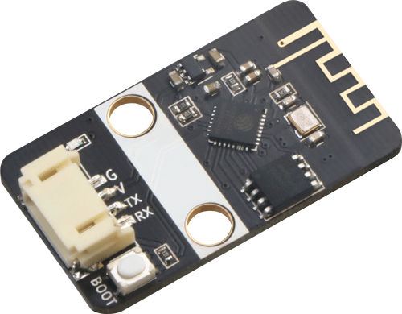

## 一、概述

​		esp8266-mqtt无线模块是emakefun公司基于乐鑫科技的wifi芯片ESP8266基础上重新研发的串口转wifi的物联网模块，该模块采用AT配置方式来支持wifi无线通信，AT指令全面兼容[乐鑫官方指令库（V3.0.0）](https://www.espressif.com/sites/default/files/documentation/4a-esp8266_at_instruction_set_cn.pdf)，在此基础上添加了MQTT指令，并且全部封装成scratch，mixly，Makecode图形化编程块支持arduino，micro:bit。让用户非常容易接收和发送物联网信息，远程物联网控制从未如此简单。

## 二、模块参数
- 工作电压：5V
- 接口速率：9600 bps
- 无线频率：2.4GHz
- 接口类型：PH2.0-4Pin (G V TX TX)
- 无线模式：IEEE802.11b/g/n
- SRAM：160KB
- 外置Flash：4MB
- 支持低功耗：<240mA
- 模块尺寸：4 * 2.1cm
- 安装方式：M4螺钉螺母固定
- LED指示灯：Link网络连接指示灯和MQTT服务器连接指示灯


## 三、实际使用：

### 3.1 Arduino UNO使用教程

#### 3.1.1 接线

| 引脚名称 | 描述       | Arduino uno |
| -------- | ---------- | ----------- |
| G        | GND地线    |             |
| V        | 5V电源引脚 |             |
| TX       | 串口发送端 | 5           |
| RX       | 串口接收端 | 6           |


#### 3.1.2 Mixly示例程序

在Mixly编程界面右上角点击设置——导入库，选择EmakeFun的库文件从云端导入。[示例程序下载](esp8266_mqtt_pic/uno-mixly示例程序.zip)


参照示例编写程序，在此我们用Emakefun公司的服务器为例。

点击左侧导入的库，在智能模块中找出MQTT相关编程指令。


示例程序。

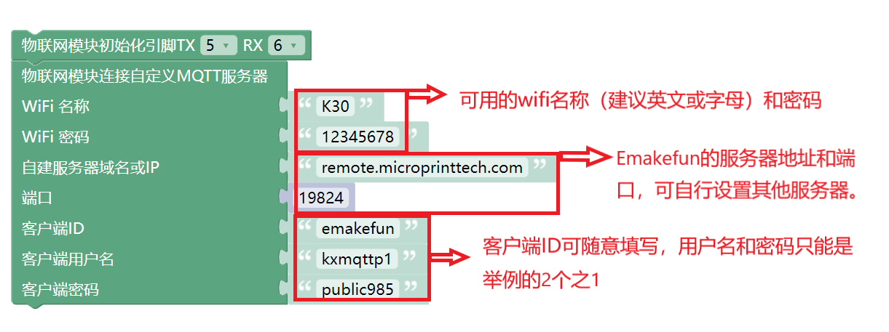

服务器域名 remote.microprinttech.com 为Emakefun自建服务器，对应端口19824（使用了该服务器就请用提供的参数），用户名和密码如下：注意！！！**一定是用这两个账号**！！！

账号1：kxmqttp1  密码  public985

账号2：kxmqttp2  密码  public211

上传完程序，将硬件断电后重连，等待MQTT模块连接上wifi和服务器，连接成功现象为MQTT两个灯Link和MQTT都长亮。


硬件接收服务器信息示例。

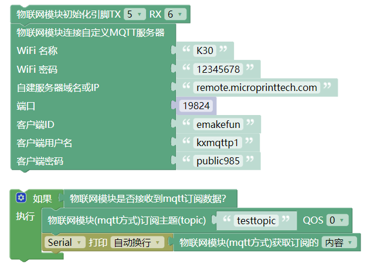

硬件发送信息到服务器示例。

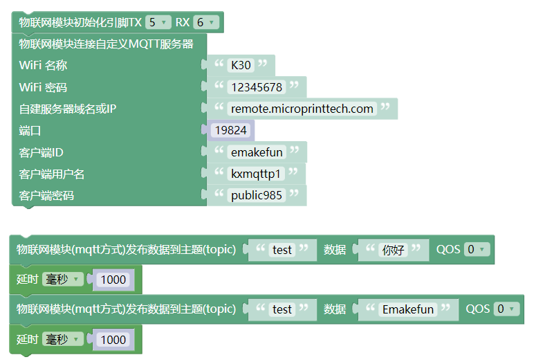

#### 3.1.3 Arduino IDE示例程序

[Arduino IDE示例程序下载](esp8266_mqtt_pic/uno-IDE示例程序.zip)

硬件接收服务器信息示例。

```
#include "WiFiEsp.h"
#include <SoftwareSerial.h>
SoftwareSerial esp8266_serial(5, 6);  //MQTT模块接口，TX对应5，RX对应6
#include "WifiEspMqtt.h"

WiFiEspMqtt esp8266;
char ssid[] = "K30";    //wifi名称
char passwd[] = "12345678";  //wifi密码
char mqtt_host[] = "remote.microprinttech.com";  //服务器地址
uint16_t mqtt_port = 19824;                      //端口，固定值19824
char mqtt_client_id[] = "emakefun";              //客户端ID，随意填
char mqtt_username[] = "kxmqttp1";               //账号和密码，必须为提供的2选1
char mqtt_password[] = "public985";

void setup(){
  esp8266_serial.begin(9600);
  WiFi.init(&esp8266_serial);
  WiFi.begin(ssid, passwd);

  esp8266.mqtt_usercfg(mqtt_client_id, mqtt_username, mqtt_password);
  esp8266.mqtt_connect(mqtt_host, mqtt_port, 0);
  Serial.begin(9600);

}

void loop(){
  if (esp8266.mqtt_receive()) {   //如果接受到信息
    esp8266.mqtt_sub(String("testtopic").c_str(), 0);  //主题名称
    Serial.println(esp8266.mqtt_message);  //打印信息
  }
}
```

硬件发送信息到服务器示例。

```
#include "WiFiEsp.h"
#include <SoftwareSerial.h>
SoftwareSerial esp8266_serial(5, 6);  //MQTT模块接口，TX对应5，RX对应6
#include "WifiEspMqtt.h"
WiFiEspMqtt esp8266;

char ssid[] = "K30";    //wifi名称
char passwd[] = "12345678";  //wifi密码
char mqtt_host[] = "remote.microprinttech.com";  //服务器地址
uint16_t mqtt_port = 19824;                      //端口，固定值19824
char mqtt_client_id[] = "emakefun";              //客户端ID，随意填
char mqtt_username[] = "kxmqttp1";               //账号和密码，必须为提供的2选1
char mqtt_password[] = "public985";

void setup(){
  esp8266_serial.begin(9600);
  WiFi.init(&esp8266_serial);
  WiFi.begin(ssid, passwd);
  esp8266.mqtt_usercfg(mqtt_client_id, mqtt_username, mqtt_password);
  esp8266.mqtt_connect(mqtt_host, mqtt_port, 0);

}

void loop(){
  esp8266.mqtt_public("test", String("你好").c_str(), 0);  //要发送的信息，test为主题，“你好”为内容
  delay(1000);
  esp8266.mqtt_public("test", String("Emakefun").c_str(), 0);
  delay(1000);
}
```

#### 3.1.4 实验现象

打开电脑浏览器，输入[网页端地址](http://remote.microprinttech.com:19825/#/clients)： http://remote.microprinttech.com:19825/#/clients 端口19825，用户名admin，密码Anynod2022514 ，打开后并登陆，如下图。

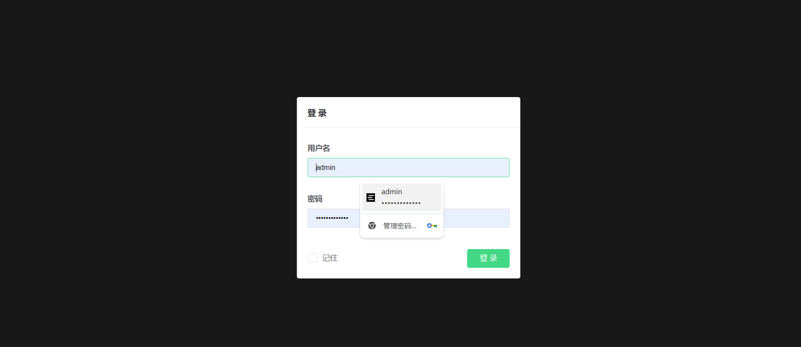

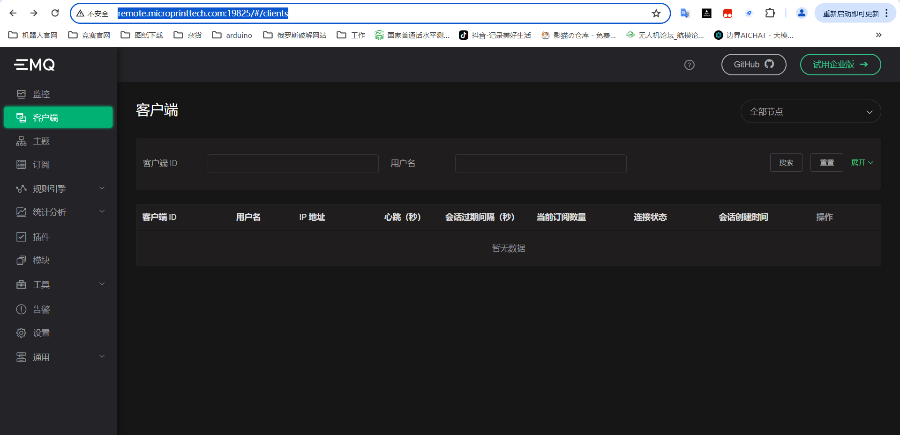

上传程序，等待硬件连接服务器，连接成功后网页端显示如下。

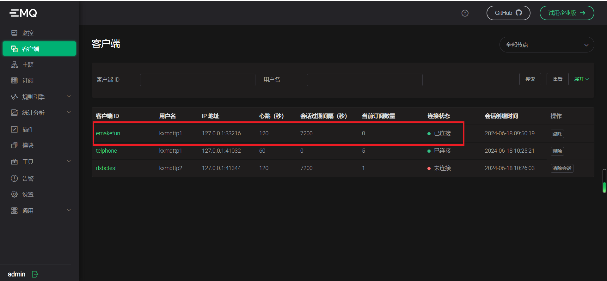

点击工具，选择 websocket，然后再点击“连接”。

**主机地址默认不用改，端口一定为19829，ID随便填写，用户名与密码用编程中提供的。**

**账号1：kxmqttp1  密码  public985**

**账号2：kxmqttp2  密码  public211**

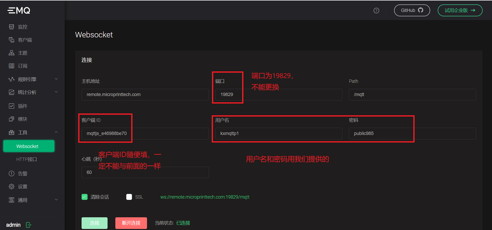

硬件接收服务器的信息，在“消息”中填写主题，发送数字或文字，编程软件的串口会打印出信息。

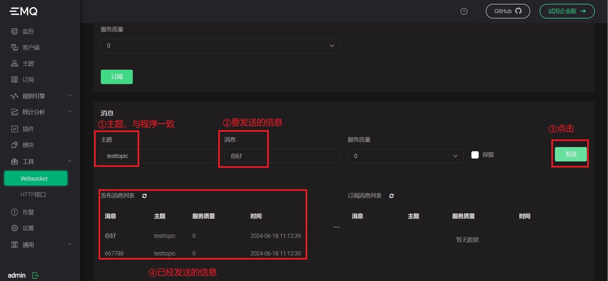


硬件发送信息到服务器。在“主题”中填写主题，点击订阅，会提示订阅成功；然后让硬件发送信息，可以看到订阅消息列表中收到相关的消息。


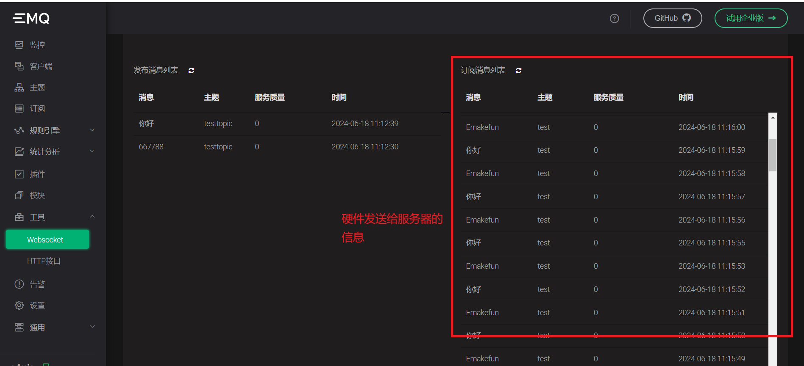

### 3.2 MicroBit使用教程

#### 3.2.1 接线

| 引脚名称 | 描述       | Arduino uno |
| -------- | ---------- | ----------- |
| G        | GND地线    |             |
| V        | 5V电源引脚 |             |
| TX       | 串口发送端 | 15          |
| RX       | 串口接收端 | 14          |


#### 3.2.2 Microsoft在线编程示例

[Microsoft在线编程网址](https://makecode.microbit.org/#)：https://makecode.microbit.org/#

打开网址，新建项目，命名为“硬件接收服务器信息”。


如上图，打开编程界面后，我们需要导入MQTT库文件，点击“+拓展”，在弹出的界面添加如下网址https://github.com/emakefun/pxt-mqtt，回车，点击出现的库。


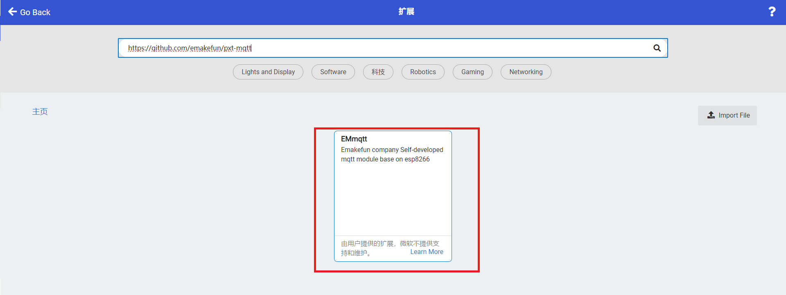


注意！！！在使用MQTT模块时，下载完程序后请彻底断电再重启！使用时建议外接电源。

硬件接收服务器信息示例。[https://makecode.microbit.org/_VX1FPAdYyCes](https://makecode.microbit.org/_VX1FPAdYyCes)

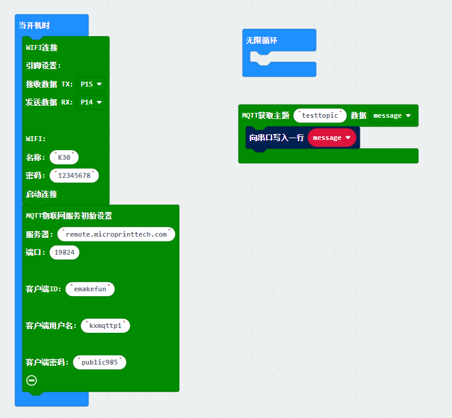

硬件发送信息到服务器示例。[https://makecode.microbit.org/_Lx299LKwK7k2](https://makecode.microbit.org/_Lx299LKwK7k2)

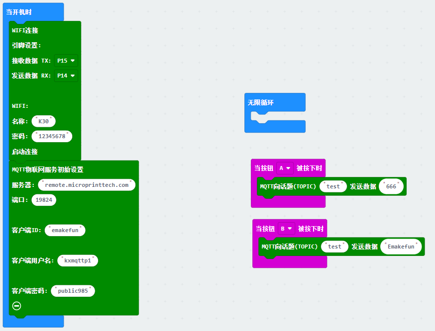

#### 3.2.3 实验现象

与Arduino UNO的实验现象一致，请参考5.1.4步骤。


### **四、Arduino连接阿里云案例分析**

[阿里云连接示例下载](esp8266_mqtt_pic/AliyunMqttSendReceive.7z)。

```
/*
 WiFiEsp test: BasicTest

 Performs basic connectivity test and checks.
*/

#include "WiFiEsp.h"
#include "WifiEspMqtt.h"
#include "SoftwareSerial.h"
SoftwareSerial esp8266_serial(5, 6); // RX, TX
uint32_t _startMillis = 0;

WiFiEspMqtt esp8266;

char ssid[] = "emakefun";        // your network SSID (name)
char passwd[] = "501416wf";        // your network password

char aliyun_mqtt_host[] = "a1gVfAJo2pv.iot-as-mqtt.cn-shanghai.aliyuncs.com";  // 阿里云物联网服务器host
uint16_t aliyun_mqtt_port = 1883;    // 阿里云物联网服务器端口
char product_key[] = "a1gVfAJo2pv";  // 设备所属产品的ProductKey，即物联网平台为产品颁发的全局唯一标识符
char device_name[] = "emakefun";     // 设备在产品内的唯一标识符。DeviceName与设备所属产品的ProductKey组合，作为设备标识，用来与物联网平台进行连接认证和通信。
char device_secret[] = "8412c9a3a13d5398fb33afc91a5f4c0c";  // 物联网平台为设备颁发的设备密钥，用于认证加密。需与DeviceName成对使用。

void setup()
{
  Serial.begin(115200);
  esp8266_serial.begin(9600);
  Serial.println("Aliyun MqttSendReveive Test");
  WiFi.init(&esp8266_serial);
  assertEquals("Firmware version", WiFi.firmwareVersion(), "3.0.2");
  assertEquals("Status is (WL_DISCONNECTED)", WiFi.status(), WL_DISCONNECTED);
  esp8266.mqtt_connect_aliyun(aliyun_mqtt_host, aliyun_mqtt_port, product_key, device_name, device_secret, 0);

  if (WiFi.begin(ssid, passwd) == WL_CONNECTED)
  {
     Serial.println("wifi connected");
     
     esp8266.mqtt_sub("/a1gVfAJo2pv/emakefun/user/get", 0);   // 订阅topic
  }
  esp8266.mqtt_public("/a1gVfAJo2pv/emakefun/user/add", "on", 0); // 发布topic 数据为 "on"
  delay(10000);
}

void loop()
{
    if (esp8266.mqtt_receive())
    {

     Serial.print("topic:");
     Serial.println(esp8266.mqtt_topic);    // 打印订阅的topic
     Serial.print("message:");
     Serial.println(esp8266.mqtt_message);  // 打印订阅的topic的数据
    
    }
}

void assertNotEquals(const char* test, int actual, int expected)
{
  if(actual!=expected)
    pass(test);
  else
    fail(test, actual, expected);
}

void assertEquals(const char* test, int actual, int expected)
{
  if(actual==expected)
    pass(test);
  else
    fail(test, actual, expected);
}

void assertEquals(const char* test, char* actual, char* expected)
{
  if(strcmp(actual, expected) == 0)
    pass(test);
  else
    fail(test, actual, expected);
}


void pass(const char* test)
{
  Serial.print(F("********** "));
  Serial.print(test);
  Serial.println(" > PASSED");
  Serial.println();
}

void fail(const char* test, char* actual, char* expected)
{
  Serial.print(F("********** "));
  Serial.print(test);
  Serial.print(" > FAILED");
  Serial.print(" (actual=\"");
  Serial.print(actual);
  Serial.print("\", expected=\"");
  Serial.print(expected);
  Serial.println("\")");
  Serial.println();
  delay(10000);
}

void fail(const char* test, int actual, int expected)
{
  Serial.print(F("********** "));
  Serial.print(test);
  Serial.print(" > FAILED");
  Serial.print(" (actual=");
  Serial.print(actual);
  Serial.print(", expected=");
  Serial.print(expected);
  Serial.println(")");
  Serial.println();
  delay(10000);
}
```
**当连接上WIFI时，物联网模块的蓝灯会常亮，否则蓝灯会闪烁，同时串口监视器会显示WiFi connected,如下图所示。**
****
**当连上阿里云服务器时，选择阿里云设备菜单时，会显示当前在线的设备数量，并且所连接的设备的状态为在线状态，如下图所示。**
****
**同时在串口监视器里面可以看到是否连接成功，如下图所示。**
**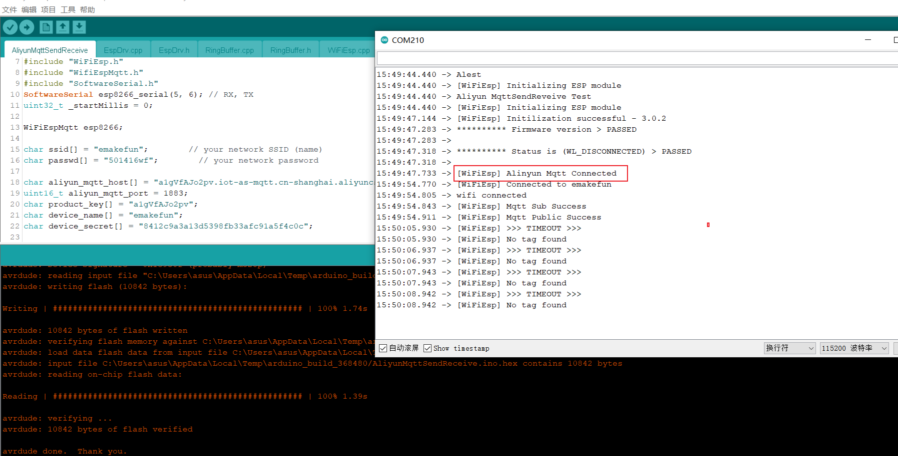**
**当前程序会在连接阿里云服务器成功之后，会向服务器发布和订阅相关的主题(topic)。**
**发布: 向云端发送数据。比如温度、湿度、气压值、停车位......** 
     **可以在阿里云的监控运维->日志服务里面可以看到当前发布的记录，并且点击查看可以看到发送的数据。**
****	 
****	 
**订阅: 获取云端的数据。比如天气预报.....**
     **可在设备的topic列表里找到相应的topic，并且点击发布消息，发布想要发布的数据。**
****
	 **同时在串口监视器里面我们可以看到订阅的数据。**
**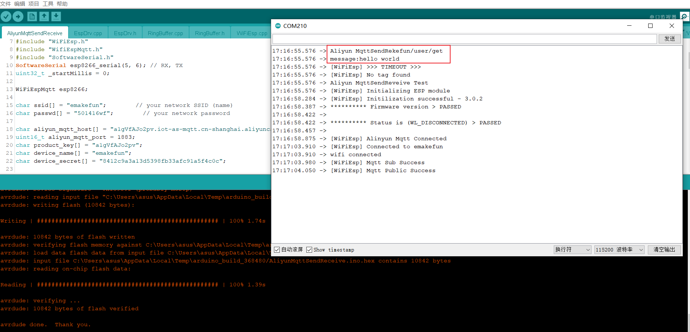**

