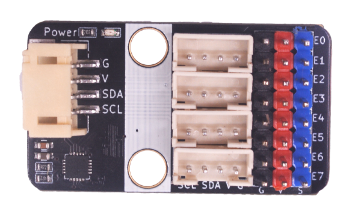
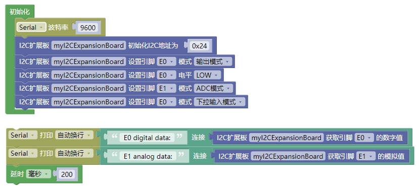

# 8 路 ADC/I2C/IO 三合一口扩展板

## 模块实物图



## 概述

  该模块是 emakefun 为了解决创客在使用中，主板的 adc/io/i2c 不够用的场景而开发的一块扩展板，可以扩展4 路 i2c接口，8路io口可以通过软件分别配置成adc，输入，输出模式。配置接口为I2C接口，地址为0x24

## 模块参数

| 引脚名称 | 描述         |
| -------- | ------------ |
| G        | GND 地线     |
| V        | 3~5V电源引脚 |
| SDA      | I2C数据引脚  |
| SDL      | I2C时钟引脚  |

## 硬件尺寸图


## arduino 应用场景

### arduino 函数介绍

```c++
#pragma once

#include <stdint.h>

/**
 * @class I2cExpansionBoard
 * @brief I2C扩展板主类
 */
class I2cExpansionBoard {
 public:
  /**
   * @enum GpioMode
   * @brief 扩展板GPIO模式类型
   */
  enum GpioMode {
    kGpioModeAdc = 0,       /**< ADC模式*/
    kGpioModeInputPullUp,   /**< 输入模式，默认拉高电平*/
    kGpioModeInputPullDown, /**< 输入模式，默认拉低电平*/
    kGpioModeOutput,        /**< 输出模式*/
  };

  /**
   * @enum GpioPin
   * @brief 扩展板GPIO引脚
   */
  enum GpioPin {
    kGpioPinE0 = 0, /**< 引脚E0*/
    kGpioPinE1 = 1, /**< 引脚E1*/
    kGpioPinE2 = 2, /**< 引脚E2*/
    kGpioPinE3 = 3, /**< 引脚E3*/
    kGpioPinE4 = 4, /**< 引脚E4*/
    kGpioPinE5 = 5, /**< 引脚E5*/
    kGpioPinE6 = 6, /**< 引脚E6*/
    kGpioPinE7 = 7, /**< 引脚E7*/
  };

  /**
   * @brief 扩展板默认I2C地址
   */
  enum { kDeviceI2cAddressDefault = 0x24, /**< 默认I2C地址：0x24*/ };

  /**
   * @brief 构造函数
   * @param [in] device_i2c_address 扩展板I2C地址，默认值为0x24, @see
   * kDeviceI2cAddressDefault
   */
  I2cExpansionBoard(uint8_t device_i2c_address = kDeviceI2cAddressDefault);

  /**
   * @brief 设置GPIO模式
   * @param [in] gpio_pin GPIO引脚 @see GpioPin
   * @param [in] mode GPIO模式 @see GpioMode
   * @return bool 成功返回true，失败返回false
   */
  bool SetGpioMode(GpioPin gpio_pin, GpioMode mode);

  /**
   * @brief 设置GPIO输出电平
   * @param [in] gpio_pin GPIO引脚 @see GpioPin
   * @param [in] level 电平值，0为低电平，1为高电平
   * @return bool 成功返回true，失败返回false
   */
  bool SetGpioLevel(GpioPin gpio_pin, uint8_t level);

  /**
   * @brief 获取GPIO输出电平
   * @param [in] gpio_pin GPIO引脚 @see GpioPin
   * @return uint8_t 电平值，0为低电平，1为高电平
   */
  uint8_t GetGpioLevel(GpioPin gpio_pin);

  /**
   * @brief 获取GPIO ADC电平值
   * @param [in] gpio_pin GPIO引脚 @see GpioPin
   * @return uint16_t ADC电平值
   */
  uint16_t GetGpioAdcValue(GpioPin gpio_pin);

 private:
  uint8_t device_i2c_address_;
};
```

### Arduino 示例程序

[下载Arduino库](i2c_expansion_board/i2c_expansion_board_demo.zip)

```c++
#include "i2c_expansion_board.h"

// 定义一个I2C扩展板对象
I2cExpansionBoard i2c_expansion_board;

void setup() {
  // put your setup code here, to run once:
  Serial.begin(115200);
}

void loop() {
  // 设置GPIO E7为输出模式
  i2c_expansion_board.SetGpioMode(I2cExpansionBoard::kGpioPinE7,         	 I2cExpansionBoard::kGpioModeOutput);

  // 设置GPIO E7输出高电平
  i2c_expansion_board.SetGpioLevel(I2cExpansionBoard::kGpioPinE7, 1);

  // 设置GPIO E0为输入模式，默认拉低电平
  i2c_expansion_board.SetGpioMode(I2cExpansionBoard::kGpioPinE0, I2cExpansionBoard::kGpioModeInputPullDown);

  // 获取GPIO E0的电平值并输出到串口打印
  Serial.println(i2c_expansion_board.GetGpioLevel(I2cExpansionBoard::kGpioPinE0));

  // 延时100ms
  delay(100);
}
```

### Mixly示例程序



[下载mixly示例程序](i2c_expansion_board/i2c_expansion_board_mixly.zip)