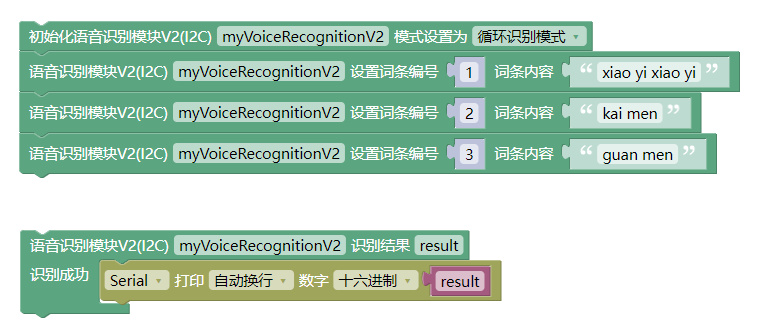

# 语音识别模块2.0

## 产品图

TODO

## 概述

该语音识别模块是`EMakeFun`基于非特定人语音识别LD3320SI-ASR：（Speaker-Independent Automatic Speech Recognition）芯片开发的一款语音识别模块。LD3320芯片上集成了高精度的A/D和D/A接口，不再需要外接辅助的Flash和RAM，即可以实现语音识别/声控/人机对话功能。提供了真正的单芯片语音识别解决方案。该模块有如下特点：

- 非特定人语音识别技术

用户不需要进行录音训练即可动态编辑的识别关键词语列表，只需要把识别的关键词语以字符串的形式传送进芯片，即可以在下次识别中立即生效。

- 支持用户自由编辑15条关键词语条

在同一时刻，最多在15条关键词语中进行识别，终端用户可以根据场景需要，随时编辑和更新关键词语的内容，每条词条的字符数不超过50个。

- 模块上有蓝色状态灯，亮起表示正在识别语音，灭掉表示不会识别语音，当识别到语音时状态灯闪烁

- 该模块采用MCU+LD3320设计，和应用主控采用I2C通讯，大大简化了用户接线和编程难度。

## 软件特性

该模块编程简单，使用I2C协议通讯，按照特定的流程初始化后，只需要不断从模块读取是否有新事件生成，然后`对不同的事件做你想做的事情`即可。

编程思路可以参考下图：

### 触发模式

该模块有4种触发激活模式，可以通过编程配置，具体描述如下表所示：

| 触发方式 | 描述 |
|--- |---|
| 自动 | 不断地循环检测人声，如果有人说话，就会去比对用户设置的关键字列表，并返回识别结果，主控可以根据识别结果作相应处理，然后模块会自动开始下一次识别 |
| 按键触发 | 可以通过模块上面的按键进行触发，按下后开始识别，直到识别成功或者识别超时（默认超时时间5秒）。当这个过程结束后，需要用户再次触发才能再次启动一个识别过程。|
| 关键词触发 | 如果配置了关键词触发模式，默认会将索引号为0的识别词条配置为关键词，当模块识别到关键词后才会开始识别其他索引词，直到识别成功或者识别超时（默认超时时间5秒）。当这个过程结束后，需要用户再次触发才能再次启动一个识别过程。 |
| 按键和关键词触发 | 该模式可以由按键或者关键词来触发开始识别，同样的会将索引号为0的识别词条配置为关键词，当模块被触发激活后开始识别索引词条，直到识别成功或者识别超时（默认超时时间5秒）。当这个过程结束后，需要用户再次触发才能再次启动一个识别过程。 |

### 事件类型

不同触发模式下，模块在工作过程中会产生不同的事件

| 事件类型 | 在特定触发模式下才会生成 | 描述 |
| --- | --- | --- |
| 无 | 自动、按键触发、关键词触发、按键和关键词触发 | 代表无新事件生成 |
| 等待触发唤醒 | 按键触发、关键词触发、按键和关键词触发 | 代表模块进入等待触发唤醒的状态 |
| 被按键触发唤醒 | 按键触发、按键和关键词触发 | 代表模块被按键触发唤醒 |
| 被关键词触发唤醒 | 关键词触发、按键和关键词触发 | 代表模块被关键词触发唤醒 |
| 开始识别 | 自动、按键触发、关键词触发、按键和关键词触发 | 代表模块开始进入语音识别状态 |
| 识别成功 | 自动、按键触发、关键词触发、按键和关键词触发 | 代表模块成功识别到索引词，并已经将结果存入对应位置，可以进行识别结果的读取 |
| 识别超时 | 按键触发、关键词触发、按键和关键词触发 | 代表模块超过超时时间（默认5秒）未识别到关键词，重新进入等待触发唤醒状态 |

不同事件的触发时机可以参考模块工作流程图，如下一些图所示：

- 自动

- 按键触发

- 关键词触发

- 按键和关键词触发

## 模块参数

- 工作电压：5V
- 连接方式：4 PIN 防反接杜邦线
- 模块尺寸：4 * 2.1cm
- 安装方式：M4螺钉螺母固定

## 引脚定义

| 引脚名称| 描述 |
|---- |----|
| G | GND地线 |
| V | 5V电源引脚 |
| SDA | I2C数据引脚 |
| SCL | I2C时钟引脚   |

## 模块尺寸

TODO

## arduino 应用场景

- Arduino库和示例程序下载链接 [点击此处链接下载](https://github.com/emakefun-arduino-library/emakefun_speech_recognizer/archive/refs/tags/latest.zip)

- [文档链接](https://emakefun-arduino-library.github.io/emakefun_speech_recognizer/class_speech_recognizer.html)

示例程序

- 自动循环识别 [点击此处链接查看](https://emakefun-arduino-library.github.io/emakefun_speech_recognizer/trigger_auto_8ino-example.html)
- 按键触发识别 [点击此处链接查看](https://emakefun-arduino-library.github.io/emakefun_speech_recognizer/trigger_button_8ino-example.html)
- 关键字触发识别 [点击此处链接查看](https://emakefun-arduino-library.github.io/emakefun_speech_recognizer/trigger_keyword_8ino-example.html)
- 关键字或者按键触发识别 [点击此处链接查看](https://emakefun-arduino-library.github.io/emakefun_speech_recognizer/trigger_button_and_keyword_8ino-example.html)

### Mixly示例程序

程序解析：语音识别模块的接Arduino的I2C引脚(SDA---A4, SCL---A5)；设置语音识别模块需要识别的词条和该词条对应的编号，当时别出对应的词条时，串口打印出该词条对应的编号。

[点击下载Mixly示例](./speech_recognizer/speech_recognizer_example.zip)

## microbit示例程序

语音识别模块MakeCode用户库链接：<https://github.com/emakefun-makecode-extensions/emakefun_speech_recognizer>

[点击查看Micro:bit示例](https://makecode.microbit.org/_b1TdFzTME7Py)

程序解析：语音识别模块的接Microbit的I2C引脚(SDA---P20, SCL---P19)；设置语音识别模块需要识别的词条和该词条对应的编号，编号0为"kai deng", 编号1为"guan deng", P2引脚接LED模块，当语音识别模块识别到"开灯"，LED模块亮灯，识别到"关灯"，LED模块熄灭。

## 语音识别模块和语音合成模块的综合程序(Arduino)

[点击查看](../../examples/example_tts_and_speech_recognizer/example_tts_and_speech_recognizer.md)
