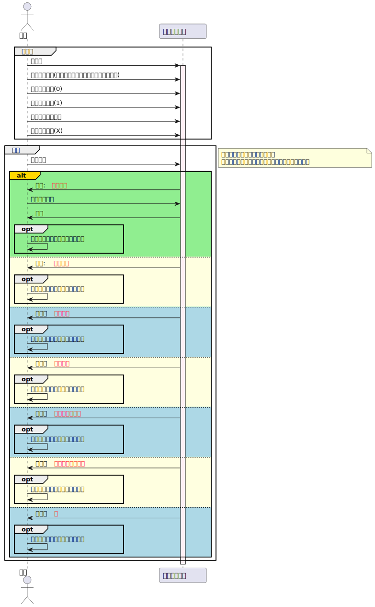
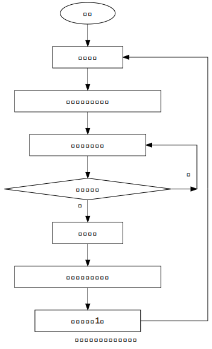
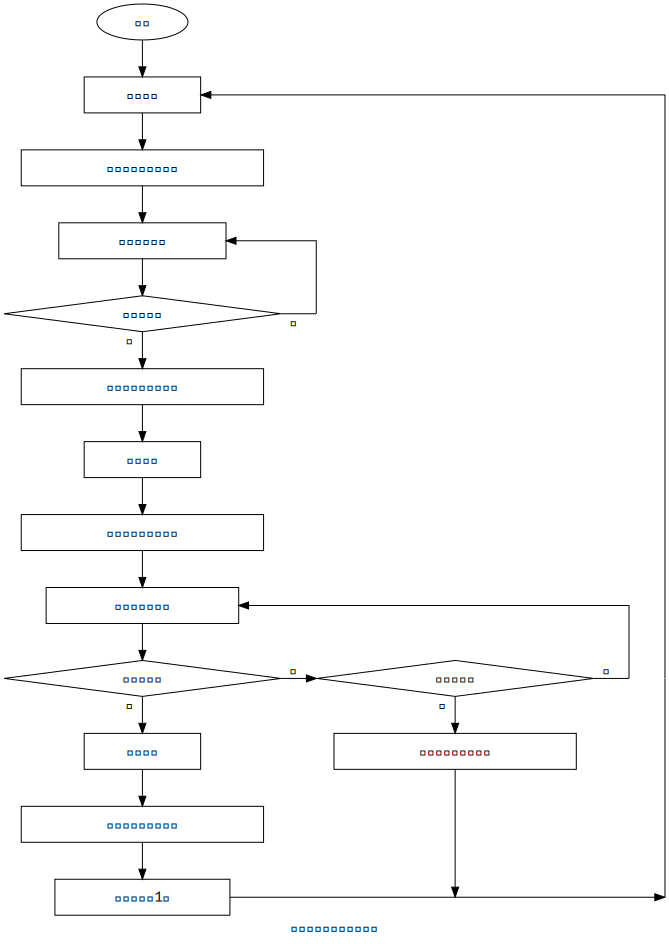
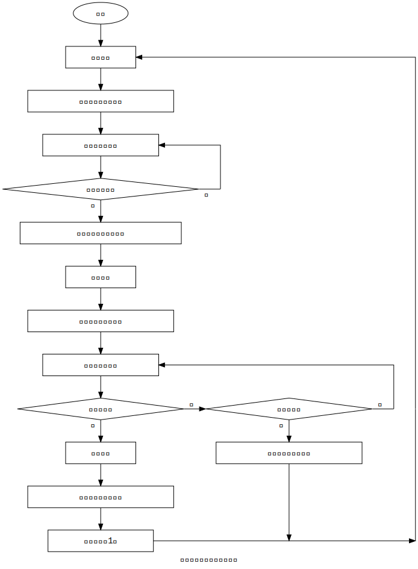
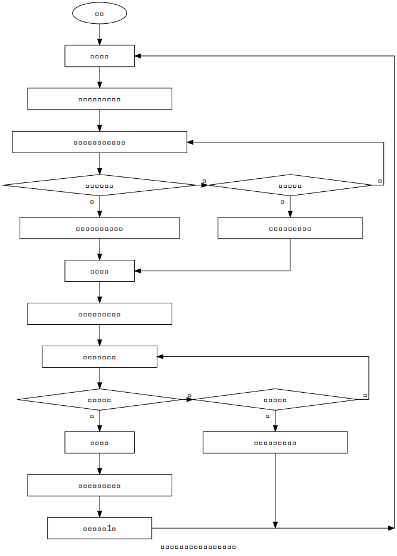
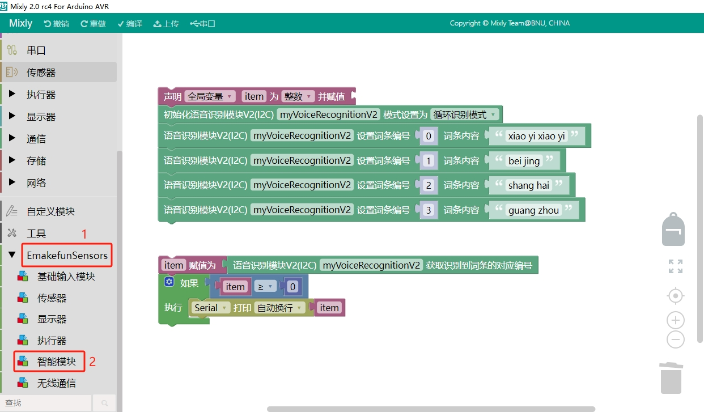
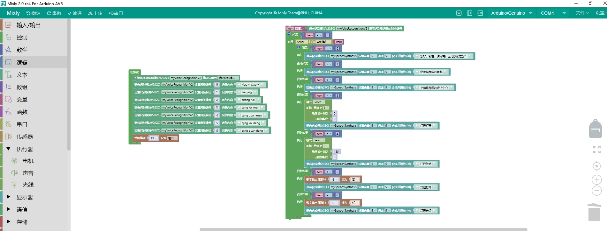
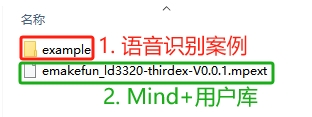
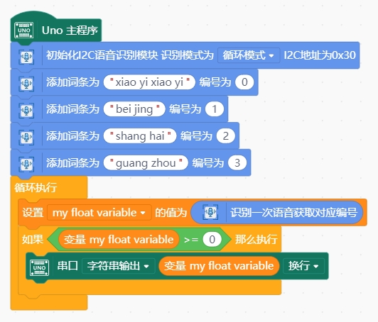
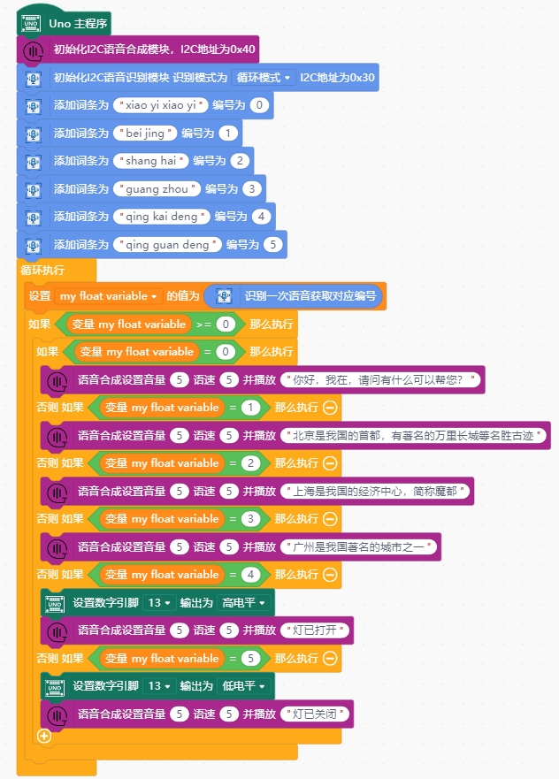

# 语音识别模块2.1

## 概述

该语音识别模块是`emakefun`基于非特定人语音识别`LD3320SI-ASR`：（Speaker-Independent Automatic Speech Recognition）芯片开发的一款语音识别模块。`LD3320`芯片上集成了高精度的A/D和D/A接口，不再需要外接辅助的Flash和RAM，即可以实现语音识别/声控/人机对话功能。提供了真正的单芯片语音识别解决方案。该模块有如下特点：

- 非特定人语音识别技术

用户不需要进行录音训练即可动态编辑的识别关键词语列表，只需要把识别的关键词语以字符串的形式传送进芯片，即可以在下次识别中立即生效。

- 支持用户自由编辑`50`条关键词语条

在同一时刻，最多在`50`条关键词语中进行识别，终端用户可以根据场景需要，随时编辑和更新关键词语的内容，每条词条的字符数不超过50个。

- 模块上有**蓝色状态灯**，亮起表示正在识别语音，灭掉表示不会识别语音，当识别到语音时状态灯闪烁

- 该模块采用MCU+`LD3320`设计，和应用主控采用I2C通讯，大大简化了用户接线和编程难度。

- 支持多种工作模式：自动识别、按键触发识别、关键词触发识别、按键或关键词触发识别，让用户可以在不同工作场景中使用。

## 模块参数

- 工作电压：5V
- 连接方式：4 PIN 防反接杜邦线
- 模块尺寸：4 * 2.1cm
- 安装方式：M4螺钉螺母固定
- I2C地址：0x30

## 引脚定义

| 引脚名称| 描述 |
| ---- | ---- |
| G | GND地线 |
| V | 5V电源引脚 |
| SDA | I2C数据引脚 |
| SCL | I2C时钟引脚 |

## 模块尺寸

TODO

## 软件特性

该模块编程简单，使用I2C协议通讯，除了可以多种识别模式、自定义关键词，获取特定事件等功能

- 编程简单，使用I2C协议通讯

- 可以设定多种识别模式

- 自定义多个关键词

- 可以获取特定事件，如识别开始、识别超时、按键触发、识别到关键词等

### 识别模式

可以初始化为多种识别模式，如下表所示

| 触发方式 | 描述 |
|--- |---|
| 自动 | 不断地循环检测人声，如果有人说话，就会去比对用户设置的关键字列表，并返回识别结果，主控可以根据识别结果作相应处理，然后模块会自动开始下一次识别 |
| 按键触发 | 可以通过模块上面的按键进行触发，按下后开始识别，直到识别成功或者识别超时（默认超时时间为10秒）。当这个过程结束后，需要用户再次触发才能再次启动一个识别过程。|
| 关键词触发 | 如果配置了关键词触发模式，默认会将索引号为`0`的识别词条配置为关键词，当模块识别到关键词后才会开始识别其他索引词，直到识别成功或者识别超时（默认超时时间为10秒）。当这个过程结束后，需要用户再次触发才能再次启动一个识别过程。 |
| 按键和关键词触发 | 该模式可以由按键或者关键词来触发开始识别，同样的会将索引号为0的识别词条配置为关键词，当模块被触发激活后开始识别索引词条，直到识别成功或者识别超时（默认超时时间为10秒）。当这个过程结束后，需要用户再次触发才能再次启动一个识别过程。 |

### 事件类型

不同触发模式下，模块在工作过程中会产生不同的事件

| 事件类型 | 在特定触发模式下才会生成 | 描述 |
| --- | --- | --- |
| 无 | 自动、按键触发、关键词触发、按键和关键词触发 | 代表无新事件生成 |
| 等待触发唤醒 | 按键触发、关键词触发、按键和关键词触发 | 代表模块进入等待触发唤醒的状态 |
| 被按键触发唤醒 | 按键触发、按键和关键词触发 | 代表模块被按键触发唤醒 |
| 被关键词触发唤醒 | 关键词触发、按键和关键词触发 | 代表模块被关键词触发唤醒 |
| 开始识别 | 自动、按键触发、关键词触发、按键和关键词触发 | 代表模块开始进入语音识别状态 |
| 识别成功 | 自动、按键触发、关键词触发、按键和关键词触发 | 代表模块成功识别到索引词，并已经将结果存入对应位置，可以进行识别结果的读取 |
| 识别超时 | 按键触发、关键词触发、按键和关键词触发 | 代表模块超过超时时间（默认10秒）未识别到关键词，重新进入等待触发唤醒状态 |

### 编程思路

### 模块内部工作流程图

不同事件的触发时机可以参考模块工作流程图，如下一些图所示：

- 自动

- 按键触发

- 关键词触发

- 按键和关键词触发

## Arduino应用场景

| 支持开发板系列 |
| ---- |
| Arduino UNO R3 |
| Arduino Nano |
| Arduino Mega 2560 |
| ESP32 |

注意: 以下列出的库包含依赖库，需要全部下载安装，否则无法编译运行。如果已经安装过某些库，使用Arduino IDE再次安装会提示"安装失败，库已经安装"，那么直接忽略该库即可。

| Arduino库 | 下载链接 |
| --- | --- |
| I2C设备(emakefun i2c device) | [点击此处链接下载](https://github.com/emakefun-arduino-library/emakefun_i2c_device/archive/refs/tags/latest.zip) |
| 语音识别(emakefun speech recognizer) | [点击此处链接下载](https://github.com/emakefun-arduino-library/emakefun_speech_recognizer/archive/refs/tags/latest.zip) |

- [点击此处文档链接查看API说明](https://emakefun-arduino-library.github.io/emakefun_speech_recognizer/classemakefun_1_1_speech_recognizer.html)

### Arduino示例程序

- 自动循环识别 [点击此处链接查看](https://emakefun-arduino-library.github.io/emakefun_speech_recognizer/simple_example_8ino-example.html)
- 按键触发识别 [点击此处链接查看](https://emakefun-arduino-library.github.io/emakefun_speech_recognizer/button_trigger_mode_8ino-example.html)
- 关键词触发识别 [点击此处链接查看](https://emakefun-arduino-library.github.io/emakefun_speech_recognizer/keyword_trigger_mode_8ino-example.html)
- 关键字或者按键触发识别 [点击此处链接查看](https://emakefun-arduino-library.github.io/emakefun_speech_recognizer/button_or_keyword_trigger_mode_8ino-example.html)
- 大量关键词(50个)示例 [点击此处链接查看](https://emakefun-arduino-library.github.io/emakefun_speech_recognizer/lots_of_keywords_8ino-example.html)

## Mixly示例程序

用Mixly2.0通过云端导入PH2.0 Sensors库，如下图

**自动循环识别模式**

**程序解析：** 语音识别模块接Arduino Uno R3主板的I2C接口，当对语音识别模块说“xiao yi xiao yi”时，串口打印0，当对语音识别模块说“bei jing”时，串口打印1。

**语音识别和语音合成综合示例**

**程序解析：** 语音识别模块接Arduino Uno R3主板的I2C接口，当对语音识别模块说“xiao yi xiao yi”时，语音合成模块播报“你好，我在，请问有什么可以帮您？”，当对语音识别模块说“qing kai deng”时，主板上的13引脚指示灯亮，并且语音合成模块播报“灯已打开”，当对语音识别模块说“qing guan deng”时，主板上的13引脚指示灯熄灭，并且语音合成模块播报“灯已关闭”。当对语音识别模块说“qing kai men”时，连接主板3引脚的舵机转到0°，并且语音合成模块播报“门已打开”，当对语音识别模块说“qing guan men”时，主板上的3引脚的舵机转到180°，并且语音合成模块播报“门已关闭”。

[**点击下载米思齐案例**](./speech_recognizer/ld3320_mixly_example.zip)

## Mind+示例程序

[**点击下载Mind+用户库**](speech_recognizer/ld3320_mindplus.zip)  用户库包含需要导入的Mind+的用户库和语音识别的案例，如下图。

##### 自动循环识别模式

**程序解析：** 语音识别模块接Arduino Uno R3主板的I2C接口，当对语音识别模块说“xiao yi xiao yi”时，串口打印0，当对语音识别模块说“bei jing”时，串口打印1。

##### 语音识别和语音合成综合示例

**程序解析：** 语音识别模块接Arduino Uno R3主板的I2C接口，当对语音识别模块说“xiao yi xiao yi”时，语音合成模块播报“你好，我在，请问有什么可以帮您？”，当对语音识别模块说“qing kai deng”时，主板上的13引脚指示灯亮，并且语音合成模块播报“灯已打开”，当对语音识别模块说“qing guan deng”时，主板上的13引脚指示灯熄灭，并且语音合成模块播报“灯已关闭”。

## Microbit示例程序

语音识别模块MakeCode用户库链接: <https://github.com/emakefun-makecode-extensions/emakefun_speech_recognizer>

- 自动循环识别 [点击此处链接查看](https://makecode.microbit.org/_ieFfCh9Rs9fh)
- 按键触发识别 [点击此处链接查看](https://makecode.microbit.org/_7oCgom060Axt)
- 关键词触发识别 [点击此处链接查看](https://makecode.microbit.org/_HPF8jX1E7CTk)
- 关键字或者按键触发识别 [点击此处链接查看](https://makecode.microbit.org/_VRbTqFK2TW45)

## 语音识别模块和语音合成模块的综合程序(Arduino)

[点击查看](../../examples/example_tts_and_speech_recognizer/example_tts_and_speech_recognizer.md)
