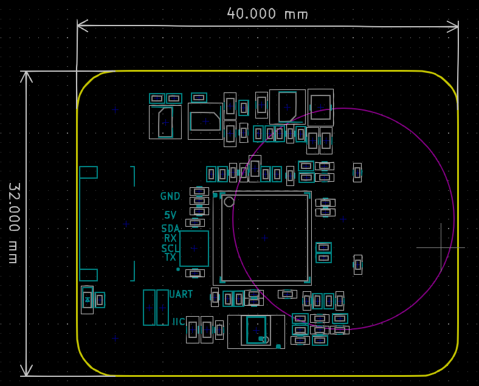
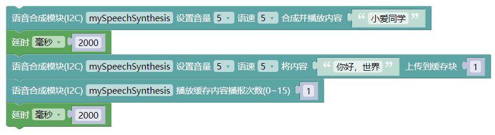
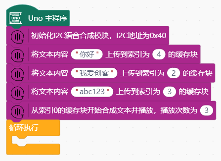

# 语音合成模块

## 概述

语音合成模块是一款高集成度的语音合成模块，该模块方案基于新一代神经网络算法，选取优质的女声发音人，满足通用应用场景的合成播报。

方案以中文为主，同时支持数字、字母、单词、简单的中英文混读，在合成效果（可懂度、清晰度、自然度、表现力、节奏/ 停顿、语速、语调、音质、音色、理解费力程度）方面有显著的提升。 模块通过I2C协议接收待合成的文本，直接合成为语音输出；主要是面向中高端应 用，为其提供一套完整的物美价廉的语音解决方案。支持纯中文、常规英文文本（如字母、单词、短句）以及中英文混合合成，可实现多音字、生僻字、数字、数值、日期、时间、字母正确流畅的合成，播放清晰无杂音，支持实时更新的特殊播报（如：字母、数字穿插播报、大写字母缩写；支持五种文本编码方式，当前方案支持 GB2312、GBK、BIG5、UTF16LE 和 UTF8 五种编码方式。可接收文本数据字节数多达50个。支持多种控制命令，控制命令包括：合成文本、停止合成、暂停合成、恢复合成等控制命令。

| 支持文本数据输入的编码格式 |
| --- |
| GB2312 |
| GBK |
| BIG5 |
| UTF16LE |
| UTF8 |

## 模块参数

| 引脚名称 | 描述 | Arduino Uno
| --- | --- | --- |
| G | GND | |
| V | 5V电源| |
| SDA | I2C SDA引脚 | A4 |
| SCL | I2C SCL引脚 | A5 |

- 供电电压：5V，**注意：供电电压必须是5V**
- 连接方式：PH2.0 4PIN防反接线
- 模块尺寸：40*32mm
- 安装方式：M4螺钉兼容乐高插孔固定

## 机械尺寸图



## 合成文本播放详细参数设置

如需对合成播放效果进行设置，如**语调**，**语速**，**音量**，**音效**等，以下提供一套标注方式，用户可以通过标注的方式，达到想要的合成效果，修复机器合成在自然度、流畅度方面的不足。

### 文本标注方法

正常文本:

```c++
"一二三四五"
```

增加音量标准的文本，正常文本任意位置添加`[详细参数]`，例如文本前增加`[v10]`，代表以音量为10来合成播放这段文本，如下所示:

```c++
"[v10]一二三四五"
```

可以在任意位置进行标注，比如`"一二三"`以音量为`10`进行合成播放，`"四五六"`以音量为`5`进行合成播放，如下所示：

```c++
"[v10]一二三[v5]四五六"
```

文本控制标记的格式一般是半角中括号（即“[]”）内一个小写字母、一个阿拉伯数字。需要注意的是：**文本标记符全部是半角，字母必须是小写的英文字母，不符合要求的不作为文本标记**。

设置文本标记时，标记的位置很重要，除标记`[n*]`、`[r*]`、`[o*]`、`[y*]`外，其余在标记处会强制分句处理，因此在使用时，尽量将其放在句首位置。

加标记不会影响整个合成播报内容的变动。如：`[w0]`是取消词语间停顿的标记，合成过程中标记不会被合成。

### 文本控制标记列表

| 序号 | 类型                               | 格式  | 参数                                                         | 说明                                                         |
| ---- | ---------------------------------- | ----- | ------------------------------------------------------------ | ------------------------------------------------------------ |
| 1    | 设置标点符号读法                   | [b*]  | *=0/1   0–不读   1–朗读                                      | 设置标点符号是  否朗读的标记，默认为 0（不读）。             |
| 2    | 设置合成场景                       | [c*]  | *=0/1/2/3/4/5   <br />0-默认场景   <br />1-阅读（散文类）   <br />2-小说   <br />3-新闻   <br />4-广告   <br />5-交互 |                                                              |
| 3    | 恢复默认的合成参数                 | [d]   | ——                                                           | 不能恢复语种和发音人，其他参数都可以恢复                     |
| 4    | 设置音效模式                       | [e*]  | *=0/1/2/3/4/5/6   <br />0–关闭   <br />1–忽远忽近   <br />2–回声   <br />3–机器人   <br />4–合唱   <br />5–水下   <br />6–混响 | 默认为关闭                                                   |
| 5    | 选择语种环境                       | [g*]  | *=0/1/2   0–自动判断<br />1–本语种环境   <br />2–英语语种环境 | 默认语种为自动判断。                                         |
| 6    | 设置单词发音方式                   | [h*]  | *=0/1/2   <br />0–自动判断单词发音方式   <br />1–字母发音方式   <br />2–单词发音方式 | 默认单词为自动判断                                           |
| 7    | 设置数字处理策略                   | [n*]  | *=0/1/2   0–自动判断   1–数字作号码处理   2–数字作数值处理   | 默认为自动判断                                               |
| 8    | 设置汉语号码中  “1”的读法          | [y*]  | *=0/1  <br /> 0–合成号码时  “1”读成“yāo”                     |                                                              |
| 9    | 静音一段时间                       | [p*]  | *=静音的时间长  度，无符号整数，如[p500]单位：毫秒(ms)       |                                                              |
| 10   | 设置姓名读音策略                   | [r*]  | *=0/1   <br />0–自动判断姓氏读音   <br />1–强制使用姓氏读音规则 | 默认为自动判断  姓名读音，[r1]标记仅对紧跟其后的姓氏有效，如  “[r1]单”自动判断为“shàn” |
| 11   | 设置音量                           | [v*]  | (*=0~10)                                                     | * – 音量值默认音量为 5，10 对应到最高音量。                  |
| 12   | 设置语速                           | [s*]  | *=0~10                                                       | 默认语速值为 5，最大语速为 10                                |
| 13   | 设置语调                           | [te*] | *=0~100                                                      | 默认语调值为  50，最大语调为  100                            |
| 14   | 强制停顿边界                       | [w*]  | *=0/1/3   <br />0–强制标记位置位 L0 边界，无停顿   <br />1–强制标记位置位 L1（韵律词）边界，短停顿   3–强制标记位置位 L3（韵律短语）边界，长停顿 | ——                                                           |
| 15   | 设置韵律标注处 理策略              | [z*]  | *=0/1 0–不处理韵律标 注 1–处理韵律标注                       | 默认不处理韵律 标注。韵律标注使 用“*”标出 L1 划 分位置，使用“#” 标出 L3 划分位 置。 |
| 16   | 为单个汉字/单词 强制指定拼音/音 标 | [=*]  | *=拼音/音标 为前一个汉字/单 词设定的拼音/音 标               | 汉字：声调用后接 一位数字 1~5 分 别表示阴平、阳 平、上声、去声和 轻声 5 个声调。 6~9 分别对应阴 平、阳平、上声、 去声的轻 度，该标记只 能放在非汉语拼 音的汉语音节之 后指定拼音，连续 出现时以最后一 个为准。 示例： “着 [=zhuo2]手”，“着” 字将读作“zhuó” |

## Arduino应用场景

| 支持开发板系列 |
| ---- |
| Arduino UNO R3 |
| Arduino Nano |
| Arduino Mega 2560 |
| ESP32 |

- Arduino库和示例程序下载链接: [点击此处链接下载](https://github.com/emakefun-arduino-library/emakefun_tts/archive/refs/tags/latest.zip)，包含Arduino库文件和示例代码

- [点击此处文档链接查看API说明](https://emakefun-arduino-library.github.io/emakefun_tts/classemakefun_1_1_tts.html)

### Arduino 库示例程序

- 文本播放 [点击此处链接查看](https://emakefun-arduino-library.github.io/emakefun_tts/play_8ino-example.html)

- 缓存文本播放 [点击此处链接查看](https://emakefun-arduino-library.github.io/emakefun_tts/play_from_cache_8ino-example.html)

- 播放流程控制 [点击此处链接查看](https://emakefun-arduino-library.github.io/emakefun_tts/play_flow_control_8ino-example.html)

- 设置播放参数 [点击此处链接查看](https://emakefun-arduino-library.github.io/emakefun_tts/play_with_parameters_8ino-example.html)

### Mixly示例程序



程序解析：语音合成模块先播放程序设定的"小爱同学"文字，然后将"你好，世界"上传到缓存块中，再播放一次。

[点击下载Mixly示例](./tts_module/tts_mixly_example.zip)

[点击下载语音识别和语音识别Mixly综合程序](./tts_module/ttsAndLD3320.zip)

### Mind+示例程序



程序解析：语音合成模块初始化播放"hello world"和"我爱创客"，之后一直播报当前的温度。

[点击下载Mind+示例](./tts_module/tts_mindplus.zip)

## 语音识别模块和语音合成模块的综合程序(Arduino)

[点击查看](../../examples/example_tts_and_speech_recognizer/example_tts_and_speech_recognizer.md)
